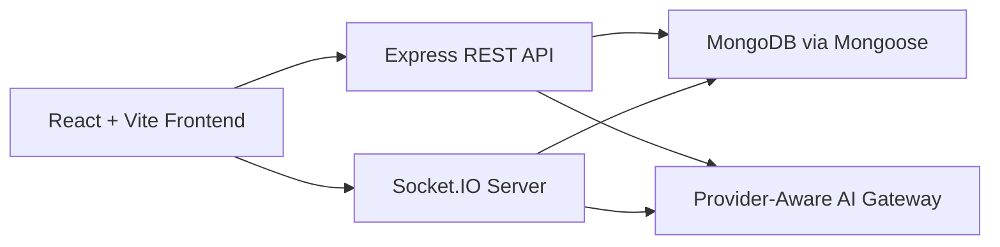

# ARCHITECTURE

## System Overview

## AI Architecture Summary

- Solo AI uses `POST /api/chat` and persists enriched assistant metadata on `Conversation.messages`.
- Room AI uses the `trigger_ai` Socket.IO event and persists enriched AI replies on `Message`.
- Shared services provide model routing, memory retrieval, insight generation, prompt templates, and import/export support.
- Admin users can override prompt templates without redeploying the backend.

## Key Backend Modules

- `backend/index.js`
- `backend/routes/chat.js`
- `backend/routes/ai.js`
- `backend/routes/conversations.js`
- `backend/routes/rooms.js`
- `backend/routes/memory.js`
- `backend/routes/settings.js`
- `backend/routes/admin.js`
- `backend/services/gemini.js`
- `backend/services/memory.js`
- `backend/services/conversationInsights.js`
- `backend/services/promptCatalog.js`
- `backend/services/importExport.js`

## Reference Bundle

See the ten-file backend AI bundle in `docs/backend-ai` for the detailed implementation map.
