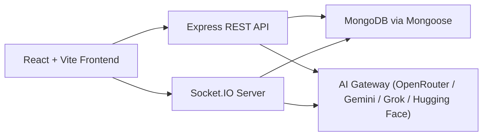

# ARCHITECTURE

## System Overview

## Backend Structure

- `backend/index.js`: Express runtime, route mounting, Socket.IO lifecycle.
- `backend/routes/*`: REST endpoints for auth, chat, conversations, rooms, AI tools, memory, export, admin, analytics, settings, polls, uploads, and moderation.
- `backend/services/gemini.js`: provider-aware AI gateway, model discovery, prompt assembly, and attachment-aware requests.
- `backend/services/memory.js`: extraction, ranking, retrieval, and usage tracking.
- `backend/services/conversationInsights.js`: summary, topics, decisions, and action items.
- `backend/services/importExport.js`: import parsing, dedupe, bundle export.
- `backend/services/promptCatalog.js`: prompt defaults and prompt-template persistence.

## Frontend Structure

- `frontend/src/App.tsx`: lazy-loaded route shell.
- `frontend/src/pages/SoloChat.tsx`: synced solo chat + insight panel.
- `frontend/src/pages/GroupChat.tsx`: room chat, polls, sentiment badges, room insight.
- `frontend/src/pages/MemoryCenter.tsx`: memory management UI.
- `frontend/src/pages/ExportChat.tsx`: export and import center.
- `frontend/src/store/*`: auth, chat, and room state with Zustand.

## Data Model Additions

- `MemoryEntry`: stable user memory with scoring and source references.
- `ConversationInsight`: structured conversation or room summary.
- `ImportSession`: dedupe and traceability for imports.
- `PromptTemplate`: versioned prompt overrides.

## Message Lifecycle

### Solo

1. User sends `POST /api/chat`.
2. Backend retrieves relevant memory and current insight.
3. AI response is generated through the selected provider/model.
4. Conversation is persisted.
5. Memory and insight are refreshed.

### Group

1. User joins room over Socket.IO.
2. User sends message or `trigger_ai`.
3. Backend validates membership, flood limits, and AI quota.
4. Message and AI response are persisted to MongoDB with provider/model metadata.
5. Room insight is refreshed and emitted state is updated.
