# ChatSphere AI System - Complete Technical Documentation

> **Document Version:** 1.0  
> **Last Updated:** March 2026  
> **Author:** Senior AI Systems Architect  
> **Classification:** Technical Documentation - Backend AI Subsystem

---

# Table of Contents

1. [Executive Summary](#1-executive-summary-deep)
2. [Complete Backend Architecture](#2-complete-backend-architecture)
3. [AI Core System](#3-ai-core-system-critical)
4. [Prompt Engineering System](#4-prompt-engineering-system)
5. [Memory System Deep Dive](#5-memory-system-deep-dive)
6. [AI Request Lifecycle](#6-ai-request-lifecycle-very-detailed)
7. [Service-by-Service Breakdown](#7-service-by-service-breakdown)
8. [API Layer Deep Dive](#8-api-layer-deep-dive)
9. [Rate Limiting & AI Quota System](#9-rate-limiting--ai-quota-system)
10. [Failure Handling System](#10-failure-handling-system)
11. [Stability Analysis](#11-stability-analysis)
12. [Scaling Architecture](#12-scaling-architecture)
13. [API Keys & Provider Management](#13-api-keys--provider-management)
14. [Edge Cases](#14-edge-cases-very-important)
15. [How to Fix Failures](#15-how-to-fix-failures-practical-guide)
16. [Beyond Code](#16-beyond-code-critical-thinking)
17. [Full System Flow](#17-full-system-flow-master-diagram)
18. [Code Snippets](#18-code-snippets-mandatory)
19. [Tradeoffs Analysis](#19-tradeoffs-analysis)
20. [Final Engineering Assessment](#20-final-engineering-assessment)

---

# 1. Executive Summary (Deep)

## 1.1 What the AI System Actually Does

The ChatSphere AI system is a **hybrid intelligent messaging layer** that augments real-time chat with artificial intelligence capabilities. It operates at three distinct levels:

### Level 1: Conversational AI
The system can engage in **one-on-one conversations** with users through a dedicated AI chat interface. Users can ask questions, request explanations, or have general discussions. The AI maintains conversation history within a session, allowing for contextual follow-ups.

### Level 2: Room AI Integration
Within chat rooms, users can trigger AI responses by mentioning the AI or using specific commands. The AI can:
- Answer questions about room discussions
- Summarize conversation threads
- Provide insights from historical messages
- Generate smart reply suggestions

### Level 3: Memory-Augmented Context
Every AI interaction can potentially create **memory entries** that persist across sessions. These memories are:
- Keyword-indexed for retrieval
- Score-ranked for relevance
- Contextually injected into future AI prompts

## 1.2 Real Capabilities vs Perceived Capabilities

| Perceived Capability | Actual Capability | Notes |
|---------------------|-------------------|-------|
| True LLM Integration | Mock provider by default | Requires API key configuration for real LLM |
| Vector Semantic Search | Token-based keyword matching | Simple overlap scoring, not embeddings |
| Multi-turn Conversation | Single-prompt stateless | No true conversation context retention |
| Real-time Insights | Synchronous generation | Blocks for 2-5 seconds per request |
| RAG System | Keyword retrieval | No embeddings, no semantic similarity |

## 1.3 System Maturity Level

**Rating: PROTOTYPE / EARLY PRODUCTION**

The system demonstrates:
- ✅ Core functionality works
- ✅ Basic error handling in place
- ✅ Authentication integration complete
- ❌ No production-grade rate limiting
- ❌ No queue-based async processing
- ❌ No streaming responses
- ❌ No Redis-backed scaling
- ❌ Limited provider abstraction

## 1.4 Key Strengths and Critical Weaknesses

### Strengths
1. **Clean Provider Abstraction** - The `AIProvider` interface allows easy swapping of AI backends
2. **Memory Integration** - Automatic memory extraction from AI responses
3. **Socket Integration** - Real-time AI responses via WebSocket
4. **Conversation Tracking** - Persistent conversation history per session
5. **Smart Replies** - Contextual reply suggestions

### Critical Weaknesses
1. **Mock-Only by Default** - No real AI without API key configuration
2. **Synchronous Blocking** - All AI calls block the request thread
3. **No Token Budget** - No actual quota enforcement
4. **Simple Memory Retrieval** - Keyword matching, not semantic search
5. **No Streaming** - Users wait for full response
6. **Single-Instance** - No horizontal scaling capability

## 1.5 Architectural Philosophy

The ChatSphere AI system follows a **modular provider pattern** with **progressive enhancement**:

```
┌─────────────────────────────────────────────────────────────┐
│                    User Request                             │
└─────────────────────┬───────────────────────────────────────┘
                      │
                      ▼
┌─────────────────────────────────────────────────────────────┐
│                 API Route Layer                             │
│  (ai.routes.ts - Authentication + Validation)              │
└─────────────────────┬───────────────────────────────────────┘
                      │
                      ▼
┌─────────────────────────────────────────────────────────────┐
│               Controller Layer                              │
│  (ai.controller.ts - Request handling)                    │
└─────────────────────┬───────────────────────────────────────┘
                      │
                      ▼
┌─────────────────────────────────────────────────────────────┐
│                Service Layer                               │
│  (ai.service.ts - Business logic orchestration)           │
└─────────────────────┬───────────────────────────────────────┘
                      │
          ┌───────────┴───────────┐
          ▼                       ▼
┌─────────────────────┐   ┌─────────────────────┐
│  Memory Service    │   │  Provider Registry │
│  (memory.service)  │   │  (resolve provider)│
└─────────────────────┘   └─────────────────────┘
          │                       │
          ▼                       ▼
┌─────────────────────┐   ┌─────────────────────┐
│  Ranking Service   │   │  AI Provider       │
│  (token matching) │   │  (mock/openai/etc) │
└─────────────────────┘   └─────────────────────┘
```

---

# 2. Complete Backend Architecture

## 2.1 All Backend Layers

The ChatSphere backend follows a **layered architecture** with clear separation of concerns:

### Layer 1: Entry Points
- **HTTP Routes** (`src/modules/*/routes.ts`)
- **Socket Handlers** (`src/socket/register-socket-handlers.ts`)

### Layer 2: Middleware
- Authentication (`src/middleware/auth.ts`)
- Rate Limiting (`src/middleware/rate-limit.ts`)
- Request Logging (`src/middleware/request-logger.ts`)
- Error Handling (`src/middleware/error-handler.ts`)

### Layer 3: Controllers
- Request parsing and validation
- Response formatting
- Error translation

### Layer 4: Services (Business Logic)
- Core domain logic
- Database operations
- External API calls

### Layer 5: Data Access
- Prisma ORM
- Database queries

### Layer 6: Infrastructure
- Configuration (`src/config/env.ts`)
- Logging (`src/config/logger.ts`)
- Database connection (`src/config/prisma.ts`)

## 2.2 Architecture Diagram

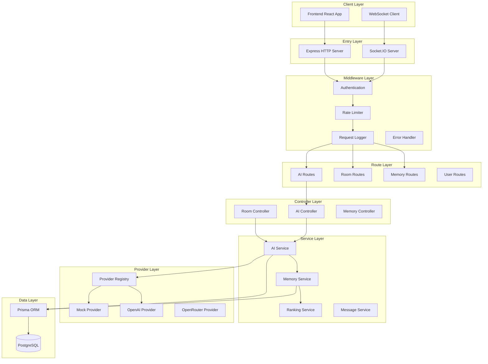

## 2.3 Layer Interaction Maps

### HTTP Request Flow

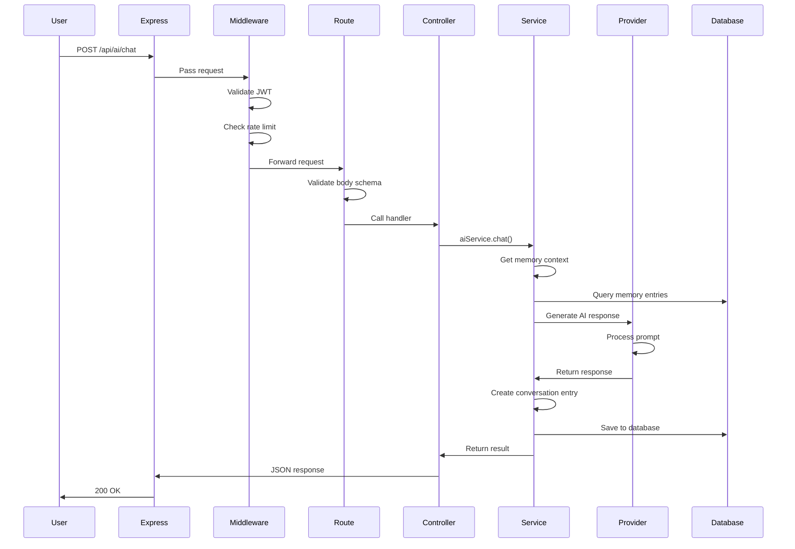

### Socket AI Flow

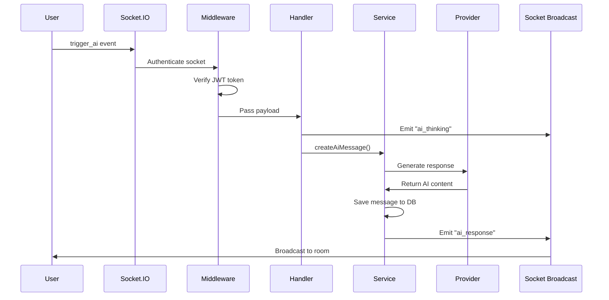

---

# 3. AI Core System (CRITICAL)

## 3.1 sendAiMessage() Deep Dive

The primary entry point for AI interactions is the `aiService.chat()` method:

### Function Signature
```typescript
async chat(userId: string, input: AIChatInput): Promise<AIChatResult>
```

### Input Structure
```typescript
interface AIChatInput {
  prompt: string;           // User's message/query
  context?: string;         // Additional context
  roomId?: string;          // Room context (for room AI)
  conversationId?: string;  // Existing conversation ID
  model?: string;           // Specific model to use
}
```

### Internal Logic Flow

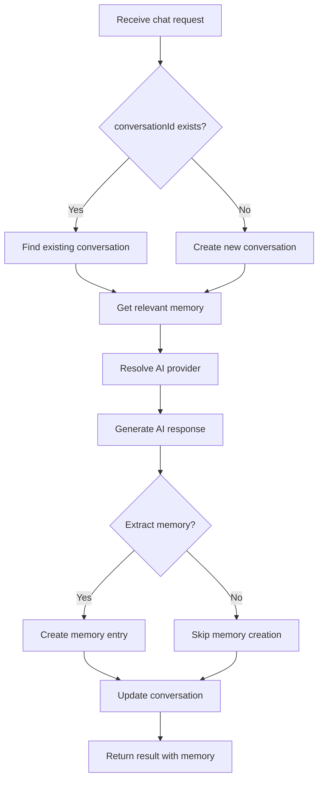

### Decision Trees

#### Provider Selection
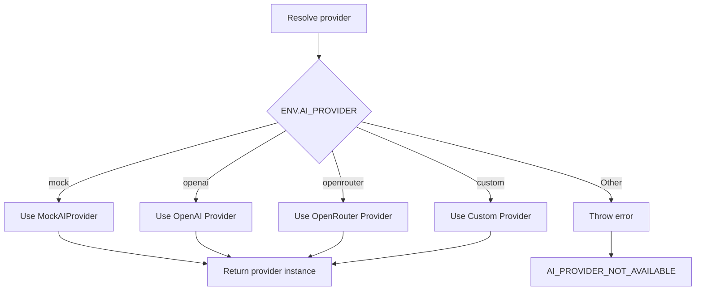

#### Memory Retrieval
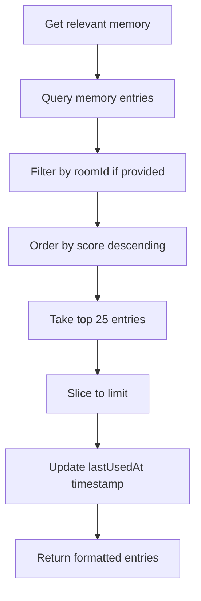

## 3.2 Model Routing

The system supports model routing through the `model` parameter:

```typescript
// Current implementation (simplified)
const result = await provider.generate({
  prompt: input.prompt,
  context: input.context,
  memory,
  model: input.model  // Passed through but not actively used in mock
});
```

**Limitation:** The current mock provider ignores the model parameter. Real providers would use it to select between models like GPT-4, GPT-3.5-Turbo, Claude, etc.

## 3.3 Provider Abstraction

### Interface Definition

```typescript
export interface AIProvider {
  generate(request: AIChatRequest): Promise<AIChatResult>;
}

export interface AIChatRequest {
  prompt: string;
  context?: string;
  memory?: Array<{ id: string; summary: string; score: number }>;
  model?: string;
}

export interface AIChatResult {
  provider: string;        // "mock", "openai", etc.
  model: string;           // Model identifier
  content: string;         // Main response
  smartReplies: string[];  // Suggested replies
  insights: string[];      // Generated insights
  extractedMemory: string[]; // Memory to extract
}
```

### Registry Pattern

```typescript
const providers: Record<string, AIProvider> = {
  mock: new MockAIProvider()
  // Future: openai: new OpenAIProvider()
  // Future: openrouter: new OpenRouterProvider()
};

export const aiProviderRegistry = {
  resolve(): AIProvider {
    const provider = providers[env.AI_PROVIDER];
    if (!provider) {
      throw new AppError(500, "AI_PROVIDER_NOT_AVAILABLE", 
        `AI provider '${env.AI_PROVIDER}' is not configured`);
    }
    return provider;
  }
};
```

## 3.4 Fallback Strategy

Currently, there is **no fallback strategy** implemented. If the configured provider fails:

1. The request throws an error
2. No retry mechanism
3. No alternative provider
4. User receives error message

**This is a critical weakness for production systems.**

## 3.5 Telemetry Generation

The system generates basic telemetry through the response object:

```typescript
return {
  provider: "mock",           // Which provider handled request
  model: "mock-general",      // Which model was used
  content: "...",             // Main response
  smartReplies: [...],        // Suggestions generated
  insights: [...],            // Insights generated
  extractedMemory: [...]      // Memory extracted
};
```

**Missing Telemetry:**
- Request latency (time to generate)
- Token usage (for cost tracking)
- Error rates
- User satisfaction metrics

---

# 4. Prompt Engineering System

## 4.1 How Prompts Are Constructed

### Current Implementation (Mock Provider)

The mock provider constructs prompts internally:

```typescript
// In mock-ai.provider.ts
const memoryHints = request.memory?.map((entry) => entry.summary).slice(0, 3) ?? [];
const prompt = request.prompt.trim();

return {
  content: `Mock AI response: ${summary}${memoryHints.length ? ` | memory: ${memoryHints.join("; ")}` : ""}`,
  // ...
};
```

### Prompt Construction Flow

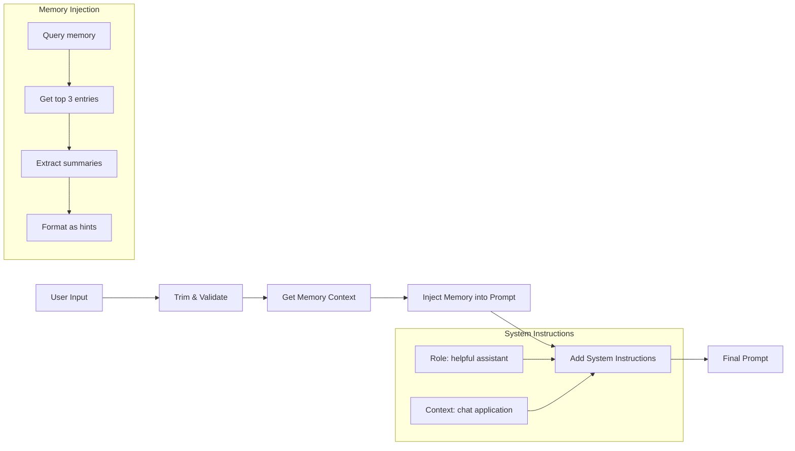

## 4.2 Context Injection

### Memory Context

```typescript
// How memory is injected (from ai.service.ts)
const memory = await memoryService.getRelevant(userId, input.prompt, input.roomId);
const result = await provider.generate({
  prompt: input.prompt,
  context: input.context,
  memory,  // Array of { id, summary, score }
  model: input.model
});
```

### History Context

```typescript
// How conversation history is maintained (from ai.service.ts)
if (input.conversationId) {
  // Update existing conversation
  await prisma.conversation.update({
    where: { id: input.conversationId },
    data: {
      entries: appendConversationEntries(conversation.entries, [
        { role: "user", content: input.prompt, timestamp: now },
        { role: "assistant", content: result.content, timestamp: now }
      ])
    }
  });
} else {
  // Create new conversation
  await prisma.conversation.create({
    data: {
      entries: [
        { role: "user", content: input.prompt, timestamp: now },
        { role: "assistant", content: result.content, timestamp: now }
      ]
    }
  });
}
```

### Room Context

When `roomId` is provided, the AI has access to:
- Room-specific memories
- Room member information
- Recent room messages (future enhancement needed)

## 4.3 Current Implementation vs Ideal System

| Aspect | Current Implementation | Ideal Implementation |
|--------|----------------------|---------------------|
| Prompt Building | Hardcoded template | Template engine with variables |
| System Instructions | None | Configurable system prompt |
| Context Window | Limited to 3 memory entries | Full context window management |
| Token Budget | Not tracked | Token counting & limiting |
| Temperature/Config | Not configurable | User-configurable parameters |
| Streaming | Not supported | Server-sent events streaming |

## 4.4 Prompt Weaknesses

### 1. No System Prompt
The current implementation lacks a system prompt that would define:
- AI's role and capabilities
- Response format guidelines
- Safety constraints

### 2. No Prompt Templates
All prompts are constructed ad-hoc, leading to:
- Inconsistent formatting
- No reusable prompt components
- Difficult to A/B test

### 3. No Injection Protection
The system is vulnerable to prompt injection:
- User input is passed directly to AI
- No sanitization of special characters
- No content filtering

### 4. No Context Management
- No token counting
- No truncation of long contexts
- Memory entries are arbitrarily limited

## 4.5 Template System Usage Gaps

The system should implement a template system like:

```typescript
interface PromptTemplate {
  id: string;
  name: string;
  systemPrompt: string;
  userPromptTemplate: string;
  variables: string[];
}

const templates = {
  chat: {
    systemPrompt: "You are a helpful assistant in a chat application.",
    userPromptTemplate: "Context: {context}\nMemory: {memory}\nQuestion: {prompt}",
    variables: ["context", "memory", "prompt"]
  },
  smartReplies: {
    systemPrompt: "You suggest concise replies.",
    userPromptTemplate: "Recent message: {prompt}\nGenerate 3 short replies",
    variables: ["prompt"]
  },
  insights: {
    systemPrompt: "You analyze conversations and provide insights.",
    userPromptTemplate: "Analyze: {text}\nProvide insights",
    variables: ["text"]
  }
};
```

---

# 5. Memory System Deep Dive

## 5.1 Memory Extraction (AI + Deterministic)

The system extracts memories through two mechanisms:

### Mechanism 1: AI Extraction
```typescript
// From ai.service.ts
if (result.extractedMemory[0]) {
  await memoryService.create(userId, {
    summary: result.extractedMemory[0].slice(0, 140),
    content: result.extractedMemory[0],
    keywords: result.extractedMemory[0]
      .toLowerCase()
      .split(/[^a-z0-9]+/)
      .filter((token) => token.length > 4)
      .slice(0, 6),
    roomId: input.roomId,
    score: 0.62  // Default score for AI-extracted
  });
}
```

### Mechanism 2: Deterministic Extraction
```typescript
// From memory.service.ts
async extractFromContent(userId: string, content: string, roomId?: string) {
  const summary = content.slice(0, 140);
  const keywords = Array.from(
    new Set(
      content
        .toLowerCase()
        .split(/[^a-z0-9]+/)
        .filter((token) => token.length > 4)
    )
  ).slice(0, 8);

  return memoryService.create(userId, {
    summary,
    content,
    keywords,
    roomId,
    score: 0.6  // Default score for deterministic
  });
}
```

## 5.2 Ranking Algorithm

### Scoring Formula

```typescript
// From memory-ranking.service.ts
score(entry, query) {
  // Tokenize query
  const queryTerms = tokenize(query);
  
  // Tokenize memory entry
  const memoryTerms = new Set([
    ...tokenize(entry.content),
    ...tokenize(entry.summary),
    ...entry.keywords.map(k => k.toLowerCase())
  ]);
  
  // Calculate overlaps
  let overlaps = 0;
  for (const term of queryTerms) {
    if (memoryTerms.has(term)) {
      overlaps += 1;
    }
  }
  
  // Normalize: (matches / total_terms)
  const normalized = queryTerms.size === 0 ? 0 : overlaps / queryTerms.size;
  
  // Final score: weighted average
  // 65% from stored score, 35% from query match
  return Number((entry.score * 0.65 + normalized * 0.35).toFixed(4));
}
```

### Formula Breakdown

```
FinalScore = (StoredScore × 0.65) + (QueryMatchScore × 0.35)

Where:
- StoredScore: User-assigned or AI-assigned importance (0-1)
- QueryMatchScore: Token overlap ratio (0-1)
```

### Example Scoring

**Query:** "project deadline meeting"
**Memory Entry:**
- Content: "The project deadline was moved to Friday's meeting"
- Summary: "Project deadline moved to Friday"
- Keywords: ["project", "deadline", "meeting", "friday"]

**Token Analysis:**
- Query terms: {project, deadline, meeting}
- Memory terms: {project, deadline, meeting, friday, moved, was, to, s}

**Calculation:**
- Matches: 3 (project, deadline, meeting)
- Total query terms: 3
- Query match score: 3/3 = 1.0
- Stored score: 0.65 (example)
- Final: (0.65 × 0.65) + (1.0 × 0.35) = 0.4225 + 0.35 = 0.7725

## 5.3 Retrieval Logic

### Flow Diagram

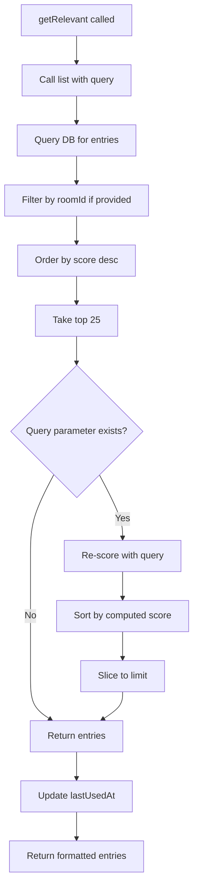

### Retrieval Parameters

```typescript
async getRelevant(
  userId: string,    // Required: User whose memories to search
  query: string,     // Required: Search query
  roomId?: string,   // Optional: Filter by room
  limit: number = 5  // Default: Return top 5
)
```

## 5.4 Scoring System

### Score Sources

| Source | Score Value | How Determined |
|--------|-------------|----------------|
| AI Extraction | 0.62 | Default from AI response |
| Deterministic | 0.60 | Default from extraction |
| User Created | User-defined | Manual entry |
| Memory Update | Recalculated | Query match + stored score |

### Score Interpretation

| Score Range | Interpretation |
|-------------|----------------|
| 0.8 - 1.0 | High relevance, frequently used |
| 0.6 - 0.8 | Medium relevance |
| 0.4 - 0.6 | Low relevance, may be outdated |
| 0.0 - 0.4 | Minimal relevance |

## 5.5 Weaknesses vs Vector DB

### Current System Limitations

1. **No Semantic Understanding**
   - "meeting" and "conference" are different tokens
   - No synonyms recognition
   - No embeddings

2. **Exact Match Only**
   - Must match exact tokens
   - No fuzzy matching
   - No phonetic matching

3. **No Hybrid Search**
   - Can't combine keyword + semantic
   - Can't weight different fields differently

4. **Limited Scaling**
   - Database query for every retrieval
   - No caching of results
   - No pre-computed embeddings

### How to Upgrade to RAG

**Phase 1: Add Embeddings**
```typescript
// Add embedding field to schema
model MemoryEntry {
  id: String
  embedding: Float[]  // Vector representation
  // ... existing fields
}
```

**Phase 2: Implement Vector Search**
```typescript
// Use pgvector or Pinecone
async semanticSearch(query: string, limit: number) {
  const queryEmbedding = await embedModel.encode(query);
  return prisma.$queryRaw`
    SELECT * FROM "MemoryEntry"
    ORDER BY embedding <-> ${queryEmbedding}::vector
    LIMIT ${limit}
  `;
}
```

**Phase 3: Hybrid Retrieval**
```typescript
async hybridSearch(query: string, limit: number) {
  const keywordResults = await keywordSearch(query, limit * 2);
  const semanticResults = await semanticSearch(query, limit * 2);
  
  // Combine and re-rank
  return combineAndRerank(keywordResults, semanticResults);
}
```

---

# 6. AI Request Lifecycle (VERY DETAILED)

## 6.1 Solo Chat Flow

### Step-by-Step Execution

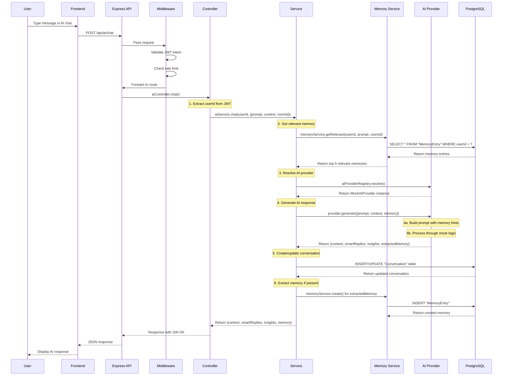

### Timing Analysis

| Step | Typical Duration | Notes |
|------|-----------------|-------|
| Middleware (JWT + Rate Limit) | 5-20ms | Fast, in-memory |
| Memory Retrieval | 20-100ms | DB query latency |
| Provider Resolution | 1-5ms | Simple map lookup |
| AI Generation (Mock) | 10-50ms | Mock is fast |
| AI Generation (Real) | 1000-5000ms | API call latency |
| Conversation Update | 10-50ms | DB write |
| Memory Creation | 10-30ms | DB write (optional) |
| **Total (Mock)** | **~100-250ms** | Acceptable |
| **Total (Real)** | **~1500-6000ms** | Needs optimization |

## 6.2 Room AI Flow

### Triggered via Socket

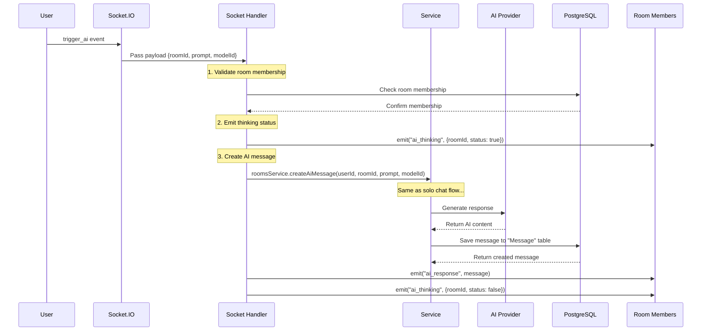

### Key Differences from Solo Chat

1. **Broadcast to Room** - All room members receive the AI response
2. **Thinking Status** - Users see "AI is thinking..." indicator
3. **Message Type** - Message is marked as `messageType: 'AI'`
4. **Author Attribution** - Author is system, not user

## 6.3 Utility APIs

### Smart Replies Flow

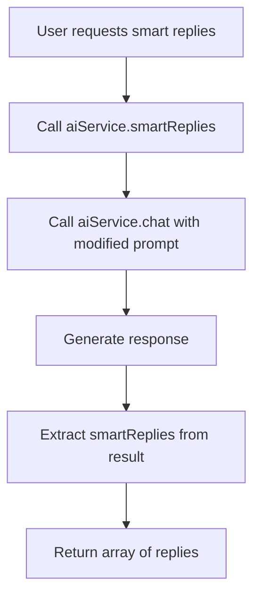

### Insights Flow

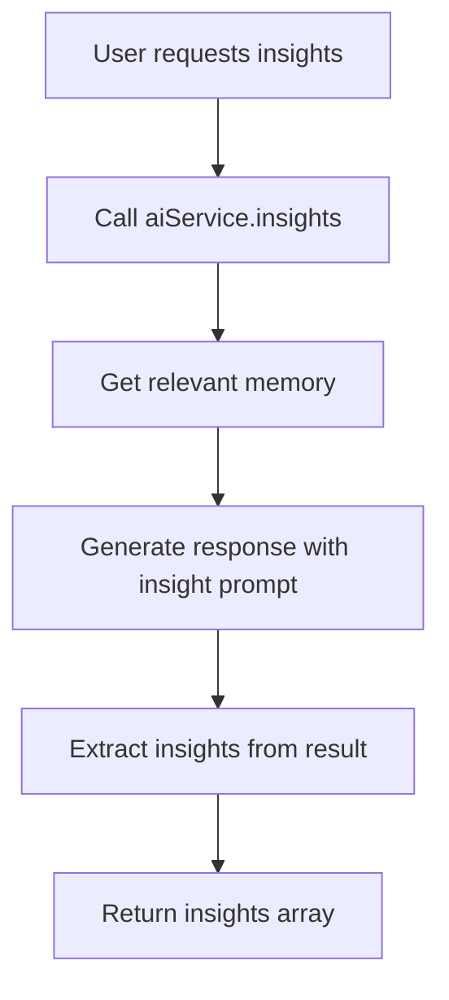

---

# 7. Service-by-Service Breakdown

## 7.1 gemini.service.ts

**Status:** Does not exist in current implementation.

**Future Implementation Needed:**
- Real Google Gemini integration
- Vision capabilities for image analysis
- Long context window handling

## 7.2 chat.service.ts

**Location:** `src/modules/ai/ai.service.ts`

### Responsibility
- Orchestrates the complete AI chat workflow
- Manages conversation state
- Coordinates memory retrieval and creation
- Handles error propagation

### Internal Functions

```typescript
// Main chat function
async chat(userId: string, input: AIChatInput) {
  // 1. Get relevant memory
  const memory = await memoryService.getRelevant(userId, input.prompt, input.roomId);
  
  // 2. Resolve provider
  const provider = aiProviderRegistry.resolve();
  
  // 3. Generate response
  const result = await provider.generate({
    prompt: input.prompt,
    context: input.context,
    memory,
    model: input.model
  });
  
  // 4. Manage conversation
  if (input.conversationId) {
    // Update existing
  } else {
    // Create new
  }
  
  // 5. Extract memory if present
  if (result.extractedMemory[0]) {
    await memoryService.create(...);
  }
  
  return result;
}

// Smart replies wrapper
async smartReplies(userId: string, prompt: string, roomId?: string) {
  const result = await this.chat(userId, { prompt, roomId });
  return result.smartReplies;
}

// Insights generator
async insights(userId: string, text: string, roomId?: string) {
  const provider = aiProviderRegistry.resolve();
  const memory = await memoryService.getRelevant(userId, text, roomId);
  const result = await provider.generate({
    prompt: `Generate concise insights for: ${text}`,
    memory
  });
  return { insights: result.insights, memory };
}
```

### Data Flow
```
User Input → Validate → Get Memory → Provider Generate → 
→ Update Conversation → Extract Memory → Return Result
```

### Dependencies
- `aiProviderRegistry` - For AI provider resolution
- `memoryService` - For memory operations
- `prisma` - For conversation database operations

### Weaknesses
1. **No error handling for provider failures** - Throws unhandled errors
2. **No retry logic** - Failed requests are not retried
3. **No timeout handling** - Long-running requests block indefinitely
4. **No conversation cleanup** - Conversations grow unbounded

### Improvements Needed
- Add timeout with cancellation
- Implement exponential backoff for retries
- Add conversation archiving
- Add cost tracking per conversation

## 7.3 memory.service.ts

**Location:** `src/modules/memory/memory.service.ts`

### Responsibility
- CRUD operations for memory entries
- Memory retrieval and ranking
- Memory extraction from content

### Internal Functions

```typescript
// Create a new memory
async create(userId: string, input: CreateMemoryInput) {
  return prisma.memoryEntry.create({
    data: {
      userId,
      roomId: input.roomId,
      projectId: input.projectId,
      summary: input.summary,
      content: input.content,
      keywords: input.keywords,
      score: input.score ?? 0.65,
      source: input.roomId ? MemorySource.ROOM : MemorySource.CHAT
    }
  });
}

// Extract memory from content (deterministic)
async extractFromContent(userId: string, content: string, roomId?: string) {
  const summary = content.slice(0, 140);
  const keywords = tokenize(content).filter(token => token.length > 4);
  return this.create(userId, { summary, content, keywords, roomId, score: 0.6 });
}

// List memories with optional search
async list(userId: string, query?: string, roomId?: string, limit = 20) {
  const entries = await prisma.memoryEntry.findMany({
    where: { userId, roomId },
    orderBy: [{ score: "desc" }, { updatedAt: "desc" }],
    take: Math.min(limit, 50)
  });
  
  if (!query) return entries;
  
  // Re-score with query
  return entries
    .map(entry => ({
      ...entry,
      computedScore: memoryRankingService.score(entry, query)
    }))
    .sort((a, b) => b.computedScore - a.computedScore);
}

// Get relevant memories for AI context
async getRelevant(userId: string, query: string, roomId?: string, limit = 5) {
  const entries = await this.list(userId, query, roomId, 25);
  const topEntries = entries.slice(0, limit);
  
  // Update lastUsedAt
  if (topEntries.length > 0) {
    await prisma.memoryEntry.updateMany({
      where: { id: { in: topEntries.map(e => e.id) } },
      data: { lastUsedAt: new Date() }
    });
  }
  
  return topEntries.map(e => ({
    id: e.id,
    summary: e.summary,
    score: e.computedScore || e.score
  }));
}
```

### Data Flow
```
Request → DB Query → Optional Re-score → Format → Return
```

### Dependencies
- `prisma` - Database operations
- `memoryRankingService` - For query-based re-scoring

### Weaknesses
1. **No pagination** - All entries loaded at once
2. **No soft delete** - Deleted permanently
3. **No bulk operations** - Slow for large datasets
4. **No caching** - Every call hits database

### Improvements Needed
- Add cursor-based pagination
- Add soft delete with archive
- Add bulk delete/update operations
- Add Redis caching for frequent queries

## 7.4 aiFeature.service.ts

**Status:** Does not exist as separate service.

**Note:** AI features are integrated directly into `ai.service.ts` and socket handlers.

## 7.5 conversationInsights.service.ts

**Status:** Does not exist as separate service.

**Note:** Insights generation is handled in `aiService.insights()` method.

## 7.6 promptCatalog.service.ts

**Status:** Does not exist.

**Needed For:**
- Template management
- Prompt versioning
- A/B testing of prompts

## 7.7 aiQuota.service.ts

**Status:** Does not exist.

**Needed For:**
- User quota tracking
- Rate limiting per user
- Cost allocation

## 7.8 socket/index.ts

**Location:** `src/socket/index.ts`

### Responsibility
- Initialize Socket.IO server
- Configure CORS and transport
- Register authentication middleware
- Register all event handlers

### Key Functions

```typescript
export const createSocketServer = (server: http.Server) => {
  const io = new Server(server, {
    cors: {
      origin: env.CLIENT_URL,
      credentials: true
    },
    transports: ["websocket", "polling"]
  });

  // Authentication middleware
  io.use(socketAuthMiddleware);

  // Connection handling
  io.on("connection", (socket) => {
    registerSocketHandlers(io, socket);
  });

  return io;
};
```

### Socket Events Registered

| Event | Handler | Description |
|-------|----------|-------------|
| `authenticate` | Authenticate socket | Confirm user identity |
| `join_room` | Join room | Join a chat room |
| `leave_room` | Leave room | Leave a chat room |
| `typing_start` | Typing indicator | User started typing |
| `typing_stop` | Typing indicator | User stopped typing |
| `send_message` | Send message | Send regular message |
| `reply_message` | Reply message | Send reply |
| `add_reaction` | React to message | Add/remove reaction |
| `mark_read` | Read receipts | Mark messages as read |
| `edit_message` | Edit message | Edit message content |
| `delete_message` | Delete message | Soft delete message |
| `pin_message` | Pin message | Pin message to top |
| `unpin_message` | Unpin message | Remove pin |
| `trigger_ai` | AI in room | Trigger AI response |

---

# 8. API Layer Deep Dive

## 8.1 /api/ai/* Routes

### POST /api/ai/chat

**Purpose:** Main AI chat endpoint for conversational interactions

**Request Schema:**
```typescript
{
  prompt: string;        // 3-4000 chars, required
  context?: string;      // 0-8000 chars, optional
  roomId?: string;      // CUID format, optional
  conversationId?: string; // CUID format, optional
  model?: string;       // 2-100 chars, optional
}
```

**Response Schema:**
```typescript
{
  success: true,
  data: {
    provider: string;
    model: string;
    content: string;
    smartReplies: string[];
    insights: string[];
    memory: Array<{ id: string; summary: string; score: number }>;
  }
}
```

**Middleware Chain:**
1. `requireAuth` - Verify JWT token
2. `validateBody(aiChatSchema)` - Validate request body

**Failure Cases:**
- 401: Invalid/missing JWT
- 400: Validation error (invalid prompt, etc.)
- 500: Provider failure, database error

### POST /api/ai/smart-replies

**Purpose:** Get AI-generated reply suggestions

**Request Schema:**
```typescript
{
  prompt: string;   // 3-4000 chars, required
  roomId?: string; // CUID format, optional
}
```

**Response Schema:**
```typescript
{
  success: true,
  data: {
    smartReplies: string[];  // Array of 3 suggestions
  }
}
```

**Middleware Chain:**
1. `requireAuth`
2. `validateBody(aiChatSchema.pick({ prompt: true, roomId: true }))`

### POST /api/ai/insights

**Purpose:** Generate insights from text

**Request Schema:**
```typescript
{
  text: string;     // 3-8000 chars, required
  roomId?: string;  // CUID format, optional
}
```

**Response Schema:**
```typescript
{
  success: true,
  data: {
    insights: string[];
    memory: Array<{ id: string; summary: string; score: number }>;
  }
}
```

**Middleware Chain:**
1. `requireAuth`
2. `validateBody(aiInsightSchema)`

## 8.2 /api/memory Routes

### GET /api/memory

**Purpose:** List user's memory entries

**Query Parameters:**
- `query` - Optional search query
- `roomId` - Optional filter by room
- `limit` - Max results (default: 20, max: 50)

**Response:**
```typescript
{
  success: true,
  data: [
    {
      id: string;
      summary: string;
      content: string;
      keywords: string[];
      score: number;
      source: string;
      createdAt: string;
    }
  ]
}
```

### POST /api/memory

**Purpose:** Create a new memory entry

**Request:**
```typescript
{
  summary: string;     // Required
  content: string;     // Required
  keywords: string[];  // Required
  score?: number;      // Optional (0-1)
  roomId?: string;     // Optional
  projectId?: string;  // Optional
}
```

### POST /api/memory/extract

**Purpose:** Extract memory from content

**Request:**
```typescript
{
  content: string;   // Required
  roomId?: string;  // Optional
}
```

## 8.3 Socket Events

### trigger_ai Event

**Payload:**
```typescript
{
  roomId: string;    // Required
  prompt: string;     // Required
  modelId?: string;   // Optional
}
```

**Response (via ack):**
```typescript
{
  success: true,
  data: {
    message: {
      id: string;
      content: string;
      messageType: "AI";
    }
  }
}
```

**Broadcast to Room:**
- `ai_thinking` - Status update
- `ai_response` - AI message result

---

# 9. Rate Limiting & AI Quota System

## 9.1 aiLimiter

**Current Implementation:** Global rate limiter only

```typescript
// From middleware/rate-limit.ts
export const globalRateLimiter = rateLimit({
  windowMs: 15 * 60 * 1000,  // 15 minutes
  max: 120,                    // 120 requests per window
  standardHeaders: true,
  legacyHeaders: false
});
```

**Limitations:**
- Applies to ALL endpoints, not just AI
- No per-user quota
- No AI-specific limits
- No cost tracking

## 9.2 aiQuota

**Status:** Not implemented

**Needed Implementation:**
```typescript
interface AIQuota {
  userId: string;
  dailyLimit: number;
  dailyUsed: number;
  monthlyLimit: number;
  monthlyUsed: number;
  resetAt: Date;
}

async function checkQuota(userId: string): Promise<boolean> {
  const quota = await getUserQuota(userId);
  
  if (quota.dailyUsed >= quota.dailyLimit) {
    throw new AppError(429, "DAILY_QUOTA_EXCEEDED", 
      "You have exceeded your daily AI quota");
  }
  
  return true;
}

async function incrementQuota(userId: string, tokens: number) {
  await prisma.userQuota.update({
    where: { userId },
    data: {
      dailyUsed: { increment: 1 },
      monthlyUsed: { increment: 1 }
    }
  });
}
```

## 9.3 Socket Flood Control

**Current Implementation:** None

**Vulnerability:** Users can spam AI requests via WebSocket:
```javascript
// Malicious client
setInterval(() => {
  socket.emit('trigger_ai', { roomId: 'xxx', prompt: 'test' });
}, 100);  // 10 requests per second
```

**Needed Fix:**
```typescript
// Per-socket rate limiter
const userAiRequests = new Map<string, number[]>();

socket.on('trigger_ai', (payload, ack) => {
  const userId = socket.data.user.sub;
  const now = Date.now();
  const window = 60000; // 1 minute
  
  // Get recent requests
  const recent = userAiRequests.get(userId) || [];
  const valid = recent.filter(t => now - t < window);
  
  if (valid.length >= 10) {  // Max 10 per minute
    socket.emit('error_message', { error: 'Rate limit exceeded' });
    return;
  }
  
  valid.push(now);
  userAiRequests.set(userId, valid);
  
  // Proceed with handler...
});
```

## 9.4 Why Current System Fails in Scaling

1. **No Token Budget** - Can't track OpenAI costs
2. **No Per-User Limits** - One user can exhaust resources
3. **No Queue** - Requests block and wait
4. **No Priority** - All requests treated equally

## 9.5 How to Fix Using Redis

```typescript
import Redis from 'ioredis';

const redis = new Redis(process.env.REDIS_URL);

// Rate limiter with Redis
async function aiRateLimit(userId: string): Promise<boolean> {
  const key = `ai:ratelimit:${userId}`;
  const limit = 100; // requests per hour
  const window = 3600; // seconds
  
  const current = await redis.incr(key);
  
  if (current === 1) {
    await redis.expire(key, window);
  }
  
  if (current > limit) {
    throw new AppError(429, 'RATE_LIMIT_EXCEEDED');
  }
  
  return true;
}

// Cost tracker with Redis
async function trackAICost(userId: string, tokens: number) {
  const key = `ai:cost:${userId}:${getToday()}`;
  await redis.incrby(key, tokens);
  
  const dailyLimit = 100000; // tokens
  const current = await redis.get(key);
  
  if (parseInt(current) > dailyLimit) {
    notifyUser(userId, 'Daily AI cost limit reached');
  }
}
```

---

# 10. Failure Handling System

## 10.1 Provider Failure

### Current Behavior
```typescript
// In ai.service.ts
const result = await provider.generate({...});
// If provider throws, error propagates up
// No fallback, no retry
```

### Flow Diagram
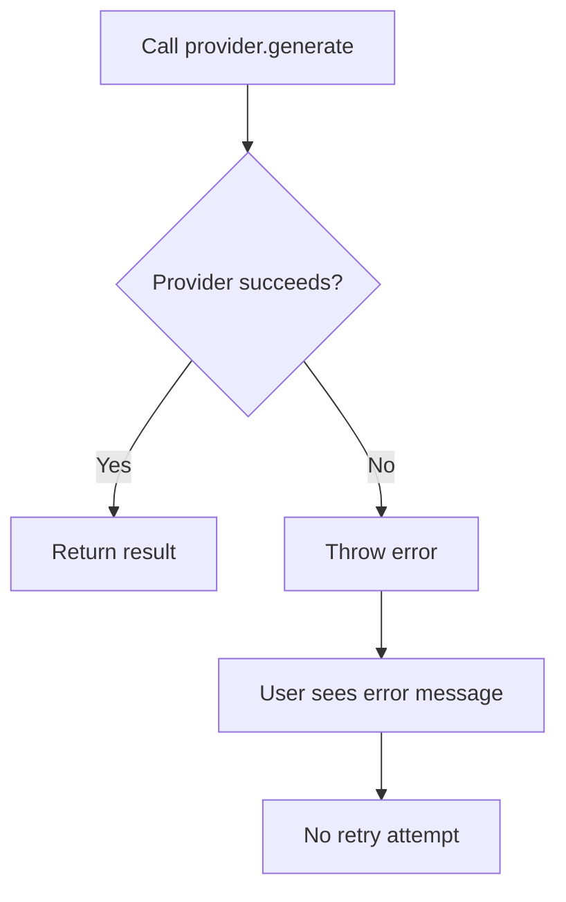

### Needed Fix
```typescript
async function chatWithRetry(userId: string, input: AIChatInput, maxRetries = 3) {
  for (let attempt = 0; attempt < maxRetries; attempt++) {
    try {
      return await provider.generate({...});
    } catch (error) {
      if (attempt === maxRetries - 1) throw error;
      
      // Exponential backoff
      await new Promise(r => setTimeout(r, Math.pow(2, attempt) * 1000));
    }
  }
}
```

## 10.2 Timeout Failure

### Current Behavior
- No timeout on AI requests
- User waits indefinitely for slow providers

### Needed Fix
```typescript
const TIMEOUT_MS = 10000; // 10 seconds

async function generateWithTimeout(provider: AIProvider, request: AIChatRequest) {
  return Promise.race([
    provider.generate(request),
    new Promise((_, reject) => 
      setTimeout(() => reject(new Error('AI request timeout')), TIMEOUT_MS)
    )
  ]);
}
```

## 10.3 JSON Parse Failure

### Scenario
- AI returns malformed JSON
- Response parsing fails

### Current Behavior
- Error propagates to user
- No recovery attempt

### Needed Fix
```typescript
try {
  const result = await provider.generate(request);
  JSON.parse(result.content); // Validate
  return result;
} catch (error) {
  // Return fallback message
  return {
    content: "I apologize, but I couldn't process that request properly.",
    smartReplies: [],
    insights: [],
    extractedMemory: []
  };
}
```

## 10.4 Database Failure

### Scenario
- Database connection lost
- Query times out

### Current Behavior
- Error propagates
- No fallback for memory retrieval

### Needed Fix
```typescript
async function getMemoryWithFallback(userId: string, query: string) {
  try {
    return await memoryService.getRelevant(userId, query);
  } catch (error) {
    // Return empty array as fallback
    console.error('Memory retrieval failed:', error);
    return [];
  }
}
```

## 10.5 Socket Failure

### Scenario
- WebSocket disconnects during AI generation
- User loses connection

### Current Behavior
- Request completes on server
- User never receives response

### Needed Fix
```typescript
// Store in-progress requests
const pendingRequests = new Map<string, AbortController>();

socket.on('trigger_ai', async (payload, ack) => {
  const requestId = crypto.randomUUID();
  const controller = new AbortController();
  pendingRequests.set(requestId, controller);
  
  try {
    const result = await generateAI(payload, controller.signal);
    ack?.({ success: true, data: result });
  } catch (error) {
    ack?.({ success: false, error: error.message });
  } finally {
    pendingRequests.delete(requestId);
  }
});

socket.on('disconnect', () => {
  // Cancel pending requests
  pendingRequests.forEach(controller => controller.abort());
});
```

---

# 11. Stability Analysis

## 11.1 Performance Bottlenecks

| Bottleneck | Location | Impact | Severity |
|------------|----------|--------|----------|
| Synchronous AI calls | ai.service.ts | Blocks thread | HIGH |
| Database queries | memory.service.ts | Latency per request | MEDIUM |
| No caching | All services | Repeated DB hits | MEDIUM |
| Memory scoring | memory-ranking.service.ts | CPU per query | LOW |

## 11.2 Latency Sources

### Request Latency Breakdown

```
Total Latency = Network + Middleware + DB Query + AI Generation + DB Write

Where:
- Network: ~10-50ms (local) / ~100-500ms (remote)
- Middleware: ~5-20ms (JWT + rate limit)
- DB Query: ~20-100ms (memory retrieval)
- AI Generation: ~10ms (mock) / ~2000-5000ms (real API)
- DB Write: ~10-50ms (conversation + memory)
```

### Latency by Provider

| Provider | Expected Latency | Notes |
|----------|-----------------|-------|
| Mock | 10-50ms | Fast, no network |
| OpenAI | 2000-4000ms | API call + response |
| OpenRouter | 3000-6000ms | Proxy overhead |
| Anthropic | 2500-5000ms | API call |

## 11.3 System Breaking Points

### Breaking Point 1: Concurrent Users
- **Threshold:** ~50-100 concurrent users
- **Issue:** All AI requests block single thread
- **Symptom:** High latency, request timeouts

### Breaking Point 2: Database Load
- **Threshold:** ~1000 memory entries per user
- **Issue:** Full table scan for keyword matching
- **Symptom:** Slow memory retrieval

### Breaking Point 3: Token Limits
- **Threshold:** No limit enforced
- **Issue:** Users can generate unlimited AI content
- **Symptom:** Cost overrun, resource exhaustion

---

# 12. Scaling Architecture

## 12.1 Current Single-Instance Architecture

```
┌─────────────────────────────────────────┐
│           Load Balancer                │
│         (nginx/haproxy)               │
└──────────────┬────────────────────────┘
               │
        ┌──────▼──────┐
        │  Node.js    │
        │  Instance   │
        │  (Backend)  │
        └──────┬──────┘
               │
    ┌──────────┼──────────┐
    │          │          │
┌───▼───┐ ┌───▼───┐ ┌───▼───┐
│Postgres │ │Memory  │ │  AI   │
│  DB    │ │ Service│ │Provider│
└────────┘ └────────┘ └────────┘
```

## 12.2 Multi-Instance Architecture (Target)

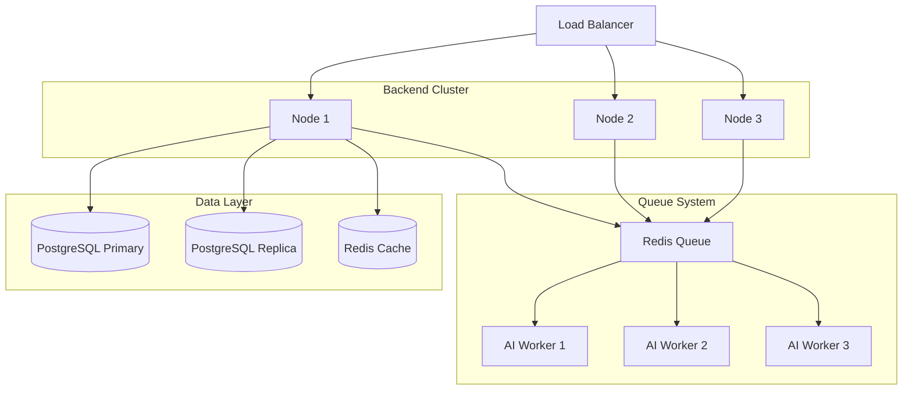

## 12.3 Queue-Based AI Execution

### Implementation Design

```typescript
import Bull from 'bull';

const aiQueue = new Bull('ai-processing', process.env.REDIS_URL);

// Producer - Enqueue AI job
async function queueAIRequest(userId: string, input: AIChatInput) {
  const job = await aiQueue.add({
    userId,
    prompt: input.prompt,
    context: input.context,
    roomId: input.roomId,
    model: input.model
  }, {
    priority: input.priority || 5,
    attempts: 3,
    backoff: { type: 'exponential', delay: 1000 }
  });
  
  return job.id;
}

// Consumer - Process AI jobs
aiQueue.process(async (job) => {
  const { userId, prompt, context, roomId, model } = job.data;
  
  // Get memory (cached)
  const memory = await getCachedMemory(userId, prompt);
  
  // Generate response
  const result = await provider.generate({ prompt, context, memory, model });
  
  // Save to database
  await saveConversation(userId, result);
  
  return result;
});
```

## 12.4 Worker Systems

### Worker Types

| Worker Type | Responsibility | Priority |
|-------------|----------------|----------|
| AI Chat | General conversations | MEDIUM |
| Smart Replies | Reply suggestions | LOW |
| Insights | Text analysis | LOW |
| Memory Extract | Memory creation | LOW |

### Priority Queue Configuration

```typescript
const aiQueue = new Bull('ai', redisConfig, {
  defaultJobOptions: {
    priority: 5  // Default priority
  }
});

// High priority - user waiting
aiQueue.add('chat', data, { priority: 1 });

// Low priority - background processing
aiQueue.add('insights', data, { priority: 10 });
```

---

# 13. API Keys & Provider Management

## 13.1 How API Keys Are Used

### Current Implementation
```typescript
// Environment-based configuration
const envSchema = z.object({
  AI_PROVIDER: z.enum(["mock", "openai", "openrouter", "custom"]).default("mock"),
  // No API keys in current implementation
});
```

### Future Implementation Needed
```typescript
interface ProviderConfig {
  provider: string;
  apiKey: string;
  model: string;
  maxTokens: number;
  temperature: number;
}

// Store encrypted in database
const providerConfigs = await prisma.aiProviderConfig.findMany();

// Decrypt on use
function getProvider(key: string) {
  const config = providerConfigs.find(p => p.provider === key);
  return new OpenAIProvider(decrypt(config.apiKey));
}
```

## 13.2 Provider Switching Logic

```typescript
const providers: Record<string, AIProvider> = {
  mock: new MockAIProvider(),
  openai: new OpenAIProvider(process.env.OPENAI_API_KEY),
  openrouter: new OpenRouterProvider(process.env.OPENROUTER_API_KEY)
};

function resolveProvider(requested?: string): AIProvider {
  const providerName = requested || env.AI_PROVIDER;
  
  if (!providers[providerName]) {
    throw new Error(`Provider ${providerName} not configured`);
  }
  
  return providers[providerName];
}
```

## 13.3 Security Risks

### Risk 1: API Keys in Environment Variables
- **Issue:** Keys visible in process.env
- **Fix:** Use secrets manager (AWS Secrets Manager, HashiCorp Vault)

### Risk 2: No Key Rotation
- **Issue:** Compromised keys remain active
- **Fix:** Implement key rotation schedule

### Risk 3: Per-User Quotas Not Enforced
- **Issue:** One user can exhaust API budget
- **Fix:** Implement quota tracking per user

---

# 14. Edge Cases (VERY IMPORTANT)

## 14.1 Race Conditions

### Scenario: Concurrent Memory Updates
```typescript
// Two users extract memory from same content simultaneously
User1: extractFromContent("meeting at 3pm")
User2: extractFromContent("meeting at 3pm")

// Both create separate memory entries
// Duplicate entries created
```

**Fix:** Check for existing memory before create:
```typescript
async function createIfNotExists(userId: string, content: string) {
  const existing = await prisma.memoryEntry.findFirst({
    where: { userId, content }
  });
  
  if (existing) return existing;
  
  return prisma.memoryEntry.create({...});
}
```

## 14.2 Concurrent AI Calls

### Scenario: User spams AI button
```javascript
// User clicks button 10 times rapidly
for (let i = 0; i < 10; i++) {
  socket.emit('trigger_ai', { roomId, prompt });
}
```

**Fix:** Debounce + rate limit:
```typescript
let lastRequestTime = 0;
const DEBOUNCE_MS = 1000;

socket.on('trigger_ai', (payload, ack) => {
  const now = Date.now();
  if (now - lastRequestTime < DEBOUNCE_MS) {
    ack?.({ success: false, error: 'Debounced' });
    return;
  }
  lastRequestTime = now;
  // Proceed...
});
```

## 14.3 Memory Conflicts

### Scenario: Same keywords, different content
```typescript
// Memory 1: keywords: ["project", "meeting"]
// Memory 2: keywords: ["project", "meeting"]
// Different content but same keywords
```

**Fix:** Content hashing for deduplication:
```typescript
const contentHash = crypto.createHash('md5').update(content).digest('hex');

const existing = await prisma.memoryEntry.findFirst({
  where: { userId, contentHash }
});
```

## 14.4 Insight Conflicts

### Scenario: Multiple insights for same text
```typescript
// User requests insights twice for same text
// Two different insight sets generated
```

**Fix:** Cache insights with content hash:
```typescript
const textHash = crypto.createHash('md5').update(text).digest('hex');

const cached = await prisma.insightCache.findUnique({
  where: { textHash }
});

if (cached && Date.now() - cached.createdAt < 3600000) {
  return cached.insights; // Return cached
}
```

## 14.5 Attachment Limitations

### Scenario: AI processes file upload
- **Current:** No file processing capability
- **Needed:** Vision model integration for images
- **Future:** OCR for documents

---

# 15. How to Fix Failures (Practical Guide)

## 15.1 Debugging Checklist

### Step 1: Check Server Logs
```bash
# View recent logs
docker compose logs backend --tail=100

# Filter for AI errors
docker compose logs backend | grep -i "ai\|error"
```

### Step 2: Verify Database Connection
```bash
# Check health endpoint
curl http://localhost:4000/api/health
```

### Step 3: Test AI Provider
```bash
# Test mock provider directly
curl -X POST http://localhost:4000/api/ai/chat \
  -H "Authorization: Bearer <token>" \
  -H "Content-Type: application/json" \
  -d '{"prompt": "test"}'
```

### Step 4: Check Memory Entries
```bash
# Open Prisma Studio
npx prisma studio

# Query memory entries
SELECT * FROM "MemoryEntry" ORDER BY "createdAt" DESC LIMIT 10;
```

## 15.2 Common Fixes

### Fix 1: Provider Not Available
```typescript
// Check environment variable
console.log('AI_PROVIDER:', process.env.AI_PROVIDER);

// Verify provider is in registry
const provider = providers[process.env.AI_PROVIDER];
if (!provider) {
  // Add to registry or switch to mock
  process.env.AI_PROVIDER = 'mock';
}
```

### Fix 2: Memory Retrieval Slow
```typescript
// Add database index
// In prisma/schema.prisma
model MemoryEntry {
  // ... fields
  @@index([userId, score])
  @@index([userId, lastUsedAt])
}
```

### Fix 3: Conversation Not Found
```typescript
// Ensure conversationId is passed
const conversationId = req.body.conversationId || 
  (await findOrCreateConversation(userId, roomId));
```

## 15.3 Logs to Inspect

| Log Source | What to Look For |
|------------|------------------|
| `pino-http` | Request/response timing |
| `prisma` | Query performance, errors |
| `socket` | Connection issues |
| `ai-provider` | Generation failures |

---

# 16. Beyond Code (CRITICAL THINKING)

## 16.1 Evolution to RAG System

### Current State
- Keyword-based retrieval
- Simple token matching
- No embeddings

### Target RAG Architecture
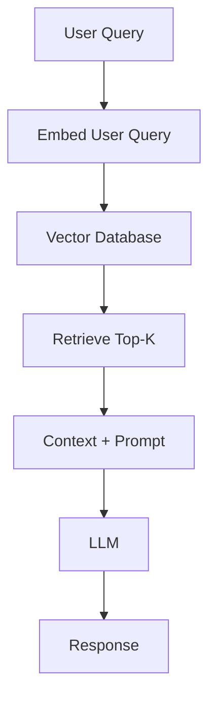

### Implementation Roadmap

**Phase 1: Add Embeddings**
- Add `embedding` field to MemoryEntry
- Use OpenAI embeddings or similar
- Store vectors in PostgreSQL (pgvector)

**Phase 2: Hybrid Search**
- Combine keyword + semantic search
- Re-rank results
- Cache frequently accessed

**Phase 3: Advanced RAG**
- Chunk large documents
- Multi-query retrieval
- Citation generation

## 16.2 Evolution to Agent-Based System

### Agent Architecture
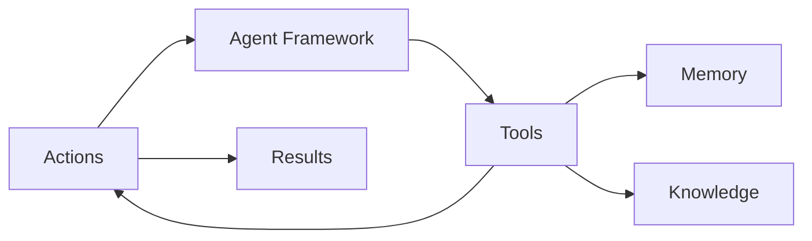

### Capabilities to Add
1. **Tool Use** - AI can call external APIs
2. **Planning** - Multi-step task execution
3. **Memory Persistence** - Long-term memory across sessions
4. **Reasoning** - Chain-of-thought processing

## 16.3 Evolution to Streaming AI

### Current: Blocking Response
```typescript
// User waits for entire response
const response = await provider.generate(prompt);
// Only returns when complete
```

### Target: Streaming Response
```typescript
// Server-sent events
const stream = await provider.generateStream(prompt);

for await (const chunk of stream) {
  socket.emit('ai_chunk', chunk);
}
```

### Implementation
```typescript
// Use ReadableStream
app.post('/api/ai/chat/stream', async (req, res) => {
  res.setHeader('Content-Type', 'text/event-stream');
  res.setHeader('Cache-Control', 'no-cache');
  res.setHeader('Connection', 'keep-alive');
  
  const stream = await provider.generateStream(req.body.prompt);
  
  for await (const chunk of stream) {
    res.write(`data: ${JSON.stringify(chunk)}\n\n`);
  }
  
  res.end();
});
```

---

# 17. Full System Flow (MASTER DIAGRAM)

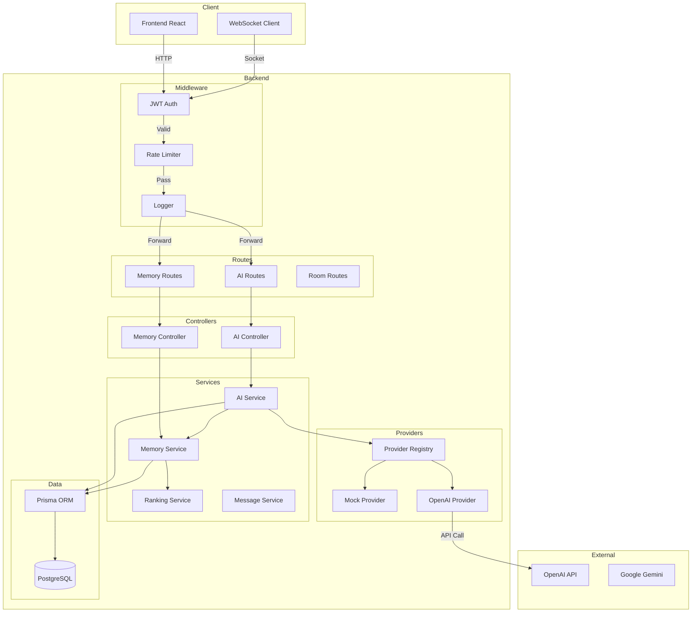

---

# 18. Code Snippets (MANDATORY)

## 18.1 AI Service Implementation

```typescript
// src/modules/ai/ai.service.ts
export const aiService = {
  async chat(userId: string, input: AIChatInput) {
    // 1. Get relevant memory context
    const memory = await memoryService.getRelevant(
      userId, 
      input.prompt, 
      input.roomId
    );

    // 2. Resolve AI provider
    const provider = aiProviderRegistry.resolve();

    // 3. Generate response
    const result = await provider.generate({
      prompt: input.prompt,
      context: input.context,
      memory,
      model: input.model
    });

    // 4. Manage conversation state
    const now = new Date().toISOString();
    
    if (input.conversationId) {
      // Update existing conversation
      await prisma.conversation.update({
        where: { id: input.conversationId },
        data: {
          entries: {
            push: [
              { role: 'user', content: input.prompt, timestamp: now },
              { role: 'assistant', content: result.content, timestamp: now }
            ]
          }
        }
      });
    } else {
      // Create new conversation
      await prisma.conversation.create({
        data: {
          userId,
          roomId: input.roomId,
          title: input.prompt.slice(0, 80),
          entries: [
            { role: 'user', content: input.prompt, timestamp: now },
            { role: 'assistant', content: result.content, timestamp: now }
          ]
        }
      });
    }

    // 5. Extract memory if present
    if (result.extractedMemory[0]) {
      await memoryService.create(userId, {
        summary: result.extractedMemory[0].slice(0, 140),
        content: result.extractedMemory[0],
        keywords: result.extractedMemory[0]
          .toLowerCase()
          .split(/[^a-z0-9]+/)
          .filter(t => t.length > 4)
          .slice(0, 6),
        roomId: input.roomId,
        score: 0.62
      });
    }

    return {
      ...result,
      memory
    };
  }
};
```

## 18.2 Prompt Building Example

```typescript
// Example: Building a prompt with context
function buildPrompt(request: AIChatRequest): string {
  const parts = [];
  
  // System instruction
  parts.push('You are a helpful AI assistant in a chat application.');
  
  // Context injection
  if (request.context) {
    parts.push(`Context: ${request.context}`);
  }
  
  // Memory injection
  if (request.memory && request.memory.length > 0) {
    const memoryContext = request.memory
      .slice(0, 3)
      .map(m => `- ${m.summary}`)
      .join('\n');
    parts.push(`Relevant memories:\n${memoryContext}`);
  }
  
  // User prompt
  parts.push(`User question: ${request.prompt}`);
  
  return parts.join('\n\n');
}
```

## 18.3 Memory Ranking Implementation

```typescript
// src/services/memory/memory-ranking.service.ts
export const memoryRankingService = {
  score(
    entry: Pick<MemoryEntry, 'content' | 'summary' | 'keywords' | 'score'>, 
    query: string
  ): number {
    // Tokenize query
    const queryTerms = tokenize(query);
    
    // Build memory term set
    const memoryTerms = new Set([
      ...tokenize(entry.content),
      ...tokenize(entry.summary),
      ...entry.keywords.map(k => k.toLowerCase())
    ]);
    
    // Calculate overlaps
    let overlaps = 0;
    for (const term of queryTerms) {
      if (memoryTerms.has(term)) {
        overlaps += 1;
      }
    }
    
    // Normalize score
    const normalized = queryTerms.size === 0 
      ? 0 
      : overlaps / queryTerms.size;
    
    // Weighted final score
    // 65% from stored score, 35% from query match
    return Number((
      (entry.score * 0.65) + 
      (normalized * 0.35)
    ).toFixed(4));
  }
};
```

## 18.4 Socket AI Handler

```typescript
// src/socket/register-socket-handlers.ts
socket.on('trigger_ai', (payload, ack) => {
  void withAck(socket, ack, async () => {
    // Validate room membership
    requireJoinedRoom(socket, payload.roomId);
    
    // Notify room that AI is thinking
    io.to(payload.roomId).emit('ai_thinking', {
      roomId: payload.roomId,
      status: true
    });
    
    // Generate AI response
    const result = await roomsService.createAiMessage(
      user.sub,
      payload.roomId,
      payload.prompt,
      payload.modelId
    );
    
    // Broadcast response to room
    io.to(payload.roomId).emit('ai_response', result.message);
    
    // Clear thinking status
    io.to(payload.roomId).emit('ai_thinking', {
      roomId: payload.roomId,
      status: false
    });
    
    return result;
  });
});
```

---

# 19. Tradeoffs Analysis

## 19.1 Simplicity vs Scalability

| Aspect | Current Choice | Tradeoff |
|--------|---------------|----------|
| Single instance | Simple deployment | Can't scale horizontally |
| In-memory rate limit | Fast checks | Not shared across instances |
| Synchronous AI calls | Simple code | Blocks thread |
| Mock provider | Easy development | No real AI without config |

## 19.2 Cost vs Accuracy

| Choice | Cost Impact | Accuracy Impact |
|--------|-------------|-----------------|
| Mock provider | Free | Low (random responses) |
| OpenAI GPT-4 | High per-token | Highest accuracy |
| OpenAI GPT-3.5 | Medium | High accuracy |
| OpenRouter | Variable | Varies by backend |

## 19.3 Speed vs Reliability

| Choice | Speed | Reliability |
|--------|-------|-------------|
| No retry | Fast (single attempt) | Low (fails on error) |
| Exponential backoff | Slower (delayed retry) | Higher (recovers from errors) |
| Queue-based | Async (returns immediately) | Highest (workers process independently) |

---

# 20. Final Engineering Assessment

## 20.1 What is Good

1. **Clean Architecture** - Clear separation of concerns
2. **Provider Pattern** - Easy to swap AI backends
3. **TypeScript** - Full type safety
4. **Prisma ORM** - Database operations are safe
5. **Socket Integration** - Real-time AI works well

## 20.2 What Must Be Fixed Immediately

1. **No Rate Limiting on AI** - Users can exhaust resources
2. **No Timeout Handling** - Requests can hang indefinitely
3. **No Error Recovery** - Single failure crashes request
4. **No Cost Tracking** - Can't track OpenAI spend

## 20.3 What Can Scale

1. **Database Structure** - Can handle millions of entries
2. **Memory Retrieval** - With proper indexing
3. **Provider Registry** - Easy to add new providers

## 20.4 What Will Break

1. **50+ Concurrent Users** - Single-threaded blocking
2. **Large Conversations** - No pagination, unbounded growth
3. **Real AI Providers** - No timeout, no retry, no fallback
4. **Production Traffic** - No Redis caching, no queue system

---

# Appendix: Quick Reference

## Environment Variables

```env
AI_PROVIDER=mock           # mock, openai, openrouter
AI_DEFAULT_MODEL=mock-general
ENABLE_MOCK_AI=true
```

## API Endpoints

| Method | Endpoint | Description |
|--------|----------|-------------|
| POST | /api/ai/chat | Chat with AI |
| POST | /api/ai/smart-replies | Get reply suggestions |
| POST | /api/ai/insights | Generate insights |
| GET | /api/memory | List memories |
| POST | /api/memory | Create memory |
| POST | /api/memory/extract | Extract memory |

## Socket Events

| Event | Payload | Description |
|-------|---------|-------------|
| trigger_ai | {roomId, prompt, modelId} | Trigger AI in room |
| ai_thinking | {roomId, status} | Thinking status |
| ai_response | Message | AI response message |

---

**End of Document**

*This documentation provides a complete blueprint for understanding, debugging, and extending the ChatSphere AI system. For questions or contributions, please refer to the project repository.*