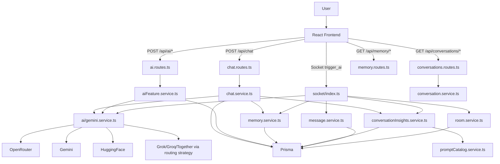
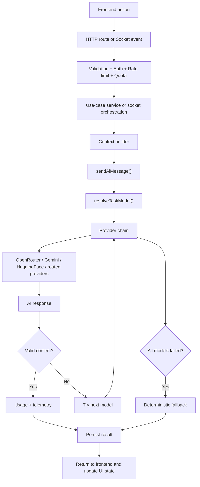
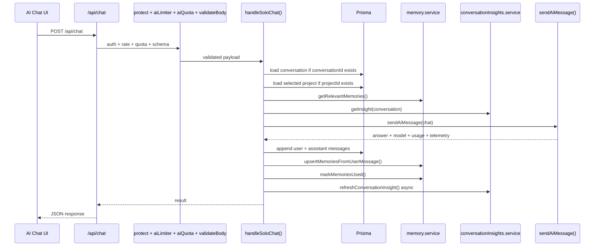
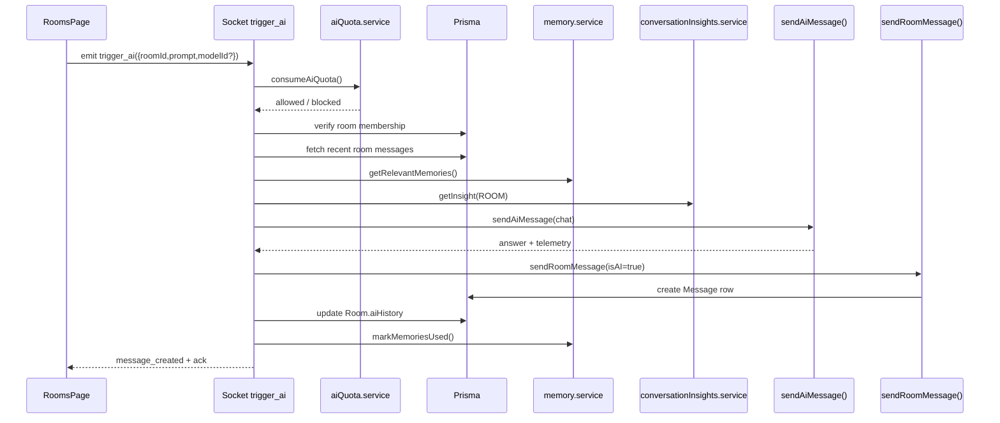
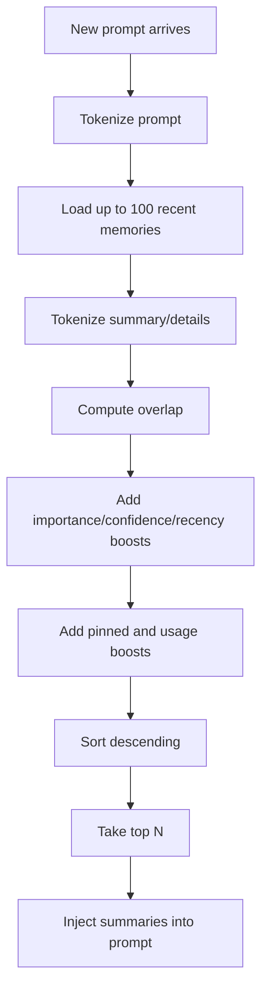
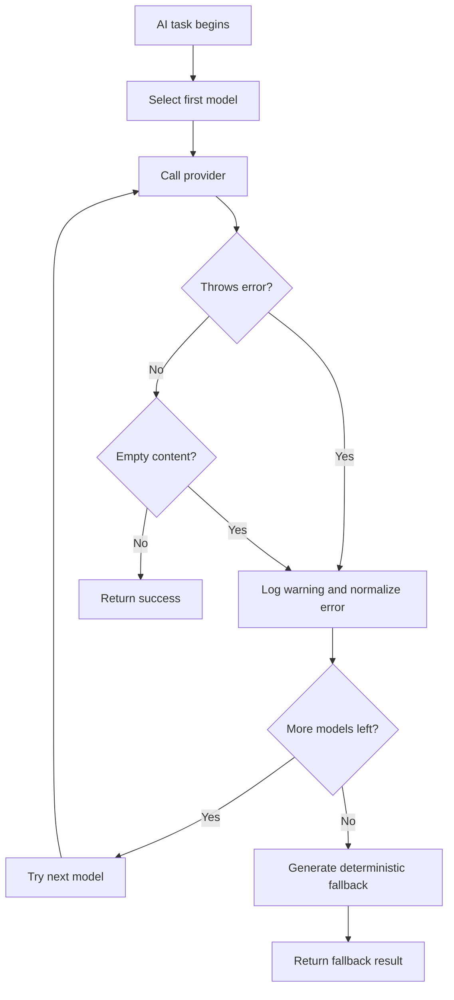
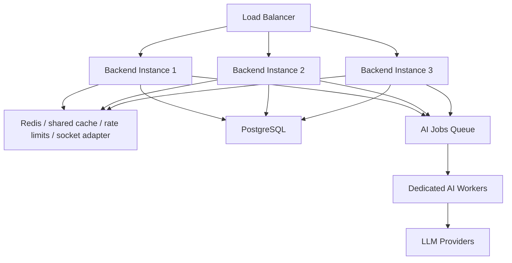
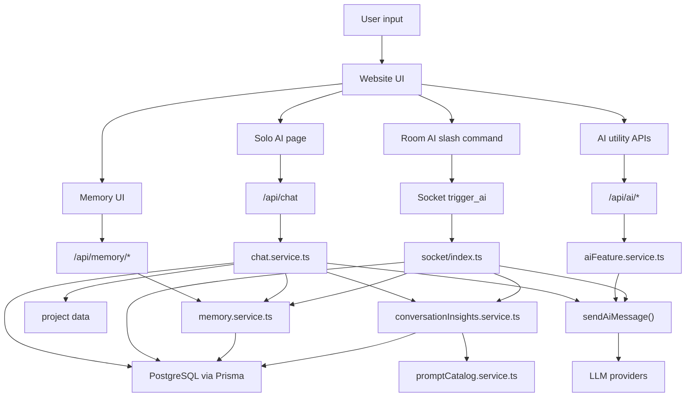

# ChatSphere AI System Documentation

## Scope

This document covers only the AI-related features that are implemented in the ChatSphere website and backend.

It is based on direct analysis of the current source tree.

It does not try to document unrelated authentication, moderation, analytics, or generic CRUD flows unless they materially affect AI execution.

It is written to help an engineer:

- understand the current AI design
- rebuild the AI system from scratch
- debug failures
- extend the product safely
- plan scaling work

## Evidence Base

The analysis in this document is grounded in these files:

- `backend/src/services/ai/gemini.service.ts`
- `backend/src/services/aiFeature.service.ts`
- `backend/src/services/chat.service.ts`
- `backend/src/services/memory.service.ts`
- `backend/src/services/conversationInsights.service.ts`
- `backend/src/services/promptCatalog.service.ts`
- `backend/src/services/aiQuota.service.ts`
- `backend/src/services/conversation.service.ts`
- `backend/src/services/project.service.ts`
- `backend/src/services/room.service.ts`
- `backend/src/services/message.service.ts`
- `backend/src/routes/chat.routes.ts`
- `backend/src/routes/ai.routes.ts`
- `backend/src/routes/conversations.routes.ts`
- `backend/src/routes/memory.routes.ts`
- `backend/src/routes/rooms.routes.ts`
- `backend/src/routes/settings.routes.ts`
- `backend/src/socket/index.ts`
- `backend/src/middleware/aiQuota.middleware.ts`
- `backend/src/middleware/rateLimit.middleware.ts`
- `backend/src/middleware/auth.middleware.ts`
- `backend/src/middleware/socketAuth.middleware.ts`
- `backend/src/middleware/validate.middleware.ts`
- `backend/src/middleware/error.middleware.ts`
- `backend/src/middleware/requestContext.middleware.ts`
- `backend/src/config/env.ts`
- `backend/src/config/startup.ts`
- `backend/src/config/prisma.ts`
- `backend/prisma/schema.prisma`
- `frontend/src/features/ai-chat/AiChatPage.tsx`
- `frontend/src/features/ai-chat/api.ts`
- `frontend/src/features/ai-chat/components/AiConversationSidebar.tsx`
- `frontend/src/features/ai-chat/components/AiConversationThread.tsx`
- `frontend/src/features/ai-chat/components/AiInspector.tsx`
- `frontend/src/features/ai-chat/ui.store.ts`
- `frontend/src/features/rooms/RoomsPage.tsx`
- `frontend/src/features/rooms/components/RoomThread.tsx`
- `frontend/src/features/rooms/components/RoomInspector.tsx`
- `frontend/src/pages/internal/MemoryPageImpl.tsx`
- `frontend/src/features/settings/SettingsPage.tsx`
- `frontend/src/features/uploads/api.ts`
- `frontend/src/shared/socket/socket-client.ts`
- `frontend/src/shared/socket/socket.store.ts`
- `frontend/src/shared/api/client.ts`
- `frontend/src/shared/api/errors.ts`
- `frontend/src/shared/types/contracts.ts`

## Executive Reality Check

ChatSphere already has a meaningful AI layer.

It supports:

- solo AI chat over HTTP
- room AI invocation over Socket.IO
- memory extraction and ranking
- structured conversation and room insights
- smart replies API
- sentiment API
- grammar improvement API
- model catalog listing
- AI-specific rate limiting and quota checks
- project context injection
- attachment-aware prompt enrichment

At the same time, several important architectural gaps exist.

The biggest ones are:

- JSON output is best-effort rather than guaranteed
- provider timeouts are not actually enforced correctly
- image attachments are not truly sent to providers as image parts
- several prompt templates exist but are not used by the corresponding features
- AI quota and rate limiting are in-memory only
- there is no streaming response path
- there is no vector store or embedding-based retrieval
- room AI stores `aiHistory`, but runtime prompting does not truly use that stored history
- room AI messages are persisted as AI messages but attributed to the triggering human user
- smart replies, sentiment, and grammar are exposed in the backend but are not visibly wired into the inspected frontend flows

Those gaps do not make the system unusable.

They do define the boundary between the current implementation and a production-grade scalable AI platform.

---

# 1. System Overview

## 1.1 What the AI system does

The AI system in ChatSphere is not a separate microservice.

It is an embedded AI orchestration layer inside the main Node.js backend.

That layer performs five broad jobs:

1. route AI requests to an available model provider
2. enrich prompts with chat history, project context, memory, and insight
3. normalize or fall back when providers fail
4. persist AI outputs back into the product data model
5. expose AI features over both HTTP and Socket.IO

## 1.2 AI capabilities visible in the product

### Solo AI chat

The website contains a dedicated AI workspace at `/app/ai`.

Users can:

- start a new AI conversation
- continue an old conversation
- select a model or use automatic routing
- select a project for additional context
- attach files
- inspect recent run telemetry
- request summaries, decisions, and tasks for the conversation

### Room AI

The website contains realtime rooms at `/app/rooms`.

Users can trigger room AI by typing `/ai <prompt>` in the room composer.

The server then:

- loads recent room messages
- retrieves relevant personal memories for the triggering user
- retrieves room insight
- calls the AI model
- persists the AI reply as a room message
- broadcasts the result to the room

### Memory

The website contains a memory management page at `/app/memory`.

The system automatically extracts memory candidates from user messages in solo AI chat.

Those memories are later ranked and injected into future prompts.

The user can also:

- review memories
- edit them
- pin them
- delete them

### Conversation and room insights

The backend can summarize:

- solo conversations
- group rooms

Those insights include:

- title
- summary
- intent
- topics
- decisions
- action items
- message count

### AI utility APIs

The backend also exposes:

- `/api/ai/models`
- `/api/ai/smart-replies`
- `/api/ai/sentiment`
- `/api/ai/grammar`

These are real capabilities in the backend.

In the inspected frontend, the settings page exposes toggles for smart replies, sentiment, and grammar.

However, the visible UI flows do not currently show dedicated controls that call those three utility endpoints.

That means the platform capability is ahead of the website surface in this part of the product.

## 1.3 Product-level value of AI

AI enhances ChatSphere in four distinct ways:

| AI role | User value | Backend mechanism | Persistence impact |
|---|---|---|---|
| Conversational assistant | Helps users draft, analyze, and plan | `handleSoloChat()` + `sendAiMessage()` | Conversation JSON updated |
| Collaborative room assistant | Brings AI into live group discussions | `trigger_ai` socket event | `Message` row created |
| Context memory | Personalizes future responses | `memory.service.ts` | `MemoryEntry` rows updated |
| Insight engine | Converts long threads into decisions/tasks | `conversationInsights.service.ts` | `ConversationInsight` rows updated |

## 1.4 End-to-end user journey

### Solo chat journey

1. User opens the AI page.
2. Frontend fetches conversations, models, and projects.
3. User writes a prompt.
4. Optional attachment is uploaded.
5. Optional project context is selected.
6. Frontend posts to `/api/chat`.
7. Backend validates auth, rate limit, and AI quota.
8. Backend loads prior conversation history.
9. Backend loads relevant memories.
10. Backend loads conversation insight if the conversation already exists.
11. Backend builds a composite prompt.
12. Backend routes the request to a model provider.
13. Backend receives an answer or a deterministic fallback.
14. Backend appends both user and assistant messages to the conversation JSON.
15. Backend extracts new memories from the user message.
16. Backend marks used memories.
17. Backend refreshes conversation insight asynchronously.
18. Frontend shows the AI response and telemetry.

### Room AI journey

1. User opens a room.
2. Frontend joins the socket room.
3. User types `/ai summarize the last discussion`.
4. Frontend emits `trigger_ai`.
5. Backend checks socket flood limit.
6. Backend checks AI quota.
7. Backend verifies room membership.
8. Backend loads the last 20 room messages.
9. Backend loads relevant memories for the prompting user.
10. Backend loads room insight.
11. Backend builds the AI prompt.
12. Backend calls the provider chain.
13. Backend stores the AI result as a room message.
14. Backend updates `Room.aiHistory`.
15. Backend broadcasts `message_created`.
16. Frontend renders the AI message in the room thread.

## 1.5 High-level architecture map



## 1.6 Key takeaways

- ChatSphere uses AI as a first-class feature, not as a toy demo.
- The system is centered around one reusable provider abstraction: `sendAiMessage()`.
- Personalization is driven by memory extraction plus retrieval.
- Insight generation is treated as a cached derived artifact.
- The design is pragmatic and workable for a single-instance deployment.
- The current implementation is not yet a hardened multi-instance AI platform.

---

# 2. Complete AI Architecture

## 2.1 Architectural layers

The AI system is distributed across six layers.

### Layer 1: Product entry points

These are the paths where AI begins from the user perspective:

- `frontend/src/features/ai-chat/AiChatPage.tsx`
- `frontend/src/features/rooms/RoomsPage.tsx`
- future-capable API consumers for smart replies, sentiment, grammar

### Layer 2: Transport and policy

These decide whether a request is allowed to reach AI logic:

- `protect`
- `aiLimiter`
- `aiQuota`
- socket flood control
- socket auth
- Zod validation

### Layer 3: Use-case orchestration

These services know what kind of AI work is being done:

- `handleSoloChat()`
- `generateSmartReplies()`
- `analyzeSentiment()`
- `improveGrammar()`
- `extractAiCandidates()`
- `buildInsightPayload()`
- room `trigger_ai` event handler

### Layer 4: Prompt/context composition

This is the layer that decides what text and history the model actually sees.

It includes:

- current user message
- conversation or room history
- project context
- memory summaries
- conversation or room insight
- attachment note
- optional prompt templates

### Layer 5: Provider routing

This is implemented in `backend/src/services/ai/gemini.service.ts`.

Despite its filename, it is the general AI router for the whole system.

### Layer 6: Persistence and feedback loop

The result of AI execution is written back into product storage:

- conversation messages JSON
- room messages
- room AI history
- memory entry usage counts
- conversation and room insights
- model telemetry embedded into stored messages

## 2.2 Core architecture principles in the current design

The current design follows these principles:

### One shared AI execution function

All AI features eventually flow into `sendAiMessage()`.

That is the most important architectural decision in the AI layer.

It centralizes:

- model selection
- provider calling
- fallback strategy
- usage estimation
- telemetry creation

### Best-effort structured output

Features like memory extraction and insight generation expect JSON-like output.

The system does not enforce structured output at the provider protocol level.

It tries to parse the returned text as JSON.

If parsing fails, it either:

- falls back to a weaker representation
- or returns a deterministic fallback

This is simple.

It is also one of the system's major reliability weaknesses.

### Context assembly at the orchestration layer

The router does not know business context.

Use-case services build the input.

Examples:

- `chat.service.ts` injects project context, memory, and insight
- `memory.service.ts` sends raw user text for memory extraction
- `conversationInsights.service.ts` injects a prompt template for insights
- the room socket handler injects recent room history plus memory plus room insight

### Deterministic fallback over hard failure

If providers fail, the system prefers to return something predictable instead of crashing the user flow.

This is especially clear in:

- smart replies
- sentiment
- grammar
- insight generation
- general chat fallback message

## 2.3 AI architecture diagram



## 2.4 Model routing system

### Catalog source

The model catalog is not fetched from providers dynamically.

It is synthesized from environment variables.

That happens in:

- `parseOpenRouterModels()`
- `providerModelDefaults()`
- `refreshModelCatalog()`

### Catalog properties

Each model definition contains:

- `id`
- `provider`
- `label`
- `supportsImages`
- `supportsJson`

### Catalog refresh behavior

The catalog is cached in memory.

It has a 10-minute TTL.

Startup attempts a forced refresh.

Important observation:

The refresh process does not query provider APIs.

It only reparses environment-based definitions.

So the word `refresh` here means `rebuild from env and cache`.

It does not mean `discover live provider models`.

## 2.5 Request lifecycle at the AI core

For every `sendAiMessage()` call:

1. start timer
2. normalize history
3. estimate complexity from the message
4. resolve the model chain
5. iterate providers in priority order
6. call the provider
7. reject empty strings
8. synthesize usage estimates from character counts
9. synthesize telemetry
10. return result
11. if provider fails, log warning and try next model
12. if all fail, return deterministic fallback

## 2.6 Complexity estimation

The complexity classifier is intentionally simple.

It returns:

- `high` if the message is over 1000 characters or includes terms like `architecture`, `refactor`, `analysis`, `plan`, or `design`
- `medium` if over 250 characters
- `low` otherwise

This complexity score influences model selection.

It does not change prompt construction.

It does not change generation parameters.

It does not control token budgets.

It only affects routing preference and telemetry.

## 2.7 Provider order

The provider fallback order is:

1. `openrouter`
2. `gemini`
3. `grok`
4. `groq`
5. `together`
6. `huggingface`

### Important caveat

The code claims Grok, Groq, and Together are routed through OpenRouter if directly unavailable.

But `isProviderEnabled()` still requires their direct API keys to be present.

That creates a behavioral contradiction:

- the call path uses OpenRouter-style execution
- the enablement gate blocks those models unless their own provider keys exist

## 2.8 Architectural strengths

- Shared AI router keeps the system cohesive.
- The context layer is product-aware.
- Provider fallback is already built in.
- Deterministic fallback reduces broken UX.
- Model catalog exposure allows the frontend to present routing options.
- Prompt templates are already abstracted enough to support admin override for some tasks.

## 2.9 Architectural weaknesses

- Filename `gemini.service.ts` understates its true responsibility.
- Output JSON mode is not protocol-enforced.
- True multimodal image prompting is not implemented.
- Timeout handling is incomplete.
- Model discovery is static.
- There is no request queue, no circuit breaker, and no streaming.
- Shared state used for quotas and flood limits is not horizontally scalable.

---

# 3. AI Service Deep Dive

## 3.1 `sendAiMessage()` is the heart of the AI system

If one function defines ChatSphere's AI architecture, it is `sendAiMessage()`.

Everything else either:

- prepares data for it
- or consumes its output

## 3.2 Input contract

The input fields are:

| Field | Purpose | Used by current implementation |
|---|---|---|
| `task` | Declares AI job type | yes |
| `message` | Primary prompt body | yes |
| `history` | Prior turns | yes |
| `modelId` | Requested model override | yes |
| `attachment` | File metadata and optional inline content | yes |
| `outputJson` | Signals structured-output expectation | partially |

The supported tasks are:

- `chat`
- `memory`
- `insight`
- `smart-replies`
- `sentiment`
- `grammar`

## 3.3 How prompts are built today

Prompt assembly is distributed.

There is no single prompt-builder module that all features use.

### Solo chat prompt assembly

Implemented in `chat.service.ts`.

The final message is built from:

- the user's current message
- project name
- project description
- project instructions
- project context
- relevant memory summaries
- existing conversation insight summary

Those parts are concatenated with newlines.

### Room AI prompt assembly

Implemented inline inside the `trigger_ai` socket handler.

The final prompt is built from:

- the prompt text emitted by the user
- memory summaries
- room insight summary

Recent room messages are passed as `history`.

### Insight prompt assembly

Implemented in `conversationInsights.service.ts`.

This is one of the few places that actually uses `promptCatalog.service.ts`.

The service:

1. loads the `conversation-insight` template
2. interpolates `{{message}}`
3. sends the template-expanded prompt to `sendAiMessage()`

### Memory extraction prompt assembly

Implemented in `memory.service.ts`.

It sends the raw user message directly to `sendAiMessage({ task: "memory" ... })`.

Important finding:

There is a default prompt template called `memory-extract`.

That template is not used by the current extraction flow.

### Smart replies, sentiment, grammar prompt assembly

Implemented in `aiFeature.service.ts`.

These utilities pass the raw `message` field directly into `sendAiMessage()`.

Important finding:

Default prompt templates for `smart-replies`, `sentiment`, and `grammar` exist.

These templates are not used in the current AI utility routes.

## 3.4 Context injection model

The current system supports four kinds of context.

### Context type 1: history

History is injected as structured `role/content` pairs.

For solo chat:

- history comes from the existing conversation JSON
- only the last 18 non-empty messages are kept

For room AI:

- history comes from the last 20 room messages
- messages are reversed into chronological order
- AI messages are mapped to `assistant`
- human messages are mapped to `user`
- each history message is converted to text in the form `username: content`

### Context type 2: project context

Solo chat can bind to a `Project`.

If a project is selected, these fields are injected into the prompt:

- name
- description
- instructions
- context

### Context type 3: memory

Memory is injected as a summarized string.

For solo chat:

`Relevant memory: summary1 | summary2 | ...`

For room AI:

`Memories: summary1 | summary2 | ...`

The system does not currently inject:

- memory details
- source references
- structured memory tags
- memory confidence scores

### Context type 4: insight

Insight is injected as one summary string.

This acts as a compressed interpretation of prior conversation state.

## 3.5 Attachment handling

Attachment support exists, but it is more limited than the model metadata suggests.

### What is actually supported

If an attachment is present:

- file name may be included
- file size may be included
- a note may indicate the attachment is a PDF
- inline text content may be included for text-like files
- a note may indicate an image base64 payload exists

### What is not actually implemented

- the provider calls do not send image content as provider-native multimodal image parts
- the provider calls do not fetch the remote `fileUrl`
- the provider calls do not pass PDF binary content
- the provider calls do not parse documents server-side

### Consequence

For text files:

- partial contextual usefulness exists because the frontend reads text and sends `textContent`

For image files:

- the system mostly tells the model that an image exists
- it does not truly give the model the image content

## 3.6 Model selection logic

`resolveTaskModel()` does the routing.

It considers:

- model catalog
- complexity estimate
- task type
- optional requested model ID

### Requested model behavior

If the frontend asks for a specific `modelId` and it exists in the catalog:

- that model becomes first in the chain
- all remaining models are appended after it

If it fails, fallback still happens.

### Insight and memory behavior

If task is `insight` or `memory`:

- only `supportsJson` models are prioritized

That is a reasonable approximation.

But because JSON mode is not truly enforced, the guarantee is weak.

## 3.7 Provider-specific execution

### OpenRouter

The code calls:

- `POST https://openrouter.ai/api/v1/chat/completions`

Payload:

- `model`
- `messages`

Notably absent:

- `response_format`
- `temperature`
- `max_tokens`
- `stream`
- timeout signal

### Gemini

The code calls:

- `POST https://generativelanguage.googleapis.com/v1beta/models/{model}:generateContent`

Payload:

- `contents`

Notably absent:

- system instruction separation
- generation config
- safety settings
- response MIME config
- JSON schema control
- timeout signal

### HuggingFace

The code calls:

- `POST https://api-inference.huggingface.co/models/{model}`

Payload:

- `inputs`

### Grok, Groq, Together

The switch path calls `callOpenRouter()` with a modified provider field.

This is a useful shortcut.

It should be treated as provisional rather than complete provider-native support.

## 3.8 Timeout behavior

The code contains `withTimeout()`.

It creates an `AbortController`.

It creates a timer that calls `controller.abort()`.

However:

- the signal is never passed into `fetch`
- the promise is not wrapped in a `Promise.race`

So the function does not actually enforce cancellation of the provider call.

This is one of the most important reliability findings in the AI subsystem.

## 3.9 Error normalization

Provider errors are mapped into coarse categories:

- `rate_limit`
- `model_unavailable`
- `credit_exhausted`
- `transient`

This is only used for logs.

It is not returned to the frontend in the main AI flows.

## 3.10 Deterministic fallback

The fallback logic is task-aware.

### Smart replies fallback

Returns a JSON string array with generic replies.

### Sentiment fallback

Returns a JSON object with:

- `label: neutral`
- `confidence: 0.51`
- `reason`

### Grammar fallback

Returns the original message trimmed.

### Generic JSON fallback

If `outputJson` is set:

- returns a summary-like object with empty topics, decisions, and action items

### Generic text fallback

Returns a generic provider-unavailable sentence.

## 3.11 Usage accounting

Usage is estimated by character count divided by 4.

That means:

- prompt tokens are heuristic
- completion tokens are heuristic
- total tokens are heuristic

This is acceptable for UX telemetry.

It is not accurate enough for billing or hard budgeting.

## 3.12 Telemetry contract

Returned telemetry includes:

- `provider`
- `selectedModel`
- `fallbackUsed`
- `complexity`
- `processingMs`
- `category`

## 3.13 Deep assessment of `gemini.service.ts`

### Responsibilities

- maintain model catalog
- determine routing order
- estimate request complexity
- map attachments into prompt notes
- call providers
- synthesize usage
- synthesize telemetry
- fallback deterministically

### Strengths

- centralizes AI execution
- already supports multiple providers
- exposes a stable result contract
- tolerates provider failure gracefully

### Weaknesses

- filename no longer matches scope
- no true timeout enforcement
- no streaming
- no provider-native JSON schema mode
- no actual image parts support
- no prompt template integration inside the router
- static env-only catalog

---

# 4. AI Request Flow

## 4.1 Solo chat flow



### Detailed solo chat step-by-step

1. The frontend sends a `POST /api/chat`.
2. The request is authenticated with bearer token middleware.
3. `aiLimiter` applies per-minute throttling.
4. `aiQuota` applies a separate AI quota window.
5. Zod validates message, IDs, and optional attachment.
6. `handleSoloChat()` trims the message.
7. Empty message is rejected.
8. If `conversationId` exists, conversation ownership is verified.
9. If `projectId` exists, project ownership is verified.
10. Project mismatch between provided conversation and provided project is rejected.
11. Relevant memories are retrieved.
12. Existing conversation insight is fetched.
13. Prior conversation messages are normalized into history.
14. Prompt parts are assembled.
15. `sendAiMessage()` is called.
16. The assistant answer is stored next to the user message.
17. Memory extraction runs on the user message.
18. Used memories are marked.
19. Conversation insight is refreshed asynchronously.
20. Final response returns content, memory refs, insight, model, usage, telemetry.

## 4.2 Room AI trigger flow



### Detailed room AI step-by-step

1. The user types `/ai ...` in the room composer.
2. Frontend detects the slash command and emits `trigger_ai`.
3. Socket flood control runs first.
4. Payload is validated using Zod.
5. AI quota is checked using the in-memory quota map.
6. Membership in the room is verified.
7. `ai_thinking` is broadcast to the room.
8. Last 20 non-deleted messages are loaded.
9. Relevant memories for the prompting user are loaded.
10. Current room insight is loaded.
11. History is built from the recent messages.
12. Prompt text is built from the user prompt plus memory plus room insight.
13. `sendAiMessage()` is called with task `chat`.
14. Result is stored as a room message with `isAI: true`.
15. Room `aiHistory` is appended and trimmed to 30 entries.
16. Used memories are marked.
17. `message_created` is broadcast.
18. `ai_thinking` is set to false.

## 4.3 Smart replies, sentiment, and grammar flows

### Smart replies

The backend flow is:

- `POST /api/ai/smart-replies`
- auth + limiter + quota
- assert feature enabled in settings
- `sendAiMessage(task=smart-replies, outputJson=true)`
- parse JSON array if possible
- otherwise return raw string as a single reply

### Sentiment

The backend flow is:

- `POST /api/ai/sentiment`
- auth + limiter + quota
- assert feature enabled in settings
- `sendAiMessage(task=sentiment, outputJson=true)`
- parse JSON object if possible
- otherwise return neutral plus raw reason text

### Grammar

The backend flow is:

- `POST /api/ai/grammar`
- auth + limiter + quota
- assert feature enabled in settings
- `sendAiMessage(task=grammar)`
- return improved text

## 4.4 Insight flow

Both room and conversation insights use the same insight builder.

### Conversation insight

1. Conversation messages are loaded.
2. Messages are flattened to `role: content` text.
3. Prompt template `conversation-insight` is interpolated.
4. `sendAiMessage(task=insight, outputJson=true)` is called.
5. JSON is parsed if possible.
6. If parsing or provider call fails, deterministic insight is created.
7. The result is upserted in `ConversationInsight`.

### Room insight

1. Last 200 room messages are loaded.
2. Messages are flattened to `username: content`.
3. The same insight template flow runs.
4. The result is upserted in `ConversationInsight` under room scope.

## 4.5 Request-flow differences across features

| Feature | Entry type | Uses history | Uses memory | Uses insight | Stores output | Returns telemetry |
|---|---|---|---|---|---|---|
| Solo chat | HTTP | yes | yes | yes | conversation JSON | yes |
| Room AI | Socket | yes | yes | yes | `Message` row + room AI history | yes |
| Smart replies | HTTP | no | no | no | no | model + usage only |
| Sentiment | HTTP | no | no | no | no | model + usage only |
| Grammar | HTTP | no | no | no | no | no direct telemetry UI |
| Memory extraction | internal service | no | n/a | no | `MemoryEntry` rows | indirect |
| Insight generation | internal service | flattened text | no | n/a | `ConversationInsight` rows | indirect |

---

# 5. Memory System and Context Engineering

## 5.1 What the memory system is trying to achieve

The memory system is not a vector database.

It is a pragmatic structured memory layer designed to make future AI answers more personalized.

Its goals are:

- extract durable user facts from messages
- avoid storing every sentence as memory
- rank memory by relevance and importance
- inject memory summaries into later prompts
- let users manually curate memory

## 5.2 Storage model

Memories are stored in `MemoryEntry`.

Fields include:

- `summary`
- `details`
- `tags`
- `sourceReferences`
- `confidence`
- `importance`
- `recency`
- `pinned`
- `usageCount`
- `lastUsedAt`
- `fingerprint`

This is a good schema for explainable memory.

It is not an embedding schema.

## 5.3 Memory extraction pipeline

Memory extraction has two sources.

### Source 1: deterministic extraction

`extractDeterministicCandidates()` scans the user message for heuristics like:

- preferences
- deadlines
- commitments
- project context

### Source 2: AI-assisted extraction

`extractAiCandidates()` calls `sendAiMessage(task="memory", outputJson=true)`.

It expects the model to return an array of candidate objects.

If parsing fails, the AI extraction contribution becomes empty.

## 5.4 Merge and upsert behavior

The two extraction streams are merged by lowercased summary text.

Each candidate receives:

- normalized tags
- a fingerprint derived from `userId + normalized summary`
- source references including conversation ID and timestamp when available

Upsert then:

- creates the memory if fingerprint is new
- updates the memory if fingerprint already exists

## 5.5 Memory ranking

Relevant memories are retrieved from the latest 100 memories for the user.

Ranking uses token overlap plus metadata boosts.

### Score ingredients

- summary/detail token overlap: `0.4`
- importance: `0.25`
- confidence: `0.2`
- recency: `0.1`
- pinned boost: `0.2`
- usage boost: up to `0.2`

### Why this matters

This is a hand-built ranking function.

It gives ChatSphere:

- explainable scoring
- no external vector dependency
- deterministic behavior

It also has limits:

- lexical overlap misses semantic similarity
- synonyms are not captured well
- ranking quality declines as memory corpus grows

## 5.6 Memory retrieval flow



## 5.7 Memory usage loop

When memories are retrieved and used:

- their IDs are stored as `memoryRefs`
- usage count is incremented
- `lastUsedAt` is updated
- recency is reset to `1`

This creates a feedback loop.

## 5.8 Memory input and output contracts

### Input into the memory system

The main input is the user's solo-chat message text.

Metadata may include:

- conversation ID
- timestamp

### Output from the memory system

Outputs appear in three forms:

1. stored `MemoryEntry` rows
2. ranked memory references attached to conversation or room responses
3. prompt context injection as summarized strings

## 5.9 Memory in solo chat

Solo chat does two different memory operations in the same request:

### Retrieval

Before calling AI:

- it asks for relevant memories based on the new prompt

### Extraction

After the assistant answer:

- it extracts durable memory from the user's message

## 5.10 Memory in room AI

Room AI only retrieves memory.

It does not extract new memory from the room slash prompt.

## 5.11 Memory UI integration

The frontend memory page lets the user:

- search memory
- filter pinned
- edit summary/details/tags
- toggle pin
- delete memory

## 5.12 Weaknesses in the current memory design

- no vector retrieval
- no semantic embeddings
- no decay job that lowers recency over time
- no cluster deduplication beyond summary fingerprint
- no memory categories
- no automatic stale-memory review

## 5.13 Improvements that fit the current design

- store retrieval reasons
- inject memory details only when score is high
- add periodic recency decay
- add memory categories
- add embeddings and vector search later

---

# 6. Chat and AI Integration

## 6.1 Integration pattern

ChatSphere uses two AI interaction modes.

### Mode 1: synchronous HTTP AI chat

Used for solo chat.

### Mode 2: realtime Socket.IO room AI

Used for room slash-triggered AI.

## 6.2 Why there are two paths

Solo chat has different needs:

- personal context
- conversation persistence
- inspector telemetry
- project context
- attachments

Room AI has different needs:

- live collaboration
- broadcast updates
- room membership enforcement
- typing and thinking signals
- message-style output

## 6.3 Solo chat integration details

### Frontend behavior

`AiChatPage.tsx` does the following:

- fetches conversations
- fetches models
- fetches projects
- fetches current conversation detail
- fetches current insight
- lets the user pick a model
- lets the user pick a project
- uploads an attachment if present
- performs optimistic UI for ongoing messages
- stores latest run telemetry in local UI store

### Backend behavior

`/api/chat` delegates to `handleSoloChat()`.

The response returns:

- `conversationId`
- `content`
- `memoryRefs`
- `insight`
- `model`
- `usage`
- `telemetry`

## 6.4 Room AI integration details

### Frontend behavior

`RoomsPage.tsx` checks whether the message starts with `/ai `.

If it does:

- the text after `/ai` becomes the prompt
- `emitSocketEvent("trigger_ai", ...)` is called
- the UI waits for `ai_thinking` and `message_created`

### Backend behavior

The socket handler:

- emits `ai_thinking: true`
- does AI work
- persists result as a `Message`
- broadcasts `message_created`
- emits `ai_thinking: false`

## 6.5 Real-time AI response behavior

The current system is realtime but not streaming.

### What realtime means here

- the room sees a thinking state
- the room receives the final AI message via broadcast

### What streaming would mean

- tokens or chunks arrive progressively
- the message grows over time

ChatSphere does not currently implement token streaming for either solo chat or room AI.

## 6.6 AI messages stored in the database

### Solo chat persistence

Solo chat messages are stored inside `Conversation.messages` JSON.

Assistant messages include:

- `role`
- `content`
- `timestamp`
- `memoryRefs`
- `modelTelemetry`

### Room AI persistence

Room AI is stored in the relational `Message` table.

Fields include:

- `isAI`
- `triggeredBy`
- `memoryRefs`
- `modelId`
- `modelProvider`
- `modelTelemetry`

## 6.7 Important room AI identity nuance

The room AI message is stored using the triggering user's `userId`.

Then `isAI` is set to true.

This means:

- the message is AI-authored in behavior
- but human-authored in ownership identity

## 6.8 Attachment integration

### Solo AI chat

Attachments can contribute:

- file metadata
- inline text content for some file types
- base64 string prepared on the frontend for images

### Room chat

Attachments are standard room attachments.

They are not routed into AI unless the user triggers room AI with a slash prompt.

## 6.9 Inspector and telemetry integration

The AI chat inspector shows:

- latest insight
- latest run model
- total token estimate
- processing time
- selected model
- quick actions for summarize, tasks, and decisions

---

# 7. API and Route Flow for AI

## 7.1 `/api/chat`

### Middleware chain

- `protect`
- `aiLimiter`
- `aiQuota`
- `validateBody(chatBodySchema)`

### Input schema

| Field | Type | Notes |
|---|---|---|
| `message` | string | required, 1..6000 |
| `conversationId` | uuid | optional |
| `modelId` | string | optional |
| `projectId` | uuid | optional |
| `attachment.textContent` | string | max 20000 |
| `attachment.base64` | string | max 1.5M chars |

### Output shape

| Field | Meaning |
|---|---|
| `conversationId` | created or existing conversation ID |
| `content` | assistant answer |
| `memoryRefs` | memory IDs used |
| `insight` | current conversation insight |
| `model` | provider/model identity |
| `usage` | heuristic token estimates |
| `telemetry` | execution metadata |

## 7.2 `/api/ai/models`

Returns:

- `auto`
- `models`

The frontend AI page uses this to populate its model selector.

## 7.3 `/api/ai/smart-replies`

Purpose:

- generate quick response suggestions

Current product status:

- backend exists
- frontend UI integration is not visible in inspected flows

## 7.4 `/api/ai/sentiment`

Purpose:

- classify tone and confidence

## 7.5 `/api/ai/grammar`

Purpose:

- improve wording without changing intent

## 7.6 `trigger_ai` socket event

### Validation and policy

- socket auth already happened at handshake
- flood control
- payload validation
- AI quota
- room membership

### Output channels

- room-wide `ai_thinking`
- room-wide `message_created`
- socket ack with model and usage
- socket-level `socket_error`

## 7.7 Conversation and room insight routes

These indirectly invoke AI by refreshing or consuming cached summaries.

- `GET /api/conversations/:conversationId/insights`
- `POST /api/conversations/:conversationId/actions`
- `GET /api/rooms/:roomId/insights`
- `POST /api/rooms/:roomId/actions`

## 7.8 Memory routes

Memory is part of AI because it shapes future prompts.

Routes include:

- `GET /api/memory`
- `PUT /api/memory/:memoryId`
- `DELETE /api/memory/:memoryId`
- `POST /api/memory/import`
- `GET /api/memory/export`

## 7.9 Missing API-level concerns

- no idempotency keys
- no provider-specific retry hints in normal success responses
- no streaming endpoint
- no structured output schema contracts
- no explicit per-user usage ledger

---

# 8. AI Security and Rate Limiting

## 8.1 Security layers in front of AI

- authentication
- feature-level user settings
- rate limiting
- quota limiting
- input validation

## 8.2 `aiLimiter`

`aiLimiter` is an `express-rate-limit` instance.

Behavior:

- 60-second window
- max requests defined by `env.aiRateLimitPerMinute`
- keyed by user ID if present, otherwise IP

Response on limit:

- `AI_RATE_LIMITED`
- `retryAfterMs`
- `requestId`

## 8.3 `aiQuota`

`aiQuota` is separate from `aiLimiter`.

It is implemented in-memory in `aiQuota.service.ts`.

Defaults:

- 15-minute window
- max 20 AI requests

## 8.4 Socket flood control

Defaults:

- 10-second window
- max 60 events per socket

## 8.5 Abuse prevention strengths

- bounded prompt length
- bounded attachment sizes
- auth required
- room membership required for room AI
- AI routes are not public
- per-user feature toggles exist
- logs redact secrets

## 8.6 Security weaknesses

### In-memory enforcement

`aiQuota` and socket flood state live in memory.

In multi-instance deployment:

- users can effectively get extra quota by hitting different instances
- rate and quota behavior becomes inconsistent

### Attachment exposure

Uploaded files can be fetched through `/api/uploads/:filename` without auth.

### Prompt injection exposure

Project context, memory details, and conversation content are concatenated into prompts with limited isolation.

### No output filtering

There is no output moderation layer around the AI result before it is saved.

## 8.7 Rate limiting table

| Mechanism | Scope | Storage | Purpose | Scaling status |
|---|---|---|---|---|
| `apiLimiter` | general API | express memory store | generic abuse control | not shared |
| `aiLimiter` | AI HTTP routes | express memory store | burst AI control | not shared |
| `aiQuota` | AI HTTP + socket | local `Map` | AI budget window | not shared |
| socket flood limit | all socket events | local `Map` | per-socket spam control | not shared |

---

# 9. Failure Handling in AI

## 9.1 Failure philosophy

The system prefers graceful degradation over total failure.

## 9.2 Failure categories

- provider failure
- timeout or hang
- empty provider output
- malformed structured output
- quota and rate rejection
- validation rejection
- persistence failure after generation
- background insight refresh failure

## 9.3 Provider failure path

When a provider call throws:

1. `normalizeProviderError()` categorizes it
2. warning log is emitted
3. `fallbackUsed` is set to true
4. the router tries the next model in the chain

## 9.4 Failure flow diagram



## 9.5 Deterministic fallback quality

### Strong fallback cases

- smart replies
- sentiment
- grammar
- insight summary shell

### Weak fallback cases

- general chat

## 9.6 Structured-output failure handling

Current structured-output flows use parse-and-fallback.

Examples:

- smart replies parse JSON array
- sentiment parse JSON object
- insight parse JSON object
- memory extraction parse JSON array

## 9.7 Timeout issues

The biggest hidden failure mode is request hanging.

Because `withTimeout()` does not wire the abort signal into fetch, a slow provider may block much longer than intended.

## 9.8 Persistence-after-generation failure

A provider may succeed but database persistence may fail afterward.

There is no compensation layer for this.

## 9.9 Background insight refresh failure

Solo chat runs `refreshConversationInsight()` asynchronously.

If it fails:

- a warning is logged
- the chat request still succeeds

---

# 10. Stability Analysis

## 10.1 What happens under moderate load

At moderate scale on a single instance, the system should work acceptably because:

- AI execution is synchronous and simple
- memory retrieval is lightweight
- insight generation scopes are bounded
- model catalog is cached
- frontend keeps contracts small

## 10.2 Likely bottlenecks

### AI latency

Provider latency dominates the critical path for:

- solo chat
- room AI
- insight refresh
- memory extraction

### Prisma calls

Each solo chat request can do several DB operations.

### Socket fanout

Room AI triggers can broadcast to many connected clients.

The broadcast itself is cheap.

The expensive part is the inline provider call in the socket handler.

## 10.3 High-latency paths

| Path | Latency contributors |
|---|---|
| Solo chat with project and attachment | upload + DB reads + provider latency + DB writes |
| Room AI | quota check + DB reads + provider latency + message create + room update |
| Insight refresh | message fetch + provider latency + upsert |
| Memory extraction | provider latency + upsert |

## 10.4 Stability positives

- bounded message sizes
- bounded history windows
- deterministic fallback avoids total UX failure
- async conversation insight refresh avoids blocking the main request
- cached model catalog avoids repeated env parsing

## 10.5 Stability risks

- fake timeout protection
- no backpressure queue
- in-memory quota and rate state
- no provider health cache
- no streaming means users wait for the full completion
- no request cancellation from client down to provider

## 10.6 Specific code-level stability findings

### Unused context limit

`env.aiContextMessageLimit` exists.

The current history windows are hardcoded:

- solo chat slices last 18 messages
- room AI takes last 20 messages

### Room `aiHistory` underused

Room creation seeds `aiHistory`.

Room AI updates `aiHistory`.

The active prompt path does not read `Room.aiHistory` to assemble history.

---

# 11. Scaling the AI System

## 11.1 Single-instance assumptions in the current design

The current AI architecture assumes:

- one backend instance or effectively sticky traffic
- in-process shared memory is acceptable
- provider calls happen inline
- persistence volume is modest

## 11.2 Multi-instance problems

### Problem 1: quota inconsistency

`aiQuota.service.ts` uses a local `Map`.

### Problem 2: rate limit inconsistency

`express-rate-limit` default memory store is local to each instance.

### Problem 3: socket state fragmentation

`userSockets` and socket flood state are in-memory.

### Problem 4: no distributed work coordination

Provider calls happen inline in the serving process.

## 11.3 Horizontal scaling architecture target



## 11.4 What to move first when scaling

Priority order:

1. Redis-backed quota and rate limiting
2. Redis Socket.IO adapter
3. provider health and circuit breaker state in Redis or shared cache
4. optional AI work queue
5. vector retrieval service

## 11.5 Data-model scaling notes

### Conversations

Storing solo chat as JSON is simple but limiting.

### Memory

Memory is already relational enough to scale.

### Message telemetry

A dedicated AI run log table would scale analytics better.

---

# 12. API Keys and Provider Management

## 12.1 Environment-based configuration

Provider management is entirely env-driven.

Configured values include:

- `OPENROUTER_API_KEY`
- `OPENROUTER_DEFAULT_MODEL`
- `OPENROUTER_MODELS`
- `GEMINI_API_KEY`
- `GEMINI_MODEL`
- `GROK_API_KEY`
- `GROQ_API_KEY`
- `TOGETHER_API_KEY`
- `HUGGINGFACE_API_KEY`

## 12.2 Startup behavior

Startup tries to:

- validate base env
- refresh prompt catalog
- refresh model catalog

Provider keys are not hard-required for boot.

## 12.3 Provider management strengths

- easy to configure
- easy to switch defaults
- easy to expose model list to frontend
- easy to disable providers by removing keys

## 12.4 Provider management risks

- no admin UI for provider health
- no key rotation workflow
- no per-provider budget management
- no live model availability verification

---

# 13. Edge Cases

## 13.1 Invalid prompt

Rejected by schema if empty or too long.

## 13.2 Empty provider response

Treated as failure.

Next model is tried.

## 13.3 Malformed JSON result

Falls back differently per feature.

## 13.4 AI hallucination

The system has no hallucination detector.

Current mitigations are indirect:

- project context
- memory injection
- insight injection
- deterministic fallback for some tasks

## 13.5 Race condition: simultaneous room AI triggers

Two users can trigger AI in the same room at the same time.

Effects:

- both prompts run independently
- both read overlapping recent history
- replies may arrive in either order
- both update `Room.aiHistory`

## 13.6 Race condition: memory updates

Two requests may update the same memory summary fingerprint in close succession.

Prisma upsert preserves database integrity.

## 13.7 Race condition: insight refresh

Conversation insight can be refreshed lazily on read, asynchronously after chat, or manually through action endpoints.

The last write wins.

## 13.8 Attachment mismatch

The user may expect PDF understanding or image analysis.

The backend currently mostly supports text extraction from client-side file reads and attachment metadata notes.

## 13.9 Auto model semantics in room AI

Room AI sends `modelId: "auto"`.

`resolveTaskModel()` only treats a requested model specially if it matches a real catalog model.

So `auto` simply falls back to normal routing.

## 13.10 Edge-case table

| Edge case | Current behavior | Risk |
|---|---|---|
| Empty prompt | rejected | low |
| Too-long prompt | rejected | low |
| Empty AI text | next model or fallback | medium |
| Bad JSON from provider | parse fallback | medium |
| Hung provider | may hang longer than intended | high |
| Simultaneous room AI | independent replies | medium |
| Upload image expecting vision | model does not truly see image | high |
| Disabled feature called | 403 `FEATURE_DISABLED` | low |
| Multi-instance quota | inconsistent limits | high |

---

# 14. How to Fix Failures

## 14.1 Debugging checklist for solo chat failures

1. Confirm frontend request payload.
2. Confirm `Authorization` header exists.
3. Check `AI_RATE_LIMITED` vs `AI_QUOTA_EXCEEDED`.
4. Check request logs by `requestId`.
5. Inspect provider warning logs.
6. Confirm project ownership if `projectId` was sent.
7. Confirm conversation ownership if `conversationId` was sent.
8. Confirm memory retrieval did not throw.
9. Confirm conversation append succeeded.
10. Confirm response telemetry indicates provider vs fallback.

## 14.2 Debugging checklist for room AI failures

1. Confirm socket connection authenticated.
2. Confirm user joined the room.
3. Confirm slash command path is used.
4. Check socket toasts for `socket_error`.
5. Check AI quota state.
6. Confirm room membership in DB.
7. Confirm recent room messages query succeeded.
8. Confirm `sendRoomMessage()` succeeded.
9. Confirm `message_created` broadcast was emitted.

## 14.3 Useful logs to inspect

Look for these log messages:

- `Incoming request`
- `Request completed`
- `Request failed`
- `AI model catalog refreshed`
- `AI provider call failed`
- `Conversation insight refresh failed`
- `trigger_ai failed`
- `Socket authentication failed`

## 14.4 Retry strategies

### Safe retries

- `GET /api/ai/models`
- `GET /api/conversations/:id/insights`
- `GET /api/rooms/:id/insights`
- `POST /api/ai/sentiment`
- `POST /api/ai/grammar`

### Use caution on retries

- `POST /api/chat`
- room `trigger_ai`

## 14.5 Circuit breaker idea

Add a shared provider health state with:

- rolling error count
- rolling timeout count
- open, half-open, closed status
- cooldown window

## 14.6 Correct timeout implementation

Use `Promise.race` plus `AbortSignal`.

Also pass `signal` to every provider `fetch`.

## 14.7 Structured output fix

Use provider-native JSON mode where available and validate the result against schemas after parsing.

## 14.8 Persistence resilience fix

Split AI generation from persistence with a run record:

1. create AI run row
2. mark status `running`
3. generate provider output
4. persist result
5. mark status `completed`
6. if persistence fails, mark `generated_not_persisted`

---

# 15. Beyond Code: How to Improve the System

## 15.1 Add RAG

Current retrieval is lexical and record-based.

RAG would help if ChatSphere wants AI to reason over:

- uploaded documents
- long project files
- historical conversations
- large memory sets

## 15.2 Add vector DB

A vector database would improve:

- semantic memory retrieval
- project file retrieval
- attachment understanding
- long-term knowledge across threads

Given the current stack, `pgvector` is a natural first step.

## 15.3 Better memory system

Upgrade memory from heuristic ranking to hybrid ranking:

- lexical score
- embedding similarity
- recency
- explicit user pinning
- confidence calibration

## 15.4 Streaming responses

Streaming would materially improve:

- solo AI usability
- room AI liveliness
- perceived latency

## 15.5 AI agents

ChatSphere could evolve from one-shot assistant calls into agentic workflows such as:

- task decomposition
- project planning agents
- action-item follow-up agents
- memory cleanup agents
- conversation summarization jobs

## 15.6 Prompt template governance

Prompt templates already exist in the admin layer.

To turn that into a real system:

- use templates for all AI features
- version them by task
- allow staged rollout
- log which template version each run used

---

# 16. Complete Project Flow

## 16.1 Full AI system flow



## 16.2 User-to-response narrative

### Solo chat

User -> `/api/chat` -> middleware -> `handleSoloChat()` -> memory, project, and insight lookup -> `sendAiMessage()` -> provider -> conversation append -> memory update -> insight refresh -> frontend render.

### Room AI

User -> `trigger_ai` -> flood, quota, and membership checks -> recent room history + memory + insight -> `sendAiMessage()` -> provider -> `sendRoomMessage()` -> room broadcast.

---

# 17. Code Snippets

## 17.1 Solo chat request example

```ts
const result = await sendChat({
  message: "Draft a product brief from my project context.",
  conversationId,
  modelId: selectedModelId !== "auto" ? selectedModelId : undefined,
  projectId: selectedProjectId ?? undefined,
  attachment: uploadedAttachment,
});
```

## 17.2 Prompt building pattern in solo chat

```ts
const promptParts = [userMessage];

if (projectContext) {
  promptParts.push(
    `Project: ${projectContext.name}`,
    projectContext.description ?? "",
    projectContext.instructions ?? "",
    projectContext.context ?? ""
  );
}
```

## 17.3 Socket AI trigger example

```ts
await emitSocketEvent("trigger_ai", {
  roomId,
  prompt: content,
  modelId: "auto",
});
```

## 17.4 AI quota middleware example

```ts
export const aiQuota = (req, _res, next) => {
  const key = getAiQuotaKey(req.user?.userId, req.ip);
  const result = consumeAiQuota(key);

  if (!result.allowed) {
    return next(new AppError("AI quota exceeded", 429, "AI_QUOTA_EXCEEDED"));
  }

  next();
};
```

---

# 18. Analysis of All AI Files

## 18.1 `backend/src/services/ai/gemini.service.ts`

Responsibility:

- shared model catalog
- routing
- provider calls
- fallback
- telemetry

Key weaknesses:

- misleading filename
- timeout bug
- no enforced structured output
- no real multimodal payloads

## 18.2 `backend/src/services/aiFeature.service.ts`

Responsibility:

- models
- smart replies
- sentiment
- grammar

Key weakness:

- templates defined elsewhere are not used.

## 18.3 `backend/src/services/chat.service.ts`

Responsibility:

- orchestrates solo AI chat
- injects project, memory, and insight context
- persists conversation messages
- triggers memory learning

## 18.4 `backend/src/services/memory.service.ts`

Responsibility:

- memory extraction
- ranking
- CRUD
- import/export

Key weakness:

- no semantic retrieval.

## 18.5 `backend/src/services/conversationInsights.service.ts`

Responsibility:

- generate and cache structured summaries for conversations and rooms.

Key strength:

- actually uses prompt templates.

## 18.6 `backend/src/services/promptCatalog.service.ts`

Responsibility:

- prompt template registry plus admin override path.

Key weakness:

- only some AI paths actually consume templates.

## 18.7 `backend/src/services/aiQuota.service.ts`

Responsibility:

- windowed AI quota using an in-memory map.

Key weakness:

- not distributed.

## 18.8 `backend/src/socket/index.ts`

Responsibility:

- realtime collaboration and room AI orchestration.

Key weakness:

- inline provider execution in socket path.

## 18.9 `backend/src/services/message.service.ts`

AI relevance:

- stores room AI output as messages with telemetry.

Key weakness:

- AI messages use the triggering user's identity fields.

## 18.10 `backend/src/services/room.service.ts`

AI relevance:

- initializes room AI history
- exposes room insight actions

Key weakness:

- initialized AI history is not rehydrated into prompt context later.

## 18.11 `backend/src/services/project.service.ts`

AI relevance:

- provides project context for solo chat.

## 18.12 Frontend AI files

- `AiChatPage.tsx` is the main AI workspace UI.
- `RoomsPage.tsx` provides slash-triggered room AI.
- `MemoryPageImpl.tsx` gives users control over extracted memory.
- `SettingsPage.tsx` exposes AI feature toggles.
- `uploads/api.ts` prepares attachment payloads for AI usage.

---

# 19. Tradeoffs

## 19.1 Simplicity vs scalability

Current choice:

- simple local memory maps
- simple synchronous provider calls
- simple JSON persistence for conversation messages

Benefit:

- fast to build
- easy to understand

Cost:

- limited scale
- weaker observability
- inconsistent multi-instance behavior

## 19.2 Accuracy vs latency

Current choice:

- compact prompt assembly
- limited history windows
- heuristic memory retrieval

Benefit:

- smaller requests
- lower latency

Cost:

- less grounded reasoning
- weaker long-context continuity

## 19.3 Reliability vs implementation effort

Current choice:

- deterministic fallbacks
- no circuit breaker
- no queue

Benefit:

- useful basic resilience quickly

Cost:

- hard failures are not deeply managed

---

# 20. Final Knowledge Section

## 20.1 LLM basics in the context of ChatSphere

An LLM is a next-token prediction engine.

In ChatSphere, the model is treated as:

- a chat responder
- a summarizer
- a classifier
- an extractor

## 20.2 Prompt engineering in this system

Prompt engineering in ChatSphere is currently mostly:

- context concatenation
- role-history injection
- task labeling through the `task` field

## 20.3 Context windows

Models can only process a limited amount of text.

ChatSphere deals with that by:

- taking last 18 conversation messages
- taking last 20 room messages
- summarizing prior context into insight
- summarizing memories into short strings

## 20.4 Token usage

ChatSphere currently estimates tokens heuristically instead of using provider-native token accounting.

That is enough for UI display.

It is not enough for strict cost management.

## 20.5 AI system design patterns visible here

ChatSphere already uses several recognizable AI patterns:

- router pattern
- retrieval augmentation
- durable derived state
- graceful degradation
- human-editable memory

## 20.6 Rebuild guidance

If rebuilding this AI system from scratch, implement in this order:

1. provider router with deterministic fallback
2. solo chat endpoint
3. conversation persistence
4. memory extraction and retrieval
5. insight generation
6. room AI socket path
7. prompt template registry
8. telemetry inspector
9. distributed quota and rate limiting
10. vector retrieval and streaming

## 20.7 Final assessment

ChatSphere's AI subsystem is a strong modular-monolith AI foundation.

It already combines:

- conversation UX
- room collaboration
- memory personalization
- insight caching
- multi-provider routing
- fallback resilience

Its next stage should focus on:

- correctness
- structured-output reliability
- true timeout enforcement
- real multimodal support
- distributed state
- observability

---

# Appendix A. Feature Exposure Matrix

| Capability | Backend implemented | Frontend visibly implemented | Notes |
|---|---|---|---|
| Solo AI chat | yes | yes | main AI page |
| Conversation insight | yes | yes | inspector and actions |
| Project context | yes | yes | model and project selector |
| Attachment-aware prompting | yes | yes | partial multimodal reality |
| Room AI slash prompt | yes | yes | `/ai` in room composer |
| Room insight | yes | yes | room inspector |
| Memory extraction | yes | indirect | automatic backend process |
| Memory management UI | yes | yes | memory page |
| Smart replies API | yes | not visibly surfaced | backend ahead of UI |
| Sentiment API | yes | not visibly surfaced | backend ahead of UI |
| Grammar API | yes | not visibly surfaced | backend ahead of UI |

# Appendix B. Highest-Impact Findings

1. `sendAiMessage()` is the right architectural center, but it now deserves a rename and decomposition.
2. Provider timeout enforcement is currently incomplete and should be fixed first.
3. Output JSON is expected by several features but not truly enforced.
4. Image attachments are not actually sent as multimodal image content.
5. Prompt templates exist as a real system, but most feature paths do not yet use them.
6. The memory system is strong for a heuristic implementation and worth extending rather than replacing.
7. AI quota and rate controls are not horizontally scalable in their current in-memory form.
8. Room AI identity should eventually be separated from the human trigger identity.
9. The frontend already offers a strong AI inspector experience for solo chat.
10. ChatSphere is well-positioned to add RAG, streaming, and vector retrieval without a total rewrite.

# Appendix C. Practical 30-Day Improvement Plan

## Week 1

- fix timeout enforcement
- use prompt templates for smart replies, sentiment, grammar, solo chat, and memory extraction
- add provider-native JSON mode where possible

## Week 2

- improve attachment handling
- support real image parts for multimodal-capable providers
- log AI run IDs and template versions

## Week 3

- move quota and rate controls to Redis
- add Socket.IO Redis adapter
- add provider health and circuit breaker state

## Week 4

- add streaming for solo chat
- add a room model selector
- surface smart replies, sentiment, and grammar in the website UI

# Appendix D. Detailed Failure Scenario Simulations

## Scenario 1. Solo chat with provider failure on the first model

### Inputs

- user opens `/app/ai`
- model selector is `auto`
- user sends a 900-character architecture prompt
- project context is selected
- conversation already exists

### Expected backend sequence

1. `/api/chat` request is authenticated.
2. `aiLimiter` allows the request.
3. `aiQuota` allows the request.
4. conversation is loaded.
5. project is loaded.
6. relevant memories are loaded.
7. existing insight is loaded.
8. `resolveTaskModel()` marks complexity as `medium` or `high` depending on size and keywords.
9. OpenRouter is tried first.
10. OpenRouter fails.
11. warning log is emitted.
12. Gemini is tried next.
13. Gemini succeeds.
14. conversation is updated.
15. memory extraction runs.
16. insight refresh is scheduled.
17. response returns with `fallbackUsed: true`.

### User-visible outcome

- the user still gets an answer
- the inspector shows successful completion
- fallback usage is visible only through telemetry, not through a user-facing warning

### Why this matters

This is the best-case resilience story in the current architecture.

## Scenario 2. Solo chat with all providers failing

### Inputs

- user sends a chat prompt
- provider credentials are misconfigured or upstreams are down

### Expected backend sequence

1. request reaches `sendAiMessage()`.
2. every provider attempt throws.
3. each throw produces a warning log.
4. the fallback generator runs.
5. a deterministic fallback sentence is returned.
6. conversation is still appended with that fallback assistant message.

### User-visible outcome

- the user sees a graceful but low-value assistant response
- the conversation does not disappear
- the product feels degraded rather than broken

### Operational note

This is good UX resilience.

It is not good semantic recovery.

## Scenario 3. Smart replies returns prose instead of JSON array

### Inputs

- client posts to `/api/ai/smart-replies`
- provider returns `Sure, here are three options: ...`

### Backend sequence

1. route validates request.
2. feature toggle passes.
3. AI router runs.
4. provider returns plain text.
5. JSON parse fails.
6. service returns `{ replies: [response.content] }`.

### User-visible outcome

- caller still receives a response
- shape remains valid
- semantics are weaker because the API contract becomes less strict than expected

## Scenario 4. Memory extraction provider failure

### Inputs

- user sends a solo chat message that includes preferences and deadlines
- provider fails during memory extraction

### Backend sequence

1. solo chat main answer may still succeed.
2. `extractAiCandidates()` fails or returns malformed JSON.
3. deterministic candidates still run.
4. preference and timeline heuristics may still produce memory entries.
5. memory learning becomes partial rather than absent.

### Why this matters

The memory system has a genuinely useful fallback path.

## Scenario 5. Room AI under quota exhaustion

### Inputs

- user repeatedly triggers `/ai` in rooms
- quota window is exceeded

### Backend sequence

1. socket event validates payload.
2. `consumeAiQuota()` returns `allowed: false`.
3. `socket_error` with `AI_QUOTA_EXCEEDED` is emitted.
4. no provider is called.
5. no room message is written.

### User-visible outcome

- toast error
- no thinking indicator remains active
- no AI message appears

## Scenario 6. Provider hangs instead of failing fast

### Inputs

- provider never returns promptly

### Backend reality today

The system intends to enforce `env.requestTimeoutMs`.

But because the abort signal is not wired into fetch, the request may remain stuck longer than intended.

### Why this matters operationally

- HTTP threads remain occupied longer
- room slash commands feel unresponsive
- retries may pile up
- load amplifies the problem

## Scenario 7. Attachment image uploaded to solo AI chat

### Inputs

- user uploads a PNG
- frontend reads base64
- backend receives attachment payload

### Actual current behavior

- attachment note says image payload is attached as base64
- provider request does not send the image as a multimodal part
- model does not truly inspect the image content

### User-visible risk

The user may assume vision support exists because the UI accepts the file and the catalog claims some models support images.

The actual result is weaker than expected.

# Appendix E. Route-by-Route AI Contract Reference

## `/api/chat`

### Preconditions

- bearer auth token must be valid
- rate limit must allow request
- AI quota must allow request
- message must be non-empty

### Side effects

- conversation JSON may be created or updated
- memory entries may be inserted or updated
- memory usage counts may be incremented
- insight generation may be refreshed

### Failure codes likely

- `UNAUTHORIZED`
- `AI_RATE_LIMITED`
- `AI_QUOTA_EXCEEDED`
- `VALIDATION_ERROR`
- `PROJECT_MISMATCH`
- `NOT_FOUND`

## `/api/ai/models`

### Preconditions

- auth required
- rate limit required
- quota required

### Side effects

- none

### Notes

This endpoint currently consumes quota even though it does not call a provider because the route is mounted behind `router.use(protect, aiLimiter, aiQuota)`.

That is a subtle product-policy choice.

It may or may not be desired.

## `/api/ai/smart-replies`

### Preconditions

- auth
- rate limit
- quota
- feature enabled in user settings

### Side effects

- none persisted

### Contract caveat

The response shape is stable.

The semantic structure of each reply is not guaranteed because provider JSON is not enforced.

## `/api/ai/sentiment`

### Preconditions

- auth
- rate limit
- quota
- feature enabled

### Side effects

- none persisted

### Contract caveat

Confidence is model-generated or fallback-generated, not calibrated statistically.

## `/api/ai/grammar`

### Preconditions

- auth
- rate limit
- quota
- feature enabled

### Side effects

- none persisted

### Contract caveat

No diff or edit explanation is returned.

Only the improved text is returned.

## `trigger_ai`

### Preconditions

- valid socket auth handshake
- socket flood limit pass
- AI quota pass
- room membership pass
- payload schema pass

### Side effects

- room AI message row inserted
- room `aiHistory` updated
- memory usage counts incremented
- room broadcast emitted

### Failure outputs

- `socket_error`
- no HTTP status because this is socket transport

# Appendix F. Rebuild Blueprint

## Phase 1. Core router

Build a shared AI execution service with:

- provider abstraction
- model catalog
- fallback chain
- standardized result envelope
- timing and usage telemetry

## Phase 2. Solo chat

Build:

- conversations table or JSON storage
- `/api/chat`
- history normalization
- model selector support
- telemetry return contract

## Phase 3. Memory

Build:

- memory schema
- deterministic extraction
- AI extraction
- retrieval ranking
- prompt injection
- memory management UI

## Phase 4. Insight engine

Build:

- cached summary table
- insight prompt template
- summarize, extract-tasks, extract-decisions actions

## Phase 5. Room AI

Build:

- socket auth
- room membership checks
- slash-triggered AI event
- room message persistence
- thinking indicator

## Phase 6. Reliability upgrades

Build:

- proper timeout cancellation
- provider-native structured output
- run ledger
- circuit breaker
- distributed quota and rate limiting

# Appendix G. Concrete Weaknesses and How to Upgrade Them

## Weakness: timeout enforcement is not real

### Current cause

`withTimeout()` does not pass `AbortSignal` into fetch and does not race the promise.

### Upgrade

- create controller
- pass `signal` to fetch
- race provider promise against timeout promise
- normalize timeout as its own category

## Weakness: image attachments are not truly multimodal

### Current cause

The frontend prepares base64 for images, but the backend only adds an attachment note.

### Upgrade

- detect provider multimodal capability
- convert image to provider-native part format
- send as image content, not text note
- fall back to OCR or captioning if provider is text-only

## Weakness: output JSON is not guaranteed

### Current cause

`outputJson` influences expectations but not provider configuration.

### Upgrade

- use JSON response mode where supported
- validate the parsed object against a schema
- if invalid, retry with stricter instruction once

## Weakness: prompt templates are underused

### Current cause

Templates exist but solo chat, memory extraction, smart replies, sentiment, and grammar mostly bypass them.

### Upgrade

- introduce task-specific prompt builders that always start from templates
- attach template key and version to telemetry

## Weakness: model catalog is env-only

### Current cause

Catalog refresh does not query provider APIs.

### Upgrade

- store admin-approved model registry in DB
- optionally fetch live availability asynchronously
- mark models enabled or disabled by policy

## Weakness: room AI identity is ambiguous

### Current cause

AI messages are stored using the triggering human `userId`.

### Upgrade options

- dedicated assistant user
- `actorType` field
- per-room assistant identity

# Appendix H. Suggested Test Matrix

## Unit tests

- `resolveTaskModel()` respects requested model override
- `estimateComplexity()` classifies short, medium, and long prompts correctly
- deterministic fallback returns task-appropriate shapes
- memory ranking boosts pinned and frequently used memories
- settings normalization handles partial JSON safely

## Integration tests

- `/api/chat` with valid auth creates a conversation
- `/api/chat` with project mismatch fails
- `/api/ai/smart-replies` returns valid shape when provider output is malformed
- `/api/ai/sentiment` falls back to neutral when JSON parse fails
- `/api/ai/grammar` returns trimmed input when provider path fails
- room `trigger_ai` rejects non-members
- room `trigger_ai` emits `message_created` on success
- AI quota rejects after limit

## End-to-end tests

- user starts solo chat, sees telemetry, and sees insight
- user selects a project and receives context-aware answer
- user triggers `/ai` in a room and sees room response
- user edits memory and sees it on the memory page

# Appendix I. Operational Dashboard Wishlist

## AI success dashboard

Track:

- requests by task
- success vs fallback rate
- provider distribution
- latency p50, p95, p99
- parse-failure rate for JSON tasks

## Memory dashboard

Track:

- memories created per day
- memories used per day
- pinned memories count
- stale memories count
- top retrieval score distributions

## Insight dashboard

Track:

- insight refresh success rate
- average insight generation latency
- percentage of deterministic fallback insights

## Provider dashboard

Track:

- provider error rates
- timeout rates
- credit exhaustion events
- model-specific empty-response counts

# Appendix J. AI File Ownership Matrix

| File | AI role | Direct provider call | Persistence side effect | Main risk |
|---|---|---|---|---|
| `backend/src/services/ai/gemini.service.ts` | core router | yes | no | timeout and structured output gaps |
| `backend/src/services/chat.service.ts` | solo chat orchestration | indirect | yes | prompt sprawl |
| `backend/src/services/memory.service.ts` | memory learning and retrieval | indirect | yes | lexical-only retrieval |
| `backend/src/services/conversationInsights.service.ts` | summary engine | indirect | yes | parse brittleness |
| `backend/src/services/aiFeature.service.ts` | utility endpoints | indirect | no | underused templates |
| `backend/src/socket/index.ts` | room AI orchestration | indirect | yes | inline latency |
| `backend/src/services/message.service.ts` | room AI persistence | no | yes | actor identity ambiguity |
| `backend/src/services/promptCatalog.service.ts` | prompt registry | no | yes | under-adoption |
| `backend/src/services/aiQuota.service.ts` | AI budget window | no | no | single-instance only |
| `frontend/src/features/ai-chat/AiChatPage.tsx` | solo AI UX | no | no | no streaming |
| `frontend/src/features/rooms/RoomsPage.tsx` | room AI UX | no | no | no model selector |
| `frontend/src/pages/internal/MemoryPageImpl.tsx` | memory control UI | no | no | no retrieval-explanation UI |
| `frontend/src/features/settings/SettingsPage.tsx` | feature policy UI | no | no | utility flows not visible yet |

# Appendix K. Recommended Next Refactor Cuts

## Cut 1. Rename and split the AI core

From:

- `services/ai/gemini.service.ts`

To:

- `services/ai/router.service.ts`
- `services/ai/catalog.service.ts`
- `services/ai/providers/openrouter.provider.ts`
- `services/ai/providers/gemini.provider.ts`
- `services/ai/providers/huggingface.provider.ts`
- `services/ai/fallback.service.ts`

## Cut 2. Centralize prompt building

Introduce:

- `services/ai/promptBuilders/soloChat.ts`
- `services/ai/promptBuilders/roomChat.ts`
- `services/ai/promptBuilders/memoryExtract.ts`
- `services/ai/promptBuilders/insight.ts`
- `services/ai/promptBuilders/smartReplies.ts`
- `services/ai/promptBuilders/sentiment.ts`
- `services/ai/promptBuilders/grammar.ts`

## Cut 3. Add AI run ledger

New table proposal:

- `AiRun`
- `AiRunStep`

Fields should include:

- task
- userId
- conversationId or roomId
- model requested
- model selected
- provider
- template key and version
- status
- startedAt
- completedAt
- failure category
- fallback used
- prompt token estimate
- completion token estimate

# Appendix L. Final Engineering Notes

- The current system is well beyond a demo and worth investing in.
- The memory design is a particularly good foundation for future RAG work.
- The biggest correctness fix is timeout enforcement.
- The biggest product-trust fix is honest multimodal support and structured output enforcement.
- The biggest scaling fix is removing in-memory control state from the critical AI paths.
