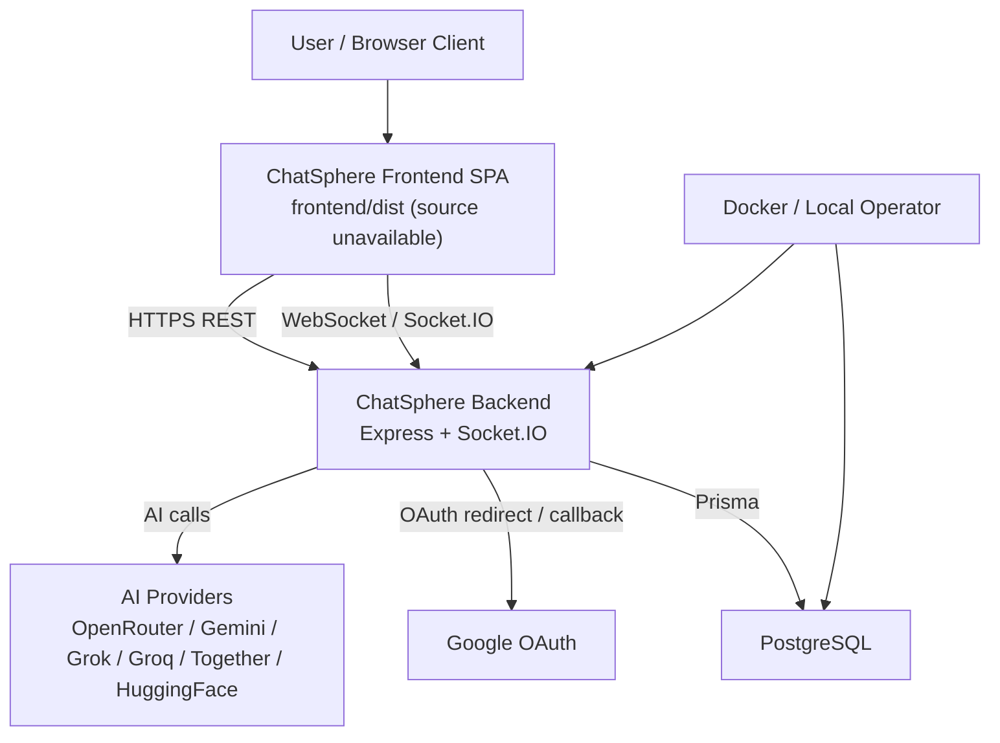
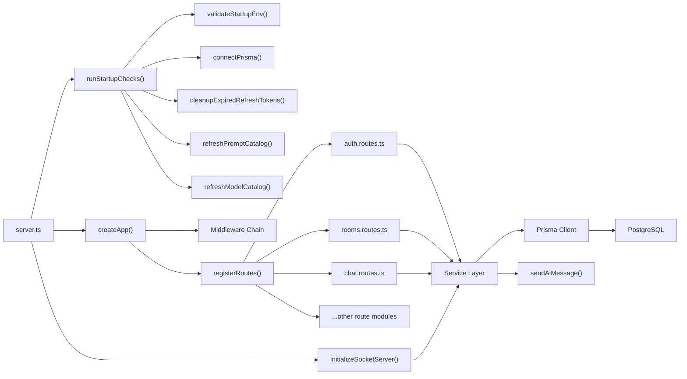
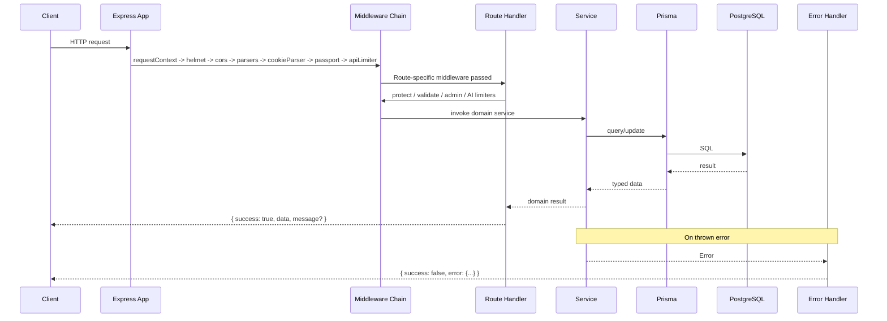
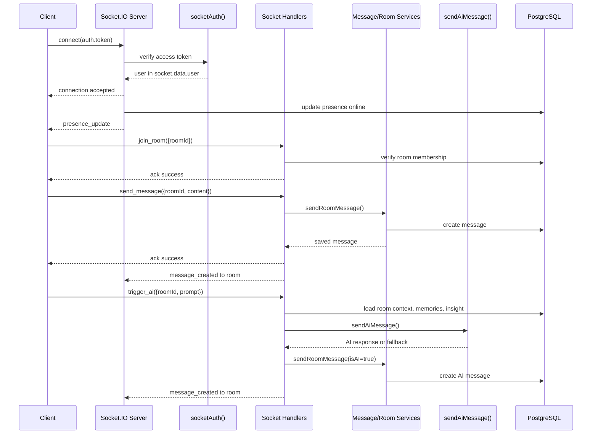
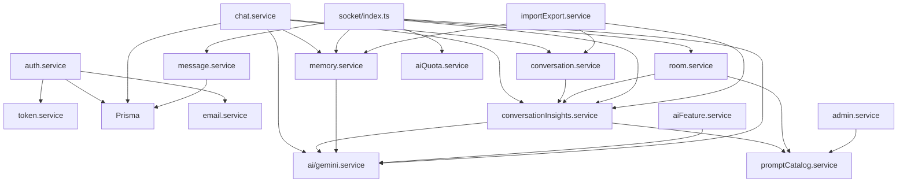

# ChatSphere Technical Architecture, Security, and Code Reference

## Table of Contents
- [1. Executive Summary](#1-executive-summary)
- [2. High-Level Architecture](#2-high-level-architecture)
- [3. Startup and Runtime Flow](#3-startup-and-runtime-flow)
- [4. HTTP Request Lifecycle](#4-http-request-lifecycle)
- [5. Realtime/Socket Lifecycle](#5-realtimesocket-lifecycle)
- [6. Directory-by-Directory, File-by-File Reference](#6-directory-by-directory-file-by-file-reference)
- [7. Security Architecture](#7-security-architecture)
- [8. Edge Cases and Defensive Behavior](#8-edge-cases-and-defensive-behavior)
- [9. Failure Modes and Resilience](#9-failure-modes-and-resilience)
- [10. Stability, Scalability, and Tradeoffs](#10-stability-scalability-and-tradeoffs)
- [11. Code Quality and Style](#11-code-quality-and-style)
- [12. Improvement Roadmap](#12-improvement-roadmap)
- [13. Onboarding Guide](#13-onboarding-guide)
- [14. Appendix](#14-appendix)

# 1. Executive Summary

## What the system does
ChatSphere is a monolithic Node.js/TypeScript collaboration backend that supports:

- local and Google-backed authentication
- one-to-one and room-based messaging
- Socket.IO realtime updates for presence, typing, read receipts, reactions, pinning, and AI-triggered room responses
- AI-assisted solo chat, room assistance, sentiment analysis, grammar improvement, smart replies, memory extraction, and conversation insights
- project context management, memory storage, moderation, analytics, import/export, and admin prompt template management

The codebase is centered in `backend/src`, with PostgreSQL persistence defined in `backend/prisma/schema.prisma`. The repository also contains a built frontend bundle under `frontend/dist`, but no authored frontend source files are present in the snapshot.

## Core architectural style
The system is a layered application:

- transport layer: Express routes and Socket.IO event handlers
- policy layer: authentication, admin checks, rate limiting, upload filtering, request validation
- domain/service layer: business logic in `backend/src/services/*`
- persistence layer: Prisma + PostgreSQL
- integration layer: Google OAuth and multiple AI providers routed through `backend/src/services/ai/gemini.service.ts`

This is operationally a modular monolith, not a distributed microservice system.

## Main runtime components
- HTTP server bootstrap: `backend/src/server.ts`
- Express app assembly: `backend/src/app.ts`
- environment/config management: `backend/src/config/*`
- database client: `backend/src/config/prisma.ts`
- route registration: `backend/src/routes/index.ts`
- realtime server: `backend/src/socket/index.ts`
- persistence schema: `backend/prisma/schema.prisma`
- container bootstrap and migrations: `backend/docker-entrypoint.sh`, `backend/docker-compose.yml`

## Primary risks and strengths
### Strengths
- Strong route-level input validation with Zod across almost all HTTP endpoints.
- Clear service separation by domain area.
- Consistent `AppError` and centralized error serialization.
- Prisma usage avoids raw SQL and provides typed DB access.
- AI provider failures degrade to deterministic fallback behavior instead of failing hard in most feature flows.
- Refresh tokens are hashed before storage in `backend/src/services/auth.service.ts`.

### Primary risks
- `backend/prisma/migrations/20260329104500_backend_rebuild/migration.sql` is destructive and drops/recreates the schema. That is a major operational risk if applied to a populated environment.
- Authorization gaps exist in `backend/src/services/search.service.ts::searchMessages` and `backend/src/socket/index.ts` typing events.
- Upload downloads in `backend/src/routes/uploads.routes.ts` are publicly readable and file validation is extension-based only.
- Password reset URLs, including the reset token, are logged via `backend/src/services/email.service.ts`.
- Several coordination/rate-limit/presence features are in-memory only, which limits horizontal scalability and resilience.
- The repository lacks frontend source, which materially slows onboarding and full-stack debugging.

# 2. High-Level Architecture

## Layered architecture map
- Presentation/API layer:
  - Express routes in `backend/src/routes/*`
  - Socket.IO handlers in `backend/src/socket/index.ts`
- Cross-cutting middleware:
  - auth, admin, request context, validation, rate limiting, upload, error handling
- Business services:
  - auth, chat, conversation, insight, moderation, analytics, import/export, memory, project, poll, room, search, settings, user, AI routing
- Persistence:
  - Prisma client in `backend/src/config/prisma.ts`
  - PostgreSQL schema in `backend/prisma/schema.prisma`
- External integrations:
  - Google OAuth via Passport
  - AI providers via OpenRouter, Gemini, Grok, Groq, Together, and HuggingFace env-based routing

## Module boundaries and responsibilities
- `backend/src/routes/*`:
  - validate HTTP input
  - apply middleware policy
  - call one or more services
  - serialize success responses
- `backend/src/services/*`:
  - own domain logic and most authorization/resource checks
  - shape persistence calls
  - adapt AI/provider output into domain responses
- `backend/src/middleware/*`:
  - enforce reusable policies before business logic runs
- `backend/src/helpers/*`:
  - generic error, logging, validation, and async wrapper utilities
- `backend/src/socket/index.ts`:
  - event-level validation, flood control, presence updates, room broadcasts

## How backend and frontend integrate
- Verified integration points:
  - CORS allows `env.clientUrl` in `backend/src/app.ts`.
  - auth refresh tokens are written as cookies in `backend/src/routes/auth.routes.ts`.
  - API responses use JSON objects with `success`, `data`, and optional `message`.
  - Socket.IO uses the same `env.clientUrl` CORS origin in `backend/src/socket/index.ts`.
  - upload URLs are built from `env.serverUrl` in `backend/src/routes/uploads.routes.ts`.
- Inferred frontend capabilities:
  - `frontend/dist/assets/index-LF6S_T_X.js` appears to be a bundled React SPA with pages for AI, groups, rooms, and settings, plus Socket.IO client usage.
  - This is an inference from minified build output, not authored source. Frontend source-level behavior is therefore partially unverified.

## Data flow overview
1. Client sends HTTP request or opens Socket.IO connection.
2. Middleware authenticates, validates, rate-limits, and attaches request context.
3. Route or socket handler delegates to service code.
4. Service code checks ownership/membership, calls Prisma, and optionally calls AI providers.
5. Service returns domain result.
6. Route serializes JSON, or socket handler emits room/global events.
7. Centralized error middleware handles HTTP failures; socket handlers emit `socket_error`.

## System context diagram

## Backend component interaction diagram

# 3. Startup and Runtime Flow

## Initialization sequence from process start to ready state
The authoritative startup path is `backend/src/server.ts::bootstrap`.

1. `bootstrap()` calls `runStartupChecks()` from `backend/src/config/startup.ts`.
2. `runStartupChecks()`:
   - calls `validateStartupEnv()` from `backend/src/config/env.ts`
   - logs startup start
   - connects Prisma with `connectPrisma()`
   - deletes expired refresh tokens with `cleanupExpiredRefreshTokens()`
   - tries `refreshPromptCatalog()`
   - tries `refreshModelCatalog(true)`
   - logs startup completion
3. If startup checks succeed:
   - `createApp()` builds the Express app in `backend/src/app.ts`
   - `http.createServer(app)` creates the HTTP server
   - `initializeSocketServer(server)` attaches Socket.IO
   - `server.listen(env.port)` starts accepting traffic
4. Signal handlers for `SIGINT` and `SIGTERM` are installed.
5. Global error listeners for `unhandledRejection` and `uncaughtException` are installed.

## Config loading and environment setup
- `backend/src/config/env.ts` loads `.env` via `dotenv.config()`.
- Parsed settings include:
  - server/client URLs
  - JWT secrets and TTLs
  - upload size/path
  - AI timeouts and catalog config
  - Google OAuth credentials
  - socket flood window and limits
- Hard-required at startup:
  - `DATABASE_URL`
  - `JWT_ACCESS_SECRET` or `ACCESS_TOKEN_SECRET`
  - `JWT_REFRESH_SECRET` or `REFRESH_TOKEN_SECRET`

## DB initialization
- `backend/src/config/prisma.ts` creates a shared `pg.Pool`, wraps it in a Prisma adapter, and exports a singleton `PrismaClient`.
- `connectPrisma()` runs during startup.
- `disconnectPrisma()` is called during graceful shutdown after `server.close()`.

## Route mounting
`backend/src/app.ts::createApp` mounts middleware in this order:

1. `requestContext`
2. `helmet`
3. `cors`
4. JSON body parser
5. URL-encoded parser
6. `cookieParser`
7. Passport initialization
8. `apiLimiter`
9. `registerRoutes(app)`
10. `notFoundHandler`
11. `errorHandler`

`backend/src/routes/index.ts::registerRoutes` mounts all route modules under `/api/*`.

## Socket initialization
- `backend/src/socket/index.ts::initializeSocketServer` creates a `Server` with CORS tied to `env.clientUrl`.
- `io.use(socketAuth)` authenticates the handshake before the `connection` callback runs.
- On connection:
  - presence maps are updated
  - the user record is marked online in PostgreSQL
  - `presence_update` is broadcast

## Health checks
- `backend/src/routes/health.routes.ts` exposes `/api/health`.
- It reports:
  - `status: "ok"`
  - `timestamp`
  - `uptimeSeconds`
- It does not verify database connectivity or downstream AI/provider reachability. That is a deliberate simplicity tradeoff, but it reduces health signal quality.

## Bootstrap failure points and fallback behavior
| Failure point | Where | Current behavior | Fallback behavior |
|---|---|---|---|
| Missing required env | `backend/src/config/env.ts::validateStartupEnv` | throws, startup fails | none |
| DB connection failure | `backend/src/config/prisma.ts::connectPrisma` | rejects, startup fails | none |
| Expired token cleanup failure | `backend/src/services/auth.service.ts::cleanupExpiredRefreshTokens` | rejects, startup fails | none |
| Prompt catalog refresh failure | `backend/src/config/startup.ts` | warning log | backend continues with default in-memory templates |
| AI model catalog refresh failure | `backend/src/config/startup.ts` | warning log | backend continues with cached/default model catalog |
| HTTP listen failure | `server.listen` in `backend/src/server.ts` | process likely throws or logs via uncaught handler | none |
| Docker DB not ready | `backend/docker-entrypoint.sh` | retries TCP checks and `prisma migrate deploy` | bounded retry loop |
| Docker migration failure | `backend/docker-entrypoint.sh` | retries then exits non-zero | none after max retries |

## Runtime shutdown behavior
- `SIGINT` and `SIGTERM` call `gracefulShutdown`.
- `gracefulShutdown` stops accepting new requests via `server.close()`, disconnects Prisma, then exits.
- There is no explicit timeout-based forced shutdown if open sockets prevent closure.
- `uncaughtException` and `unhandledRejection` are logged but do not currently trigger termination or restart coordination. That leaves possible partial-corruption runtime states.

# 4. HTTP Request Lifecycle

## Typical request path
### Entry point
Requests enter through the HTTP server created in `backend/src/server.ts` and are handled by the Express app from `backend/src/app.ts`.

### Middleware order and purpose
1. `requestContext`
   - creates or propagates `req.requestId`
   - logs request start and completion
2. `helmet`
   - adds common security headers
3. `cors`
   - restricts browser origin to `env.clientUrl`
4. body parsers
   - JSON and URL-encoded parsing with 5 MB limit
5. `cookieParser`
   - enables refresh-token cookie reads
6. Passport initialize
   - prepares Google OAuth strategy usage
7. `apiLimiter`
   - global API throttling, except health and auth
8. route-specific middleware
   - examples: `protect`, `adminCheck`, `authLimiter`, `aiLimiter`, `aiQuota`, `validateBody`, `validateParams`, `validateQuery`

### Route handling
Each route module:

- validates input with Zod
- applies auth/authorization middleware
- calls a service wrapped in `asyncHandler`
- returns a response like:
  - success: `{ success: true, data, message? }`
  - failure: handled centrally

### Controller/service transitions
There is no dedicated `controllers/` implementation in the current backend source tree even though the repo snapshot description mentioned controllers. The practical controller role is embedded in route handlers inside `backend/src/routes/*.ts`.

### DB interaction
Services call Prisma directly. Common patterns:

- single-entity fetch and ownership check
- list queries with `findMany`
- `upsert` for memory and prompt templates
- multi-step transactional deletes in `room.service.ts` and `project.service.ts`
- JSON field storage for settings, memories, polls, conversation messages, reply metadata, reactions, and AI telemetry

### Response formatting
- success responses are route-local and mostly consistent
- error responses are centralized in `backend/src/middleware/error.middleware.ts`
- error payload shape:
  - `success: false`
  - `error.code`
  - `error.message`
  - `error.requestId`
  - optional `error.details`
  - optional `error.retryAfterMs`
  - stack trace only outside production

### Error path
- thrown `AppError`, `ZodError`, or Prisma errors are normalized by `errorHandler`
- unknown exceptions become `INTERNAL_SERVER_ERROR`
- logger emits structured error logs with request context

## Request lifecycle sequence diagram

# 5. Realtime/Socket Lifecycle

## Connection establishment
- `backend/src/socket/index.ts::initializeSocketServer` configures Socket.IO on the HTTP server.
- `io.use(socketAuth)` runs before connection acceptance.
- `backend/src/middleware/socketAuth.middleware.ts::socketAuth` reads JWT from:
  - `socket.handshake.auth.token`
  - or `Authorization` header with `Bearer`
- It verifies the access token with `verifyAccessToken`.

If verification succeeds:
- decoded auth context is stored in `socket.data.user`
- connection proceeds

If verification fails:
- the server logs a warning
- the handshake fails with `Unauthorized socket connection`

## Authentication/authorization at socket level
### Authentication
- handshake JWT verification uses the same access-token secret as HTTP `protect`.

### Authorization
- event authorization is mixed:
  - strong checks: `join_room`, `send_message`, `reply_message`, `mark_read`, `trigger_ai`, `pin_message`, `unpin_message`, `reaction`
  - missing or weaker checks: `typing_start` and `typing_stop` validate payload shape but do not verify membership in the target room before broadcasting

## Event routing and message handling
Major events handled in `backend/src/socket/index.ts`:

- `authenticate`
  - returns user data to the client
- `join_room` / `leave_room`
  - joins/leaves Socket.IO rooms after membership validation
- `typing_start` / `typing_stop`
  - broadcasts typing status to room peers
- `mark_read`
  - marks messages read, then emits `messages_read`
- `send_message` / `reply_message`
  - persists via `sendRoomMessage`, then emits `message_created`
- `trigger_ai`
  - enforces AI quota, loads recent room context/memories/insight, calls AI, persists AI response as a room message, updates room `aiHistory`, emits `message_created`
- `edit_message`
  - updates and emits `message_updated`
- `delete_message`
  - soft deletes and emits `message_deleted`
- `pin_message` / `unpin_message`
  - updates pin state and emits corresponding events
- `reaction`
  - toggles reaction and emits `message_reaction`
- `disconnect`
  - updates presence maps and possibly user online state in DB

## Disconnect behavior
- Per-socket flood state is removed from `socketRateState`.
- `userSockets` is updated.
- If the disconnected socket was the user’s last active socket:
  - `trackPresence(userId, false)` updates DB
  - `presence_update` broadcasts offline state

## Failure handling for invalid/expired auth
- invalid or expired JWT during handshake:
  - connection denied
  - warning log recorded
- invalid event payload:
  - `socket_error` with `VALIDATION_ERROR`
- domain/service failure:
  - event-specific `socket_error`
  - warning log with event context
- flood limit exceeded:
  - `socket_error` with `SOCKET_FLOOD_LIMIT`
- AI quota exceeded:
  - `socket_error` with `AI_QUOTA_EXCEEDED` and `retryAfterMs`

## Socket auth + messaging sequence diagram

# 6. Directory-by-Directory, File-by-File Reference

## Scope note
This section covers authored or operationally significant files in the repository snapshot. It intentionally excludes third-party and generated dependency trees such as `backend/node_modules`, `frontend/node_modules`, and generated backend `dist` output. Because no authored frontend source is present, frontend coverage is limited to the shipped build artifacts.

## Top-level repository files
| File path | Role in system | Key symbols / I/O | Dependencies / callers | Security / failure relevance |
|---|---|---|---|---|
| `package.json` | Minimal root package manifest. Currently only declares `@prisma/client`; the main application runs from `backend/`. | No scripts. | Used mainly for root dependency consistency. | Thin file. Its sparsity reinforces that runtime ownership is in `backend/`. |
| `package-lock.json` | Root lockfile for the minimal root package. | Dependency resolution snapshot. | npm tooling. | Operationally relevant for reproducibility, but not application logic. |
| `README.md` | Primary human runbook for backend local and Docker startup. | Documents `npm ci`, `npm run build`, `npm start`, and Docker flow. | Read by operators and new engineers. | States migrations run automatically in Docker. Does not describe security caveats or destructive migration history. |
| `featureDOC.md` | Short note about group-management expectations. | Mentions group management flows. | Human-only reference. | Out of sync naming: refers to `group.service.ts`, but actual implementation lives in `backend/src/services/room.service.ts`. |
| `.gitignore` | Root ignore rules. | Ignores `node_modules`, `.env`, `dist`, logs, Prisma dev DB. | Git tooling. | Good baseline; does not affect runtime. |

## Backend operational/config files
| File path | Role in system | Key symbols / I/O | Dependencies / callers | Security / failure relevance |
|---|---|---|---|---|
| `backend/.env` | Local secret-bearing environment file. | Uninspected by design. | Loaded at runtime by `dotenv`. | Sensitive runtime config. Verification should use `.env.example`, not direct inspection. |
| `backend/.env.example` | Safe template for required env values. | Declares DB, JWT, AI provider, OAuth, and chat-related settings. | Referenced by operators and `README.md`. | Reveals supported providers and defaults. Good onboarding asset. |
| `backend/.gitignore` | Backend-specific ignore rules. | Ignores env, build, IDE, generated Prisma output. | Git tooling. | Helps prevent secret/build commits. |
| `backend/.dockerignore` | Docker build exclusion list. | Excludes `node_modules`, `dist`, `.env`, uploads, compose files. | Docker build context. | Reduces image context leakage. |
| `backend/package.json` | Real backend manifest. | Scripts: `dev`, `build`, `start`, Prisma and Docker helpers. | npm runtime in `backend/`. | Important for runtime. Odd `"backend": "file:"` dependency is a packaging smell, not a runtime blocker. |
| `backend/package-lock.json` | Backend dependency lockfile. | Dependency graph snapshot. | npm tooling. | Reproducibility asset. |
| `backend/tsconfig.json` | TypeScript compiler settings. | `strict: true`, `rootDir: src`, `outDir: dist`. | `npm run build`. | Strong type baseline; excludes tests because none are present. |
| `backend/prisma.config.ts` | Prisma CLI config. | Exports `defineConfig` with schema, migrations, datasource URL. | Prisma CLI. | Startup/build critical for migrations and generation. |
| `backend/Dockerfile` | Production-style backend image build. | Installs deps, copies source, builds, prepares uploads dir, uses entrypoint. | Docker runtime. | Uses build-time fallback `DATABASE_URL` for `prisma generate`. |
| `backend/docker-compose.yml` | Local composition of backend + Postgres. | Runs Postgres 16 and backend on port 3000. | Docker Compose. | Uses hardcoded local Postgres creds and mounts uploads. Suitable for dev, not hardened production. |
| `backend/docker-entrypoint.sh` | Container bootstrap script. | Waits for DB TCP availability, retries `prisma migrate deploy`, starts Node. | Container entrypoint. | Good resilience for DB readiness. No fallback after max retry. |

## Prisma schema and migration files
| File path | Role in system | Key symbols / I/O | Dependencies / callers | Security / failure relevance |
|---|---|---|---|---|
| `backend/prisma/schema.prisma` | Canonical data model. | Models: `User`, `RefreshToken`, `Room`, `RoomMember`, `Message`, `Conversation`, `ConversationInsight`, `MemoryEntry`, `ImportSession`, `Project`, `Poll`, `PromptTemplate`, `Report`, `UserBlock`. | Prisma client generation and runtime persistence. | Defines key auth, moderation, memory, and reporting structures. Heavy JSON usage shifts some validation from DB to app layer. |
| `backend/prisma/migrations/migration_lock.toml` | Prisma migration metadata. | Provider: `postgresql`. | Prisma CLI. | Thin but operationally required. |
| `backend/prisma/migrations/20260318163924_init/migration.sql` | Original chat schema. | Defines old `Chat`, `ChatMember`, `Message`, `User`. | Historical only. | Shows architecture evolution; no longer matches current app model. |
| `backend/prisma/migrations/20260318165008_update_schema/migration.sql` | Follow-up to initial schema. | Adds `ChatRole`, metadata fields. | Historical only. | Transitional schema; warnings indicate non-empty-table migration risk. |
| `backend/prisma/migrations/20260325172336_add_refresh_token/migration.sql` | Old refresh token change. | Adds `refreshToken` column to old `User` table. | Historical only. | Superseded by normalized `RefreshToken` table in later schema. |
| `backend/prisma/migrations/20260329104500_backend_rebuild/migration.sql` | Current full schema rebuild. | Drops all prior tables/types and recreates production model. | Applied by `prisma migrate deploy`. | Highest operational risk file in repo. It is explicitly destructive and unsuitable for live data preservation. |

## `backend/src/config`
| File path | Role in system | Key symbols / I/O | Dependencies / callers | Security / failure relevance |
|---|---|---|---|---|
| `backend/src/config/env.ts` | Central env parsing and validation. | Exports `env`, `validateStartupEnv`. Inputs: `process.env`; outputs: normalized runtime settings. | Used across app, services, middleware, socket, Prisma. | Startup gate for secrets/DB. Also defines upload, AI, and socket policy defaults. |
| `backend/src/config/passport.ts` | Google OAuth strategy setup. | Exports `configurePassport`. Calls `findOrCreateGoogleUser`. | Called by `createApp()`. | Skips OAuth when credentials missing. Good fail-soft behavior, but OAuth availability becomes environment-sensitive. |
| `backend/src/config/prisma.ts` | Shared DB client and pool. | Exports `prisma`, `connectPrisma`, `disconnectPrisma`. | Used by almost every service. | Core persistence dependency. Failure is startup-fatal. |
| `backend/src/config/startup.ts` | Startup orchestration. | Exports `runStartupChecks`. | Called by `server.ts`. | Soft-fails prompt/model catalog refresh, hard-fails env/DB/token cleanup. |

## `backend/src/helpers`
| File path | Role in system | Key symbols / I/O | Dependencies / callers | Security / failure relevance |
|---|---|---|---|---|
| `backend/src/helpers/asyncHandler.ts` | Async route wrapper. | `asyncHandler(req,res,next)` catches promise rejections. | Used by route modules. | Prevents unhandled async route failures. |
| `backend/src/helpers/errors.ts` | Custom application error type. | `AppError`, `isAppError`. | Used across services and middleware. | Standardizes status codes, machine codes, and retry hints. |
| `backend/src/helpers/logger.ts` | Structured JSON logger with redaction. | `logger.debug/info/warn/error`. | Used in startup, errors, sockets, AI, email. | Helpful redaction by key name, but sensitive values can still leak under innocuous keys such as `resetUrl`. |
| `backend/src/helpers/validation.ts` | Misc utility validation helpers. | `normalizeTags`, `assertRoomRole`, `canManageMember`, `canAssignRole`, `clamp`, `toSafeString`, plus unused `isValidObjectId`, `isValidUuid`, `escapeRegex`. | Used by room/project-like services. | Good role-safety helpers. Presence of Mongo-style `isValidObjectId` in a PostgreSQL app suggests residue from earlier designs. |

## `backend/src/middleware`
| File path | Role in system | Key symbols / I/O | Dependencies / callers | Security / failure relevance |
|---|---|---|---|---|
| `backend/src/middleware/admin.middleware.ts` | Admin-only gate. | `adminCheck(req,res,next)` checks `req.user.isAdmin`. | Used by admin and analytics routes. | Strong simple authorization layer. |
| `backend/src/middleware/aiQuota.middleware.ts` | AI quota enforcement. | `aiQuota`. Uses `consumeAiQuota` and `getAiQuotaKey`. | Used by AI and chat routes. | Limits burst usage, but state is in-memory only. |
| `backend/src/middleware/auth.middleware.ts` | HTTP bearer-token auth. | `protect`, `AuthRequest`. | Used by protected routes. | Returns generic unauthorized on invalid/expired token. |
| `backend/src/middleware/error.middleware.ts` | HTTP 404 and centralized error formatter. | `notFoundHandler`, `errorHandler`. | Terminal middleware. | Good normalization of Prisma and Zod failures. In non-production it includes stack traces in responses. |
| `backend/src/middleware/rateLimit.middleware.ts` | REST rate limiting. | `authLimiter`, `aiLimiter`, `apiLimiter`. | Applied in app and route modules. | Good abuse controls. In-memory by default via `express-rate-limit`, so multi-instance consistency is limited. |
| `backend/src/middleware/requestContext.middleware.ts` | Request ID and structured request logging. | `requestContext`. | Applied globally. | Important for tracing. Logs path and IP. |
| `backend/src/middleware/socketAuth.middleware.ts` | Socket handshake auth. | `socketAuth(socket,next)`. | Applied via `io.use`. | Reuses JWT auth. Warn-logs failed auth. |
| `backend/src/middleware/upload.middleware.ts` | Multer disk upload config. | `upload`, `uploadSingle`, `resolveUploadPath`. | Used by uploads routes. | File-size cap and basename path safety are good; extension-only validation and public serving are weak points. |
| `backend/src/middleware/validate.middleware.ts` | Generic Zod validation adapters. | `validateBody`, `validateParams`, `validateQuery`. | Used across nearly all routes. | Strong input validation backbone. |

## `backend/src/routes`
| File path | Role in system | Key endpoints / outputs | Dependencies / callers | Security / failure relevance |
|---|---|---|---|---|
| `backend/src/routes/index.ts` | Central route registrar. | `registerRoutes(app)` mounts all `/api/*` modules. | Called by `createApp()`. | Defines public API surface. |
| `backend/src/routes/health.routes.ts` | Health endpoint. | `GET /api/health` returns process uptime. | Mounted globally. | Does not test DB or external dependencies. |
| `backend/src/routes/auth.routes.ts` | Auth and OAuth API. | `POST /register`, `/login`, `/refresh`, `/logout`, `/forgot-password`, `/reset-password`, `GET /me`, `GET /google`, `GET /google/callback`, `POST /google/exchange`. | Depends on auth service, Passport, validators, auth limiter. | Central auth surface. Cookies are used for refresh tokens. Logout requires a valid access token. |
| `backend/src/routes/chat.routes.ts` | Solo AI chat API. | `POST /api/chat`. Returns AI content, model, usage, insight, memory refs. | Depends on `handleSoloChat`, `protect`, `aiLimiter`, `aiQuota`. | Protected and rate-limited. |
| `backend/src/routes/conversations.routes.ts` | Conversation read/manage API. | list, fetch, insight, action, delete endpoints. | Depends on conversation service. | Ownership enforced in service layer. |
| `backend/src/routes/rooms.routes.ts` | Room and message API. | room CRUD, join/leave, list messages, post message, edit/delete message, reactions, insights, pin/unpin. | Depends on room and message services. | Main collaborative HTTP surface. Membership and role checks mostly happen in services. |
| `backend/src/routes/groups.routes.ts` | Group membership management API. | get members, update role, remove member. | Depends on room service group helpers. | Role safety depends on service logic. |
| `backend/src/routes/polls.routes.ts` | Poll API. | create, list by room, vote, close. | Depends on poll service. | Membership and moderator/creator permissions enforced in service. |
| `backend/src/routes/projects.routes.ts` | Project context CRUD API. | list, create, get, patch, delete. | Depends on project service. | Protected; ownership enforced in service. |
| `backend/src/routes/users.routes.ts` | User profile API. | `PUT /profile`, `GET /:id`. | Depends on user service. | Public profile read, protected self-update. |
| `backend/src/routes/settings.routes.ts` | User settings API. | get/update settings. | Depends on settings service. | Protected. Settings affect AI feature availability. |
| `backend/src/routes/search.routes.ts` | Search API. | message search and conversation search. | Depends on search service. | Contains a significant authorization blind spot through `searchMessages`. |
| `backend/src/routes/moderation.routes.ts` | Moderation/reporting API. | report, block, unblock, list blocked. | Depends on moderation service. | Protected. Prevents duplicate pending reports. |
| `backend/src/routes/admin.routes.ts` | Admin operations API. | stats, reports list/review, users list, prompt templates list/upsert. | Depends on admin service and `adminCheck`. | Admin-only. |
| `backend/src/routes/analytics.routes.ts` | Analytics API. | daily message counts, DAU, top rooms. | Depends on analytics service and `adminCheck`. | Admin-only. |
| `backend/src/routes/export.routes.ts` | Export API. | user bundle, room export, conversation export. | Depends on import/export service. | Protected; room export checks membership. |
| `backend/src/routes/memory.routes.ts` | Memory CRUD/import/export API. | list, update, delete, import preview/import, export. | Depends on memory service. | Protected. Good validation around bounded lists and numeric ranges. |
| `backend/src/routes/uploads.routes.ts` | File upload/download API. | `POST /api/uploads`, `GET /api/uploads/:filename`. | Depends on upload middleware and env. | Upload write is protected. Download is public and serves files directly from disk. |
| `backend/src/routes/ai.routes.ts` | AI utility API. | model catalog, smart replies, sentiment, grammar. | Depends on AI feature service. | Protected, rate-limited, quota-limited. |
| `backend/src/routes/import.routes.ts` | Import preview/import API. | preview and import raw conversation payloads. | Depends on import/export service. | Protected. Duplicate detection is partial. |

## `backend/src/services`
| File path | Role in system | Key symbols / outputs | Dependencies / callers | Security / failure relevance |
|---|---|---|---|---|
| `backend/src/services/auth.service.ts` | Account creation, login, token rotation, Google linking, password reset, exchange codes. | `registerUser`, `loginUser`, `rotateRefreshToken`, `logoutUser`, `getMe`, `requestPasswordReset`, `resetPassword`, `findOrCreateGoogleUser`, `createGoogleExchangeCode`, `exchangeGoogleCode`, `cleanupExpiredRefreshTokens`. | Used by auth routes and Passport. | Strongest auth module. Hashes refresh tokens. Weak points: in-memory Google exchange store, hardcoded refresh-token DB expiry window, reset URL logging downstream. |
| `backend/src/services/token.service.ts` | JWT issue/verify. | access/refresh token generate/verify functions. | Used by auth middleware, socket auth, auth service. | Stateless access tokens, signed refresh tokens. No explicit revocation for access tokens. |
| `backend/src/services/user.service.ts` | User profile reads/updates. | `updateUserProfile`, `getPublicUserProfile`. | Used by users routes. | Good field bounds; no avatar content verification beyond URL validation. |
| `backend/src/services/settings.service.ts` | User settings normalization and persistence. | `getSettings`, `updateSettings`. | Used by settings routes and AI feature service. | Safely merges nested JSON settings. |
| `backend/src/services/aiQuota.service.ts` | In-memory quota tracker for AI usage. | `consumeAiQuota`, `getAiQuotaKey`. | Used by HTTP AI middleware and Socket.IO AI trigger. | Resets on restart and is per-instance only. |
| `backend/src/services/admin.service.ts` | Admin dashboards, report review, user list, prompt template administration. | `getAdminStats`, `listReports`, `reviewReport`, `listUsers`, prompt template wrappers. | Used by admin routes. | Good admin-only surface; relies on route middleware for authorization. |
| `backend/src/services/analytics.service.ts` | Analytics aggregation. | daily messages, daily active users, top rooms. | Used by analytics routes. | Reads large raw datasets into app memory; works functionally but may scale poorly. |
| `backend/src/services/email.service.ts` | Transport-agnostic password reset “sender”. | `sendPasswordResetEmail`. | Used by auth service. | Currently logs reset links instead of sending mail. This leaks reset tokens into logs. |
| `backend/src/services/chat.service.ts` | Solo AI chat orchestrator. | `handleSoloChat`. | Used by chat route; depends on conversation, memory, insight, project, and AI services. | Good composition layer. Throws on project mismatch. |
| `backend/src/services/conversation.service.ts` | Conversation persistence and retrieval. | list/get/insight/action/delete/append/get messages. | Used by chat, conversation, import/export services. | Ownership checks are strong. Conversation messages live in JSONB, limiting relational queryability. |
| `backend/src/services/conversationInsights.service.ts` | Insight generation and caching for conversations and rooms. | `refreshConversationInsight`, `refreshRoomInsight`, `getInsight`. | Used by chat, room, conversation, and socket layers. | Falls back deterministically on AI failure. |
| `backend/src/services/importExport.service.ts` | Conversation import/export and user bundle export. | `previewImport`, `importUserData`, `exportUserBundle`, `exportRoomMessages`, `exportConversation`. | Used by import and export routes. | Import dedupe is not fully idempotent. Good preview mode. |
| `backend/src/services/memory.service.ts` | Durable memory extraction, ranking, CRUD, import/export. | memory upsert, retrieval, ranking, marking used, export/import helpers. | Used by chat, socket AI, memory routes, import/export. | Good bounded heuristics and JSON export. AI extraction failures fall back silently to deterministic extraction. |
| `backend/src/services/message.service.ts` | Room message lifecycle. | send/get/mark read/react/edit/soft delete. | Used by routes and socket handlers. | Strong membership checks overall, but `replyTo.messageId` is not verified to belong to the same room. |
| `backend/src/services/moderation.service.ts` | Reports and user blocking. | report, block, unblock, list blocked. | Used by moderation routes and indirectly message/search behavior. | Prevents duplicate pending reports. Blocking affects search and replies. |
| `backend/src/services/poll.service.ts` | Poll creation, voting, closure. | `createPoll`, `getPollsByRoom`, `votePoll`, `closePoll`. | Used by poll routes. | Membership enforced. JSON vote arrays are vulnerable to lost updates under concurrency. |
| `backend/src/services/project.service.ts` | Project CRUD and conversation linkage. | list/get/create/update/delete project. | Used by project routes and chat service. | Ownership enforced. File attachments are metadata only, not stored content. |
| `backend/src/services/promptCatalog.service.ts` | Prompt template cache and DB overlay. | refresh/get/interpolate/build/list/upsert prompt templates. | Used by startup, admin, room, insight services. | Good default/fallback pattern. Active-template overlay is key-based and last-wins in memory. |
| `backend/src/services/room.service.ts` | Room lifecycle, membership, roles, pinned messages, room insights. | room CRUD, join/leave, group member management, room actions, pin/unpin. | Used by room and group routes. | Strong domain rules. `joinRoom` has race potential around `maxUsers` because count and insert are not transactional. |
| `backend/src/services/search.service.ts` | Message and conversation search. | `searchMessages`, `searchConversations`. | Used by search routes. | `searchMessages` is under-constrained when `roomId` is supplied, enabling possible unauthorized room search. |
| `backend/src/services/aiFeature.service.ts` | Thin AI utility features. | model list, smart replies, sentiment, grammar. | Used by AI routes. | Checks user settings before use. Relies on shared AI routing/fallbacks. |
| `backend/src/services/ai/gemini.service.ts` | AI model catalog, routing, provider calls, deterministic fallback. | `refreshModelCatalog`, `getModelCatalog`, `resolveTaskModel`, `sendAiMessage`. | Used by chat, insight, memory, AI feature, startup, socket code. | Strong fallback story. Timeout helper is ineffective because the `AbortController` is never wired into `fetch`. |

## `backend/src/socket` and `backend/src/types`
| File path | Role in system | Key symbols / outputs | Dependencies / callers | Security / failure relevance |
|---|---|---|---|---|
| `backend/src/socket/index.ts` | Entire Socket.IO server implementation. | `initializeSocketServer`. | Called by `server.ts`. Uses message, room, memory, insight, AI, quota services. | Realtime core. Strong event coverage, but typing authorization is incomplete and state is in-memory. |
| `backend/src/types/auth.ts` | Shared auth payload types. | `TokenPayload`, `AuthContext`. | Used by auth, passport, token, socket auth. | Important for JWT typing consistency. |
| `backend/src/types/express.d.ts` | Express request augmentation. | adds `requestId` and `user` to `Request`. | Global TypeScript augmentation. | Helps keep middleware and route code type-safe. |
| `backend/src/types/socket.ts` | Socket payload typing helpers. | `SocketEventPayload`, `SocketAuthData`. | Limited use. | Thin support file. |

## Frontend artifact files
| File path | Role in system | Key symbols / outputs | Dependencies / callers | Security / failure relevance |
|---|---|---|---|---|
| `frontend/dist/index.html` | Built SPA entry document. | Root div and asset references. | Served by a static host, not by backend code in this repo. | Confirms a browser client exists, but not its source structure. |
| `frontend/dist/assets/index-LF6S_T_X.js` | Minified frontend application bundle. | Inferred pages: AI, Groups, Rooms, Settings; inferred Socket.IO client and API usage. | Browser runtime. | Source unavailable. Any source-level architecture claims beyond visible bundle strings are inferred only. |
| `frontend/dist/assets/index-CyeatSpm.css` | Minified CSS bundle. | Presentation only. | Browser runtime. | No backend security relevance. |
| `frontend/` (no authored source files present) | Frontend source area appears absent from snapshot. | No `src/`, `package.json`, or authored TS/JS files found. | N/A | Major onboarding and maintainability gap. Full-stack debugging is partially unverified until source is restored. |

# 7. Security Architecture

## Authentication strategy
- HTTP auth:
  - `backend/src/middleware/auth.middleware.ts::protect` requires `Authorization: Bearer <accessToken>`.
- token generation:
  - `backend/src/services/token.service.ts` signs access and refresh JWTs.
- token storage:
  - access token is returned in response JSON.
  - refresh token is set as an HTTP-only cookie in `backend/src/routes/auth.routes.ts`.
- refresh token persistence:
  - `backend/src/services/auth.service.ts::issueTokenPair` stores SHA-256 hashes of refresh tokens in `RefreshToken`.
- Google OAuth:
  - configured in `backend/src/config/passport.ts`
  - callback issues a short-lived in-memory exchange code, then `/google/exchange` returns the standard token pair

## Authorization strategy
- route-level:
  - `protect` gates authenticated routes
  - `adminCheck` gates admin endpoints
- service-level:
  - ownership checks in conversation, project, settings, user, export, import, and room services
  - room membership checks in room/message/poll/search-like flows
  - role hierarchy via `canManageMember` and `canAssignRole`

Authorization is mostly service-driven, which is good for reuse across HTTP and sockets. The tradeoff is that gaps are more subtle when individual services forget to constrain scope.

## Token lifecycle and refresh handling
- access token:
  - generated per login/register/refresh/exchange
  - verified statelessly
- refresh token:
  - generated with JWT
  - hashed before DB storage
  - rotated in `rotateRefreshToken`
  - old record deleted on rotation
  - deleted on logout and password reset
- cleanup:
  - expired refresh-token rows are deleted during startup

### Important limitation
`backend/src/services/auth.service.ts::issueTokenPair` uses a fixed `7 * 24 * 60 * 60 * 1000` DB expiry window, while JWT expiry uses `env.refreshTokenTtl`. If those diverge, token validity in the DB and token signature may drift.

## Request validation and sanitization
- Zod validates nearly every HTTP body, param, and query shape.
- Additional service-level normalization occurs for:
  - usernames/emails/passwords
  - tags
  - project files
  - JSON-like settings
  - conversation messages
  - memory candidates
- Prisma usage means no raw SQL injection surface was observed in authored backend source.

## Rate limiting and abuse prevention
- `authLimiter` protects login/register/refresh/reset flows.
- `apiLimiter` protects the general API surface.
- `aiLimiter` rate-limits AI feature usage.
- `aiQuota` and socket quota checks enforce additional AI-specific bounds.
- Socket flood control counts events per socket in `socketRateState`.

### Limitation
All of these protections are in-memory or default-local-process. Under horizontal scaling, limits will be inconsistent across instances and reset on restart.

## Upload safety controls
- good controls:
  - 5 MB max size
  - random UUID server-side filename
  - basename enforcement on reads
- weak controls:
  - extension allowlist only, no content sniffing or malware scan
  - JavaScript and TypeScript files are explicitly allowed
  - uploaded files are directly served from application origin
  - download route is unauthenticated

## Socket security controls
- handshake JWT validation
- payload validation with Zod per event
- per-socket flood limit
- membership validation for most state-changing room operations

### Limitation
`typing_start` and `typing_stop` do not verify room membership before broadcasting with `socket.to(roomId).emit(...)`. An authenticated user can potentially spoof typing indicators into arbitrary room IDs.

## Error handling and information leakage prevention
- centralized error responses avoid stack leaks in production
- structured logger redacts fields whose keys match patterns like `password`, `token`, `secret`, `authorization`, `cookie`, `api_key`

### Limitation
Redaction is key-name based, not semantic. `sendPasswordResetEmail` logs `resetUrl`, which contains the reset token but uses a non-sensitive key name, so it will not be redacted.

## Secrets/config management
- env values are centralized in `backend/src/config/env.ts`
- `.env.example` provides a safe template
- `.dockerignore` excludes `.env` from build context

### Limitation
The app depends heavily on environment quality. There is no secret manager integration, key rotation workflow, or startup validation of optional AI/provider configs beyond presence/absence.

## Prisma/DB security concerns
- positives:
  - no raw SQL in authored backend source
  - DB relationships and unique constraints are well defined
  - refresh tokens are normalized into their own table
- concerns:
  - many domain objects use JSONB for high-value data structures like conversation messages, reactions, settings, AI telemetry, poll votes, and memory references
  - JSONB reduces schema rigidity and can increase validation drift between runtime and persistence

## Security controls summary
| Security control | Where implemented | How it works | What it protects | Limitations |
|---|---|---|---|---|
| Bearer JWT auth | `auth.middleware.ts`, `socketAuth.middleware.ts`, `token.service.ts` | verifies signed access token and attaches user context | protected REST and socket flows | no access-token revocation list |
| Refresh-token hashing | `auth.service.ts::issueTokenPair` | stores SHA-256 of refresh token, not raw token | reduces blast radius of DB token theft | DB expiry is hardcoded to 7 days |
| Google OAuth fallback | `passport.ts`, `auth.service.ts` | optional Google strategy with local exchange code | third-party auth flow | exchange code store is in-memory and non-shared |
| Admin authorization | `admin.middleware.ts` | checks `req.user.isAdmin` | admin and analytics APIs | only HTTP routes using middleware get this protection |
| Input validation | `validate.middleware.ts` + route schemas | rejects invalid body/param/query shapes | malformed payloads, some injection vectors | some service logic still needs semantic checks |
| Rate limiting | `rateLimit.middleware.ts`, `aiQuota.middleware.ts`, `socket/index.ts` | per-IP/user/local-process limits | abuse, brute force, AI overuse | non-distributed, reset on restart |
| Upload path safety | `upload.middleware.ts` | uses UUID filenames and basename-only reads | path traversal | no MIME/content scanning |
| Error normalization | `error.middleware.ts` | hides raw exceptions behind `AppError` payloads | information leakage | non-prod includes stacks; logs can still leak sensitive values |
| Structured log redaction | `logger.ts` | key-pattern redaction | secrets in structured metadata | misses secrets embedded in benign keys/strings |
| Prisma typed access | service layer + Prisma client | parameterized ORM operations | SQL injection and basic query correctness | auth bugs can still expose legal-but-unauthorized queries |

## Security gaps and realistic attack scenarios
1. Unauthorized room search
   - Location: `backend/src/services/search.service.ts::searchMessages`
   - Scenario: an authenticated user supplies a `roomId` they do not belong to.
   - Why it matters: the query no longer constrains room IDs to the caller’s memberships when `roomId` is present.
   - Impact: possible message disclosure if room IDs are learned or guessed.

2. Public file retrieval
   - Location: `backend/src/routes/uploads.routes.ts`
   - Scenario: anyone with a filename can fetch uploaded content.
   - Why it matters: files are served without auth checks.
   - Impact: data leakage and same-origin file hosting risk.

3. Reset token log leakage
   - Location: `backend/src/services/email.service.ts`
   - Scenario: password reset token appears in logs as part of `resetUrl`.
   - Why it matters: log readers gain account-reset capability during token validity window.
   - Impact: account takeover.

4. Typing indicator spoofing
   - Location: `backend/src/socket/index.ts` typing handlers
   - Scenario: authenticated user emits typing events for a room they do not belong to.
   - Why it matters: no room-membership validation.
   - Impact: cross-room annoyance, trust erosion, possible enumeration aid.

5. Extension-only upload controls
   - Location: `backend/src/middleware/upload.middleware.ts`
   - Scenario: attacker uploads a malicious file renamed with an allowed extension.
   - Why it matters: no MIME sniffing, no antivirus, direct file serving.
   - Impact: client compromise attempts, content abuse, storage of untrusted executable assets.

# 8. Edge Cases and Defensive Behavior

## Edge Case Matrix
| Scenario | Current behavior | Where handled in code | User impact | Risk level | Recommended improvement |
|---|---|---|---|---|---|
| Invalid input payloads | Rejected with `VALIDATION_ERROR` and Zod issues | `validate.middleware.ts`, `error.middleware.ts`, route schemas | Clear failure with structured details | Low | Keep pattern; add contract tests. |
| Expired access tokens | HTTP and socket auth reject as unauthorized | `auth.middleware.ts`, `socketAuth.middleware.ts` | User must re-auth or refresh | Low | Add frontend token-refresh retry wrapper if not already present. |
| Expired refresh tokens | Refresh fails with `UNAUTHORIZED` | `auth.service.ts::rotateRefreshToken` | Forced login | Low | Add clearer client guidance and revoke sibling sessions on suspicious reuse. |
| Missing permissions | `FORBIDDEN` or validation error depending on service | room/project/admin/moderation services | Action blocked | Low | Normalize error codes/messages for better UX consistency. |
| Rate-limit breaches | 429 for HTTP; `socket_error` for realtime | `rateLimit.middleware.ts`, `aiQuota.middleware.ts`, `socket/index.ts` | Temporary denial | Medium | Move limits to shared store like Redis for multi-instance consistency. |
| DB timeouts/failures | Most requests fail via centralized error handler; startup fails hard | Prisma calls across services, `error.middleware.ts`, `startup.ts` | Request failure or complete outage | High | Add health probes, retry policy only where idempotent, and DB observability. |
| Third-party AI failures | Logs warning and returns deterministic fallback in many AI flows | `ai/gemini.service.ts::sendAiMessage` | Degraded AI quality, app continues | Medium | Fix timeout implementation and tag fallback responses more explicitly. |
| Google OAuth not configured | OAuth endpoints return 503 or passport setup is skipped | `passport.ts`, `auth.routes.ts` | OAuth unavailable, local auth still works | Low | Expose health/config visibility for auth providers. |
| Socket reconnect storms | Flood-limited per socket, presence repeatedly updated in DB | `socket/index.ts` | Potential noisy presence changes | Medium | Add backoff hints and debounce presence writes. |
| Duplicate login/register attempts | Rate-limited; duplicates also caught by unique constraints | auth routes + Prisma uniqueness | Predictable failures | Low | Good enough. |
| Duplicate import requests | Full payload deduped by `ImportSession`, but per-conversation dedupe is title-based only | `importExport.service.ts::importUserData` | Some duplicates prevented, others skipped incorrectly | Medium | Use conversation fingerprint, not title alone, for idempotency. |
| Partial failures in async import workflow | Import is sequential; if mid-run fails, earlier conversations stay imported | `importExport.service.ts::importUserData` | Partial import state | Medium | Wrap import batch in transaction where feasible or record resumable job state. |
| Large upload | Multer rejects beyond 5 MB | `upload.middleware.ts` | Upload denied | Low | Keep bound, return friendly size guidance. |
| Malformed file disguised with allowed extension | Accepted if extension passes | `upload.middleware.ts` | Unsafe file may be stored and served | High | Validate MIME/magic bytes and serve from isolated domain/object storage. |
| Message edit after time window | Rejected with `EDIT_WINDOW_EXPIRED` | `message.service.ts::editMessage` | Expected denial | Low | Good. |
| Reply-to message from another room | Reply target existence checked, but room alignment is not checked | `message.service.ts::sendRoomMessage` | Inconsistent thread metadata and policy confusion | Medium | Verify reply target belongs to same room. |
| Room creator attempts to leave room | Rejected with `CREATOR_CANNOT_LEAVE` | `room.service.ts::leaveRoom` | User blocked from leaving | Low | Add ownership transfer flow. |
| Room max user race | Count checked before member create, not transactionally | `room.service.ts::joinRoom` | Possible over-capacity room | Medium | Enforce in transaction or DB-side constraint strategy. |
| Search for inaccessible room | Service may query arbitrary `roomId` if supplied | `search.service.ts::searchMessages` | Possible data disclosure | High | Always intersect requested `roomId` with caller memberships. |
| AI provider timeout | Intended timeout exists, but current implementation does not abort fetch | `ai/gemini.service.ts::withTimeout` | Long waits under provider degradation | High | Use `Promise.race` and pass `AbortSignal` into `fetch`. |

# 9. Failure Modes and Resilience

## Failure Mode and Effects
| Failure source | Detection mechanism | Current containment strategy | Logging / observability visibility | Recovery strategy | Residual risk |
|---|---|---|---|---|---|
| Database unavailable at startup | rejected `connectPrisma()` / entrypoint DB checks | fail fast | startup logs, container exit | restore DB and restart | Total outage until DB returns |
| Database unavailable during requests | Prisma exception to `errorHandler` | request fails, process stays up | structured error log with requestId | retry request manually if safe | no circuit breaker, no degraded mode |
| Destructive migration applied | migration execution during deploy | none | container logs only | restore from backup | catastrophic data loss |
| Invalid login credentials | explicit auth service check | bounded 401 | standard request logs | user retries | brute-force still limited only by local-process limiter |
| Refresh token missing/invalid | auth service check | 401 unauthorized | request logs | relogin | no suspicious-reuse escalation |
| OAuth provider misconfiguration | startup warning or endpoint 503 | local auth still works | warning logs | fix env and redeploy | feature unavailable |
| AI provider rate limit / outage | provider exceptions normalized in AI router | fallback model chain then deterministic fallback | warning logs with provider/model/category | automatic fallback, later retries | degraded answer quality |
| Socket auth failure | handshake verification throws | deny connection | warning logs | reconnect with fresh token | user sees connection failure |
| Logic bug in service | exception | HTTP error middleware or socket error emission | structured logs | hotfix / restart if needed | partial user-visible failures |
| Malformed request | Zod validation failure | 400 response | request/error logs | client corrects payload | low |
| File missing on download | existence check | 404 | request/error logs | none | low |
| Partial import failure | uncaught exception in sequential import loop | earlier imported items remain | error log | rerun carefully | duplicate/partial state |
| Unhandled promise rejection / uncaught exception | global process handlers | logs only | process-level logs | manual intervention | process may continue in bad state |

## Whether failures degrade gracefully
### Graceful degradation present
- AI functions are the best example of graceful degradation:
  - provider chain fallback
  - deterministic fallback if all providers fail
- prompt/model catalog refresh at startup warn instead of blocking boot
- Google OAuth absence does not block the rest of the backend

### Graceful degradation missing or weak
- database outages are mostly hard failures
- health checks do not reflect DB/provider health
- import workflows do not provide resumable or transactional safety
- destructive migration risk has no in-app containment

## Whether user-facing errors are actionable
- Usually yes for validation, auth, permissions, and edit-window rules.
- Less actionable for generic internal failures such as:
  - `INTERNAL_SERVER_ERROR`
  - `DATABASE_ERROR`
  - socket event failures like `SEND_MESSAGE_FAILED`
- AI socket failures also hide whether the issue was quota, provider outage, or logic failure, except for explicit quota cases.

## Whether retry patterns are safe
### Safe or mostly safe
- login after transient failure
- read-only GET endpoints
- AI utility requests, assuming client can tolerate duplicate responses
- refresh after transient network failure, if the original request did not complete

### Potentially unsafe
- `send_message` and `reply_message` retries can create duplicates because no idempotency key exists.
- import retries can partially duplicate or partially skip content because idempotency is session- and title-based, not operation-key-based.
- poll votes and reactions use read-modify-write JSON updates; rapid concurrent retries can lose updates.

# 10. Stability, Scalability, and Tradeoffs

## Throughput bottlenecks
- `backend/src/socket/index.ts::trackPresence`
  - writes to DB on connect/disconnect for every user/socket lifecycle event.
- `backend/src/services/message.service.ts::markMessagesRead`
  - updates each message in a loop instead of batching per message ID set.
- `backend/src/services/analytics.service.ts`
  - reads raw message rows into app memory, then aggregates in JavaScript.
- `backend/src/services/search.service.ts::searchConversations`
  - does a second pass over up to 200 conversations and scans JSON messages in memory.

## Latency hotspots
- AI-assisted flows:
  - `chat.service.ts::handleSoloChat`
  - `conversationInsights.service.ts`
  - `memory.service.ts::extractAiCandidates`
  - `socket/index.ts` `trigger_ai`
- These flows combine DB reads, prompt assembly, provider calls, persistence, and post-processing.

The current design accepts higher per-request latency in exchange for synchronous, user-visible completeness.

## Resource pressure points
- JSON-heavy objects stored in PostgreSQL:
  - conversation messages
  - memory references
  - room AI history
  - poll options/votes
  - reactions/read receipts
- In-memory maps:
  - `googleExchangeStore`
  - AI quota map
  - socket flood state
  - `userSockets`
  - prompt/model catalogs

These structures are simple and fast in a single process, but they become correctness and memory-management pressure points at scale.

## State management tradeoffs
- Good:
  - simple local-process state for quota, presence, and exchange codes keeps implementation small
  - cached prompt/model catalogs reduce repeated DB/env parsing
- Tradeoff:
  - these states are not shared across replicas
  - restart wipes volatile state
  - horizontal scaling changes behavior subtly

## Consistency vs performance tradeoffs
- Conversations are stored as JSON arrays in `Conversation.messages`.
  - Pro: append and export are simple.
  - Con: querying, indexing, moderation, and analytics on individual conversation messages are weak.
- Poll votes and reactions are JSON mutation patterns.
  - Pro: simple schema.
  - Con: concurrent updates can overwrite one another.
- Room/message/member access checks are performed in service code.
  - Pro: reusable across HTTP and sockets.
  - Con: mistakes like the `searchMessages` room-scope bug become easy to miss.

## Simplicity vs extensibility tradeoffs
- Simplicity wins:
  - modular monolith is easy to boot and reason about
  - routes are thin and mostly consistent
  - no job queue, cache cluster, or service mesh complexity
- Extensibility pressure:
  - AI orchestration is concentrated in synchronous request paths
  - analytics/search/import would benefit from background jobs or dedicated query models
  - lack of frontend source slows product evolution

## Monolith vs modular service boundaries
The current implementation is a modular monolith with healthy internal seams:

- auth
- messaging/rooms
- AI
- memory
- moderation
- import/export
- analytics
- admin

This is a good phase-appropriate shape. The main issue is not “too monolithic”; it is that some cross-cutting concerns still live in process memory rather than in shared infrastructure.

## Concrete examples from the codebase
- `backend/src/services/chat.service.ts` composes project context, memory retrieval, conversation insight, AI routing, persistence, and memory upsert in one request.
- `backend/src/socket/index.ts` composes validation, flood control, persistence, AI, and room broadcasting in one module.
- `backend/src/services/importExport.service.ts` blends parsing, dedupe, persistence, memory extraction, and insight refresh sequentially.

# 11. Code Quality and Style

## How code is organized
- Domain-oriented folder structure is strong.
- Configuration, helpers, middleware, routes, services, socket, and types are clearly separated.
- Routes are intentionally thin and use `asyncHandler` consistently.
- Services own most behavior and are named predictably.

## Naming and separation-of-concerns quality
- Overall naming is strong and readable.
- A few mismatches exist:
  - `featureDOC.md` references `group.service.ts`, but actual logic is in `room.service.ts`.
  - `ai/gemini.service.ts` is no longer Gemini-specific; it routes multiple providers and deterministic fallback behavior.
- Some modules have become orchestration-heavy:
  - `socket/index.ts`
  - `chat.service.ts`
  - `importExport.service.ts`

## Error handling consistency
- Strong overall:
  - `AppError` for expected domain failures
  - centralized formatter for HTTP
  - per-event socket error emission
- Weak spots:
  - socket errors are less structured and less actionable than HTTP errors
  - process-level fatal error policy is underdefined because uncaught errors only log

## Validation consistency
- HTTP validation is consistently applied and is one of the stronger parts of the codebase.
- Service-level semantic validation is also common for:
  - names
  - counts
  - lengths
  - ownership/membership
- Some semantic coverage still misses edge conditions such as room-scoped reply targets and restricted room search.

## Type safety usage
- `strict: true` in TypeScript config is a positive baseline.
- Express request augmentation is clean.
- Prisma gives strong model typing.
- Some pragmatic escapes remain:
  - auth route cookie helper uses `any`
  - JSON fields frequently use `unknown` and cast to `Prisma.InputJsonValue`
  - minified frontend makes full-stack type tracing impossible in this snapshot

## Reusability patterns
- Good reuse:
  - validators
  - auth/admin middleware
  - prompt catalog helpers
  - room role helpers
  - memory ranking/import helpers
- Duplicated patterns worth consolidating:
  - room membership assertions appear in room, message, poll, socket, and export logic
  - success response shaping is route-local and repetitive

## Testability level and blockers
- Testability is moderate in theory but low in practice because no test suite is present in the repository snapshot.
- Positive testability characteristics:
  - services are mostly pure-orchestrator functions around Prisma and provider calls
  - middleware is narrowly scoped
- Blockers:
  - singleton Prisma client and direct service imports make unit isolation harder
  - heavy use of live DB and live env state
  - AI provider access is runtime-bound unless mocked
  - frontend source absence prevents integrated client/server verification

# 12. Improvement Roadmap

## Quick wins (1-2 days)
| Item | Why it matters | Estimated effort | Expected impact | Risk if deferred | Suggested implementation approach |
|---|---|---|---|---|---|
| Fix unauthorized room search | Prevents possible data disclosure | 0.5 day | High security impact | Continued unauthorized search risk | In `search.service.ts`, always intersect requested `roomId` with the caller’s membership-derived room set. |
| Enforce room membership for typing events | Closes realtime auth gap | 0.5 day | Medium security and trust impact | Ongoing spoofing/abuse | Reuse `roomMembershipExists` in `typing_start` and `typing_stop` before broadcast. |
| Stop logging reset URLs/tokens | Removes direct account takeover path via logs | 0.5 day | High security impact | Token leakage remains | Change `email.service.ts` to log only recipient + requestId, or redact/tokenize the link. |
| Lock down upload downloads | Prevents public file exposure | 1 day | High security impact | Data leakage persists | Require auth on `GET /api/uploads/:filename` and add ownership/access checks or signed URLs. |
| Fix AI timeout implementation | Prevents hanging provider calls | 0.5 day | High reliability impact | Long latency under provider failure | Replace `withTimeout` with `Promise.race` and pass `AbortSignal` into each `fetch`. |
| Add same-room reply validation | Fixes message integrity bug | 0.5 day | Medium correctness impact | Cross-room reply metadata inconsistency | In `sendRoomMessage`, verify `replyTo.messageId` belongs to the same `roomId`. |

## Medium improvements (1-2 weeks)
| Item | Why it matters | Estimated effort | Expected impact | Risk if deferred | Suggested implementation approach |
|---|---|---|---|---|---|
| Replace in-memory rate limit/quota/presence state with shared store | Enables horizontal scaling and stable limits | 1-2 weeks | High stability/scalability impact | Behavior diverges across instances | Move quota, socket flood, presence, and exchange codes to Redis or equivalent. |
| Add transactional/idempotent import pipeline | Makes imports safe under retries and partial failures | 1 week | High data integrity impact | Duplicate or partial import state continues | Introduce operation IDs, transaction boundaries, and resumable session state. |
| Harden upload validation and storage | Reduces content abuse risk | 1 week | High security impact | Malicious file hosting remains | Validate MIME/magic bytes, remove `.js`/`.ts`, scan content, serve from isolated domain/object storage. |
| Refactor shared room authorization helpers | Reduces bug surface and duplication | 1 week | Medium maintainability impact | Repeated auth bugs remain likely | Centralize `assertRoomMembership`, `assertRoomModerator`, and room-scoped resource fetch helpers. |
| Add integration tests for auth, rooms, sockets, search | Raises confidence in the highest-risk paths | 1-2 weeks | High quality impact | Regressions stay easy to ship | Add test DB, mock AI providers, cover auth rotation, room membership, upload, search auth, and socket event permissions. |
| Improve health checks and observability | Speeds incident detection and diagnosis | 1 week | Medium operational impact | Shallow health signal remains | Add DB ping, provider readiness snapshot, structured metrics, and better socket/error counters. |

## Strategic improvements (1-2 months)
| Item | Why it matters | Estimated effort | Expected impact | Risk if deferred | Suggested implementation approach |
|---|---|---|---|---|---|
| Replace destructive migration path with additive migrations and data backfill | Protects production data | 2-4 weeks | Very high operational impact | Migration remains unsafe for real data | Baseline current schema, archive destructive migration strategy, author additive migrations only. |
| Introduce background jobs for insights, imports, analytics, email | Removes heavy work from request path | 1-2 months | High performance and resilience impact | Latency spikes remain | Add queue workers for import processing, insight refresh, email dispatch, and analytics precompute. |
| Normalize conversation messages into relational tables if search/analytics depth grows | Improves queryability and consistency | 1-2 months | High long-term scalability impact | JSONB limitations will compound | Add `ConversationMessage` model, migrate gradually, keep export adapters stable. |
| Restore or reintroduce frontend source into repository | Required for full-stack maintainability | 1-2 weeks to restore, longer to modernize | Very high onboarding/productivity impact | Frontend remains partly opaque | Recover `frontend/src` and manifest files, align build pipeline, document API client contracts. |
| Build a dedicated auth/session security program | Hardens session reuse, auditability, and provider handling | 1 month | High security impact | Session abuse detection remains limited | Add refresh-token family tracking, suspicious reuse detection, audit logs, and admin session visibility. |

# 13. Onboarding Guide

## Read this first file order
1. `README.md`
2. `backend/package.json`
3. `backend/src/server.ts`
4. `backend/src/app.ts`
5. `backend/src/routes/index.ts`
6. `backend/src/config/env.ts`
7. `backend/prisma/schema.prisma`
8. `backend/src/routes/auth.routes.ts`, `backend/src/routes/rooms.routes.ts`, `backend/src/routes/chat.routes.ts`
9. `backend/src/services/auth.service.ts`, `room.service.ts`, `message.service.ts`, `chat.service.ts`, `ai/gemini.service.ts`
10. `backend/src/socket/index.ts`
11. `backend/prisma/migrations/20260329104500_backend_rebuild/migration.sql`

## Suggested architecture learning sequence
1. Understand process boot and middleware assembly.
2. Understand the data model in Prisma.
3. Follow one auth request end-to-end.
4. Follow one room message end-to-end over both HTTP and Socket.IO.
5. Follow one solo AI chat request end-to-end.
6. Review moderation/search/import flows after the core is clear.
7. Finally inspect admin/analytics and the frontend bundle.

## How to debug first issues
- If auth fails:
  - check `backend/src/config/env.ts` secrets and `CLIENT_URL`/cookie settings
  - inspect `auth.routes.ts`, `auth.service.ts`, `token.service.ts`
- If rooms/messages fail:
  - inspect `rooms.routes.ts`, `room.service.ts`, `message.service.ts`
  - confirm `RoomMember` rows exist in DB
- If sockets fail:
  - inspect `socket/index.ts` and `socketAuth.middleware.ts`
  - confirm access token is fresh and membership exists
- If AI fails:
  - inspect env provider keys
  - inspect `ai/gemini.service.ts` logs and fallback telemetry
- If imports/memory behave oddly:
  - inspect `importExport.service.ts`, `memory.service.ts`, `conversation.service.ts`

## First safe contributions for new developers
- add tests for existing auth and room flows
- fix the search authorization gap
- harden reset-email logging
- add DB-aware health checks
- refactor repeated room-membership checks into shared helpers
- improve docs around env variables, migration safety, and frontend source expectations

# 14. Appendix

## Glossary of internal terms
| Term | Meaning |
|---|---|
| Access token | Short-lived JWT used for authenticated API and socket access. |
| Refresh token | Longer-lived JWT stored as HTTP-only cookie and hashed in DB for rotation. |
| Room | Group chat container with members, messages, polls, and reports. |
| RoomMember | Join table defining user membership and role in a room. |
| Conversation | Solo AI chat transcript stored as JSONB messages. |
| Conversation insight | Structured summary/intention/topics/decisions/action-items cache for a room or conversation. |
| Memory entry | Durable user-specific fact/preference/context item used to enrich AI prompts. |
| Prompt template | Admin/default prompt text keyed by function such as `conversation-insight` or `smart-replies`. |
| AI history | JSONB trace of recent AI prompts/responses stored on a room. |
| Import session | Record of an import payload fingerprint and its resulting created conversations. |

## Endpoint/module index
| Prefix / endpoint | Module | Purpose |
|---|---|---|
| `/api/health` | `health.routes.ts` | Liveness/uptime status |
| `/api/auth/*` | `auth.routes.ts` | register, login, refresh, logout, me, password reset, Google OAuth |
| `/api/chat` | `chat.routes.ts` | solo AI chat |
| `/api/conversations/*` | `conversations.routes.ts` | conversation list/detail/insights/actions/delete |
| `/api/rooms/*` | `rooms.routes.ts` | room CRUD, room messaging, insights, pinning |
| `/api/groups/*` | `groups.routes.ts` | group member list/role/remove |
| `/api/polls/*` | `polls.routes.ts` | room polls |
| `/api/projects/*` | `projects.routes.ts` | project CRUD |
| `/api/users/*` | `users.routes.ts` | public profiles and self profile update |
| `/api/settings` | `settings.routes.ts` | user settings |
| `/api/search/*` | `search.routes.ts` | message/conversation search |
| `/api/moderation/*` | `moderation.routes.ts` | report and block APIs |
| `/api/admin/*` | `admin.routes.ts` | admin stats, users, reports, prompt templates |
| `/api/analytics/*` | `analytics.routes.ts` | admin analytics |
| `/api/export/*` | `export.routes.ts` | conversation/room/user export |
| `/api/memory/*` | `memory.routes.ts` | memory CRUD/import/export |
| `/api/uploads/*` | `uploads.routes.ts` | upload and file fetch |
| `/api/ai/*` | `ai.routes.ts` | AI utility features and model list |
| `/api/import/*` | `import.routes.ts` | import preview/import |
| Socket.IO events | `socket/index.ts` | auth ack, join/leave room, typing, read receipts, messages, AI trigger, reactions, pins, presence |

## Service dependency map

## Ambiguities and unverified items
- The repository snapshot description mentioned `backend/src/controllers/*`, but no authored controller files are present in the current tree. Route handlers appear to own controller responsibilities directly.
- Frontend source is absent. Any frontend architecture statement beyond the existence and visible strings of `frontend/dist/assets/index-LF6S_T_X.js` is inferred, not source-verified.
- No tests are present in the visible repository snapshot, so runtime guarantees rely on code inspection rather than executable verification.
