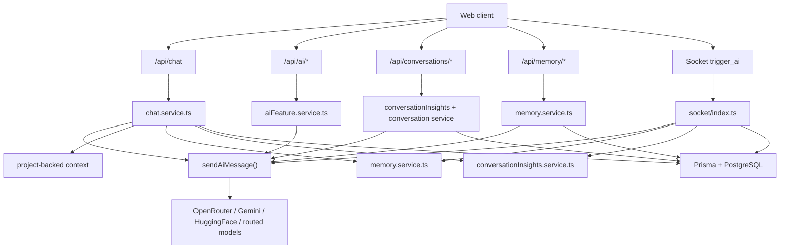

# Backend AI Documentation Overview

## Scope

This documentation set covers only backend files and backend behavior related to AI in ChatSphere.

It excludes non-AI product areas unless they directly affect AI execution, such as authentication, socket authorization, rate limiting, and persistence.

## What the backend AI system does

The ChatSphere backend embeds AI directly inside the main Node.js and TypeScript application.

It is not a separate microservice.

The AI layer currently supports:

- solo AI chat over `POST /api/chat`
- room AI invocation over the Socket.IO `trigger_ai` event
- model catalog listing through `/api/ai/models`
- utility endpoints for smart replies, sentiment, and grammar
- memory extraction and retrieval
- conversation and room insight generation
- project-aware prompt enrichment
- deterministic fallback when providers fail

## Primary backend files in scope

- `backend/src/services/ai/gemini.service.ts`
- `backend/src/services/aiFeature.service.ts`
- `backend/src/services/chat.service.ts`
- `backend/src/services/memory.service.ts`
- `backend/src/services/conversationInsights.service.ts`
- `backend/src/services/promptCatalog.service.ts`
- `backend/src/services/aiQuota.service.ts`
- `backend/src/socket/index.ts`
- `backend/src/routes/chat.routes.ts`
- `backend/src/routes/ai.routes.ts`
- `backend/src/routes/conversations.routes.ts`
- `backend/src/routes/memory.routes.ts`
- `backend/src/routes/rooms.routes.ts`
- `backend/src/middleware/aiQuota.middleware.ts`
- `backend/src/middleware/rateLimit.middleware.ts`
- `backend/src/middleware/auth.middleware.ts`
- `backend/src/middleware/socketAuth.middleware.ts`
- `backend/src/middleware/validate.middleware.ts`
- `backend/src/config/env.ts`
- `backend/prisma/schema.prisma`

## High-level architectural summary

ChatSphere uses a modular-monolith AI architecture.

The key design choice is that most AI features eventually flow into a single backend execution function: `sendAiMessage()`.

That function handles:

- model catalog use
- model routing
- provider selection
- provider fallback
- usage estimation
- telemetry creation
- deterministic fallback

The rest of the backend AI system prepares input for that router or consumes its output.

## Architecture map



## Main backend AI capabilities

### Solo AI chat

`chat.service.ts` builds a context-rich prompt from:

- the user message
- prior conversation history
- project context
- relevant memories
- conversation insight

It then calls the shared AI router and stores both the user turn and assistant turn in the `Conversation.messages` JSON field.

### Room AI

`socket/index.ts` listens for `trigger_ai`.

It loads:

- recent room messages
- relevant memories for the triggering user
- room insight

It then calls the shared AI router and persists the answer as a `Message` row with AI metadata.

### Utility AI endpoints

`aiFeature.service.ts` provides:

- smart replies
- sentiment analysis
- grammar improvement
- model listing

These are backend-complete capabilities, even though the currently inspected frontend does not visibly expose dedicated UI flows for all of them.

### Memory and personalization

`memory.service.ts` does two jobs:

- extract durable user facts from text
- retrieve ranked memories for future prompts

### Insight generation

`conversationInsights.service.ts` compresses long histories into structured summaries that can later be reused as context.

## Backend AI data model summary

| Model | AI purpose |
|---|---|
| `Conversation` | stores solo AI chat threads |
| `ConversationInsight` | stores summary, intent, topics, decisions, and tasks |
| `MemoryEntry` | stores user memory used for personalization |
| `PromptTemplate` | stores editable prompt templates |
| `Project` | stores project context injected into prompts |
| `Message` | stores room chat and room AI outputs |
| `Room` | stores room-level AI history |
| `User.settings` | stores feature toggles for smart replies, sentiment, and grammar |

## Core backend AI strengths

- One reusable AI execution layer keeps logic centralized.
- Memory retrieval and insight injection make prompts more grounded than plain chat completion.
- The system already supports more than one provider.
- Provider failure does not automatically break user flows.
- AI metadata is persisted in useful places.

## Core backend AI weaknesses

- `gemini.service.ts` is actually a general router and now carries too much responsibility.
- JSON output is expected but not truly enforced at the provider level.
- Timeout handling is incomplete.
- Image attachment support is only partial.
- Quota and rate state are single-instance only.
- Some prompt templates exist but are not actually used by the corresponding services.

## Example of the shared AI call pattern

```ts
const response = await sendAiMessage({
  task: "chat",
  message: promptText,
  history,
  modelId,
  attachment,
});
```

## Key architectural takeaway

If someone needs to rebuild the backend AI system from scratch, the correct mental model is:

1. routes and socket handlers gather validated input
2. orchestration services assemble context
3. `sendAiMessage()` routes execution to a provider chain
4. the backend persists AI results into conversations, room messages, memories, and insights
