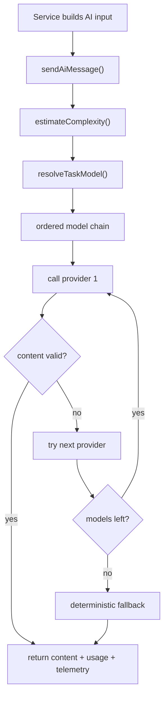

# AI Integration

## Purpose of this file

This file explains how the backend integrates with AI providers, how models are selected, how prompts are assembled, and how responses flow back into ChatSphere.

## The integration center: `sendAiMessage()`

The most important integration point in the backend is `backend/src/services/ai/gemini.service.ts`.

Despite its filename, it is not Gemini-specific anymore.

It acts as the shared AI router for all major backend AI features.

## Supported task types

The backend AI router supports these task labels:

- `chat`
- `memory`
- `insight`
- `smart-replies`
- `sentiment`
- `grammar`

## Model catalog design

The model catalog is built from environment variables.

The backend does not dynamically fetch model lists from providers.

Instead, it synthesizes a catalog from configured defaults and optional OpenRouter model rows.

## Catalog fields

Each model entry includes:

- `id`
- `provider`
- `label`
- `supportsImages`
- `supportsJson`

## Model routing logic

Routing is handled by `resolveTaskModel()`.

It considers:

- requested model override
- task type
- message complexity
- provider order

### Complexity estimation

The current backend uses a heuristic complexity classifier.

It marks a request as:

- `high` for long or architecture-style prompts
- `medium` for mid-sized prompts
- `low` for short prompts

That complexity only affects provider priority.

## Provider order

The current fallback order is:

1. OpenRouter
2. Gemini
3. Grok
4. Groq
5. Together
6. HuggingFace

## Important routing caveat

The code comments suggest Grok, Groq, and Together can be routed through OpenRouter.

However, the backend still uses `isProviderEnabled()` to require their own provider keys.

That means the routing story is only partially unified.

## AI integration diagram



## Provider integrations

### OpenRouter

The backend sends a standard chat-completions request with:

- model ID
- history messages
- current user content

### Gemini

The backend sends a `generateContent` request with:

- `contents`
- mapped user and model turns

### HuggingFace

The backend sends:

- `inputs: message`

### Grok, Groq, Together

These are currently handled through the same OpenRouter-shaped call path instead of full provider-native integrations.

## Prompt construction in the backend

Prompt assembly is not fully centralized.

Different services build different prompt bodies before calling `sendAiMessage()`.

### Solo chat prompt construction

`chat.service.ts` builds a prompt from:

- user message
- project name
- project description
- project instructions
- project context
- relevant memory summaries
- existing conversation insight summary

### Room AI prompt construction

The `trigger_ai` socket path builds a prompt from:

- slash-command text
- memory summaries
- room insight summary

Recent room messages are passed as history rather than merged into the prompt text body.

### Insight prompt construction

`conversationInsights.service.ts` uses `promptCatalog.service.ts`.

This is one of the few places where prompt templating is properly wired into the backend AI path.

### Utility task prompt construction

`aiFeature.service.ts` sends raw user text directly into the AI router for:

- smart replies
- sentiment
- grammar

That means prompt templates defined for these tasks are currently underused.

## Prompt template system

The backend defines default templates for:

- solo chat
- group chat
- memory extraction
- conversation insight
- smart replies
- sentiment
- grammar

But current usage is uneven.

## Attachment integration

The AI router has attachment support, but it is important to understand what that means technically.

### What the backend does today

- adds attachment notes
- includes text content for some text-like file types
- notes when a PDF is attached
- notes when an image base64 payload exists

### What the backend does not do today

- send images as provider-native multimodal content
- parse PDF binary content server-side
- dereference uploaded URLs into provider context

## Response flow

Every successful AI response returns:

- `content`
- `model`
- `usage`
- `telemetry`

## Important implementation gap: output JSON

Several backend services expect JSON-like responses.

The current AI integration does not enforce JSON mode at the provider protocol layer.

## Important implementation gap: timeout enforcement

The backend has a `withTimeout()` helper.

However, the current implementation does not wire `AbortSignal` into the provider fetch calls and does not truly race the promise.

## Example integration snippet

```ts
const aiResponse = await sendAiMessage({
  task: "insight",
  message: prompt,
  outputJson: true,
});
```

## Recommended next-step integration improvements

- enforce structured output where providers support it
- move provider-specific logic into separate provider adapters
- make prompt-template usage consistent across all AI tasks
- support real multimodal image requests
- implement actual timeout cancellation
