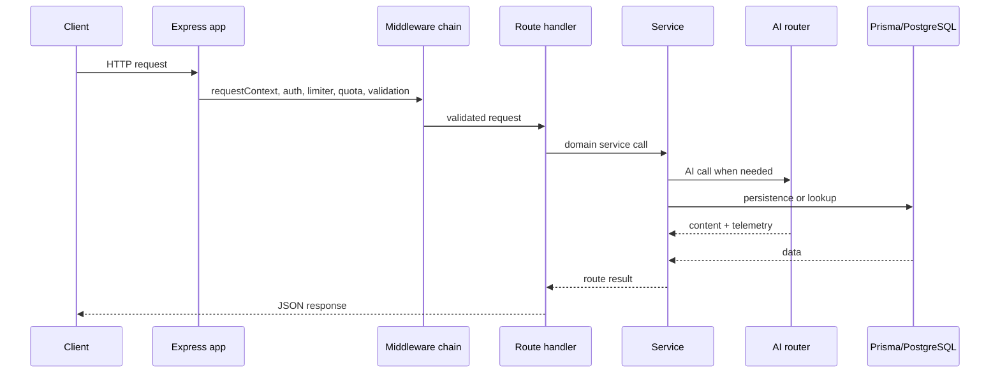

# API Routes

## Purpose of this file

This file documents backend HTTP routes related to AI and AI-adjacent backend behavior.

## Route grouping in scope

Primary AI routes:

- `/api/chat`
- `/api/ai/*`

AI-adjacent routes that shape context or consume AI output:

- `/api/conversations/*`
- `/api/memory/*`
- `/api/rooms/:roomId/insights`
- `/api/rooms/:roomId/actions`
- `/api/settings`

## HTTP request lifecycle



## `POST /api/chat`

### Purpose

Primary solo AI chat endpoint.

### Middleware

- `protect`
- `aiLimiter`
- `aiQuota`
- `validateBody(chatBodySchema)`

### Request fields

| Field | Required | Notes |
|---|---|---|
| `message` | yes | 1 to 6000 chars |
| `conversationId` | no | existing conversation |
| `modelId` | no | provider model override |
| `projectId` | no | project context selector |
| `attachment` | no | optional uploaded file metadata and inline content |

### Main service

- `handleSoloChat()`

### Side effects

- may create or update a conversation
- may add user and assistant messages
- may create or update memories
- may refresh conversation insight

## `GET /api/ai/models`

### Purpose

Expose:

- `auto`
- available model catalog

### Main service

- `listAiModels()`

### Important note

This route is behind `aiQuota`, even though it does not directly call a provider.

## `POST /api/ai/smart-replies`

### Purpose

Generate short suggested replies.

### Middleware

- `protect`
- `aiLimiter`
- `aiQuota`
- request validation

### Main service

- `generateSmartReplies()`

### Additional policy

Checks `settings.aiFeatures.smartReplies`.

## `POST /api/ai/sentiment`

### Purpose

Classify sentiment with reason and confidence.

### Main service

- `analyzeSentiment()`

### Additional policy

Checks `settings.aiFeatures.sentiment`.

## `POST /api/ai/grammar`

### Purpose

Improve user text without changing intent.

### Main service

- `improveGrammar()`

### Additional policy

Checks `settings.aiFeatures.grammar`.

## Conversation AI routes

### `GET /api/conversations/:conversationId/insights`

Returns cached or newly generated conversation insight.

### `POST /api/conversations/:conversationId/actions`

Supports:

- `summarize`
- `extract-tasks`
- `extract-decisions`

## Memory routes

### `GET /api/memory`

Lists memory entries.

### `PUT /api/memory/:memoryId`

Allows editing summary, details, tags, pinned state, and scores.

### `DELETE /api/memory/:memoryId`

Deletes a memory entry.

### `POST /api/memory/import`

Supports preview mode and import mode.

### `GET /api/memory/export`

Supports JSON, Markdown, and adapter format.

## Room insight routes

### `GET /api/rooms/:roomId/insights`

Reads or refreshes room insight.

### `POST /api/rooms/:roomId/actions`

Supports summarize, extract-tasks, and extract-decisions.

## Settings route with AI significance

### `GET /api/settings`

Reads user settings including AI feature toggles.

### `PUT /api/settings`

Updates smart replies, sentiment, and grammar flags.

## Validation design

The AI route layer uses Zod extensively.

Benefits:

- bounded input size
- predictable payload shape
- clearer failure responses

## Common error responses

| Code | Meaning |
|---|---|
| `UNAUTHORIZED` | bearer token invalid or missing |
| `VALIDATION_ERROR` | payload shape invalid |
| `AI_RATE_LIMITED` | AI request burst limit exceeded |
| `AI_QUOTA_EXCEEDED` | AI budget window exceeded |
| `FEATURE_DISABLED` | per-user AI utility feature turned off |
| `NOT_FOUND` | referenced conversation, project, or memory does not exist |
| `PROJECT_MISMATCH` | conversation and requested project conflict |

## Example route handler snippet

```ts
router.post(
  "/",
  protect,
  aiLimiter,
  aiQuota,
  validateBody(chatBodySchema),
  asyncHandler(async (req, res) => {
    const result = await handleSoloChat({ userId: req.user!.userId, ...req.body });
    res.status(200).json({ success: true, data: result });
  })
);
```
