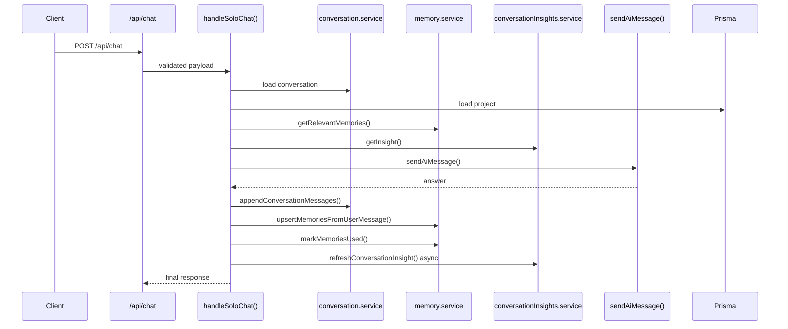
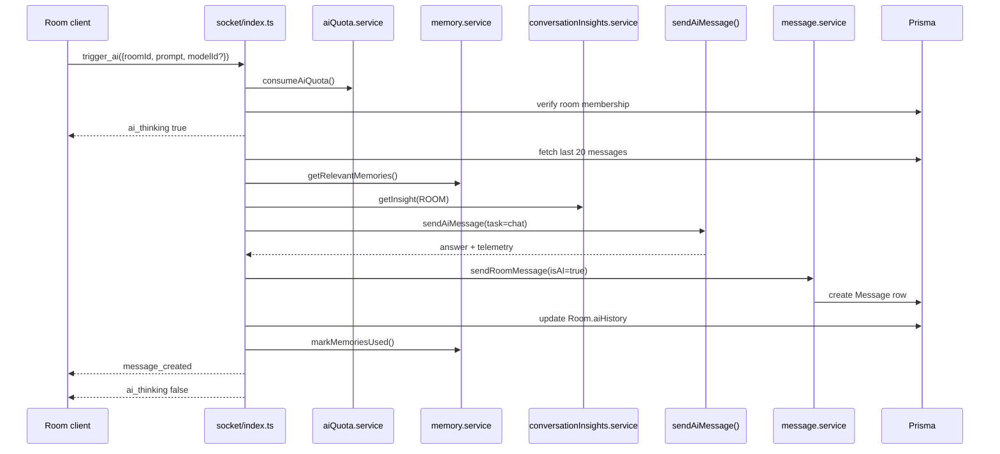

# Chat and Socket Flow

## Purpose of this file

This file explains how backend chat and realtime socket flows connect to AI.

It covers:

- solo chat orchestration
- room AI triggering
- realtime message persistence
- event behavior

## Solo chat backend flow

The solo chat path is HTTP-based.

It lives primarily in:

- `chat.routes.ts`
- `chat.service.ts`
- `conversation.service.ts`
- `memory.service.ts`
- `conversationInsights.service.ts`
- `ai/gemini.service.ts`

## Solo chat sequence



## What `handleSoloChat()` actually does

1. trims the user message
2. rejects empty prompts
3. loads an existing conversation if `conversationId` is present
4. validates project ownership if `projectId` is present
5. rejects mismatched project and conversation combinations
6. loads relevant memories
7. loads existing conversation insight
8. normalizes prior conversation history
9. assembles the prompt body
10. calls the AI router
11. appends both turns to the conversation
12. extracts new memory from the user message
13. marks retrieved memories as used
14. refreshes insight asynchronously

## Room AI socket flow

The room AI path is event-driven and lives in:

- `socket/index.ts`
- `message.service.ts`
- `memory.service.ts`
- `conversationInsights.service.ts`
- `room.service.ts`
- `ai/gemini.service.ts`

## Socket AI trigger sequence



## `trigger_ai` policy chain

Before a room AI call reaches the provider, the backend enforces:

- socket authentication
- socket flood limit
- payload validation
- AI quota
- room membership check

## Room history construction

Room AI does not use stored `Room.aiHistory` as the primary context source.

Instead, it rebuilds context from the last 20 non-deleted room messages.

Each message is mapped into:

- `assistant` role if `isAI` is true
- `user` role otherwise

And content becomes `username: message content`.

## Important room AI nuance

The saved AI room message is created with:

- `isAI: true`
- `triggeredBy: userId`
- `userId: triggering user`

So the backend treats it as AI content but stores it under the human user's identity.

## Room `aiHistory` behavior

The backend stores `Room.aiHistory` and trims it to the last 30 entries.

That history is useful as an audit-like trail.

But it is not the main source of prompt context during future room AI calls.

## Realtime UX support events

The backend emits room-AI-related socket events:

- `ai_thinking`
- `message_created`
- `socket_error`

## Example backend persistence snippet

```ts
const savedMessage = await sendRoomMessage({
  roomId: parsed.roomId,
  userId: user.userId,
  content: aiResponse.content,
  isAI: true,
  triggeredBy: user.userId,
  memoryRefs: memoryIds,
  model: {
    modelId: aiResponse.model.id,
    modelProvider: aiResponse.model.provider,
    telemetry: aiResponse.telemetry,
  },
});
```

## Failure behavior in chat versus socket paths

### Solo chat

Failure is returned through structured HTTP JSON error responses.

### Room AI

Failure is returned through `socket_error`.

This is a meaningful design difference.
