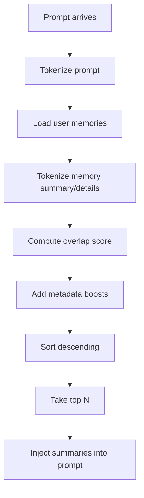

# Memory and Context

## Purpose of this file

This file explains how the backend creates, stores, ranks, and injects memory and other contextual signals into AI prompts.

## Context sources used by the backend

The backend currently uses four major context sources:

- chat history
- project context
- personal memory
- conversation or room insight

## Memory system goals

The memory system tries to make future AI answers more personalized without requiring a full RAG stack.

It aims to:

- capture durable user facts
- avoid storing everything
- rank what matters most
- inject useful summaries into prompts
- let the user edit and control memory

## Memory extraction

Memory extraction happens in `memory.service.ts`.

It has two layers.

### Deterministic extraction

The backend scans user text for patterns like:

- preferences
- project context
- commitments
- deadlines

### AI-assisted extraction

The backend also calls the AI router with:

```ts
await sendAiMessage({
  task: "memory",
  message,
  outputJson: true,
});
```

It expects structured memory candidates in JSON form.

## Important extraction limitation

The backend defines a `memory-extract` prompt template.

The current memory extraction path does not actually use that template.

## Memory storage model

Relevant fields in `MemoryEntry`:

- `summary`
- `details`
- `tags`
- `sourceReferences`
- `confidence`
- `importance`
- `recency`
- `pinned`
- `usageCount`
- `lastUsedAt`
- `fingerprint`

## Retrieval algorithm

The retrieval algorithm is lexical and score-based.

It uses:

- token overlap
- importance
- confidence
- recency
- pinned boost
- usage boost

## Retrieval flow



## Strengths of current retrieval

- deterministic
- no external infrastructure needed
- easy to debug
- easy to explain

## Weaknesses of current retrieval

- no semantic embeddings
- synonym matching is weak
- lexical overlap may miss meaning
- quality will decline as data grows

## How memory is injected

### Solo chat

The prompt gets:

- `Relevant memory: memory1 | memory2 | ...`

### Room AI

The prompt gets:

- `Memories: memory1 | memory2 | ...`

## Project context

`chat.service.ts` can enrich solo chat with project data:

- project name
- description
- instructions
- context

This is one of the strongest context signals in the current backend AI design.

## Insight as context compression

The backend uses `ConversationInsight` as a compressed summary of longer history.

This is valuable because it reduces the amount of raw history the model must process repeatedly.

## Context engineering summary

The backend uses a practical context strategy:

1. keep recent raw history
2. compress older meaning into insight
3. inject relevant memory summaries
4. add structured project context where available

## Example prompt composition pattern

```ts
const promptParts = [userMessage];

if (projectContext) {
  promptParts.push(projectContext.name, projectContext.description ?? "");
}

if (relevantMemories.length > 0) {
  promptParts.push(`Relevant memory: ${relevantMemories.map((m) => m.summary).join(" | ")}`);
}

if (existingInsight) {
  promptParts.push(`Conversation insight: ${existingInsight.summary}`);
}
```

## Important memory lifecycle detail

In solo chat, the backend does both:

- retrieval before generation
- extraction after generation

That means the system simultaneously uses old context and learns new context from each user turn.

## Memory control plane

The memory routes let the user:

- inspect stored memories
- edit them
- pin them
- delete them
- import or export them

## Best next upgrades for context quality

- use the existing prompt-template system for memory extraction
- add memory categories
- add embedding-based retrieval
- store retrieval reasons for debugging
- include citations from `sourceReferences`
