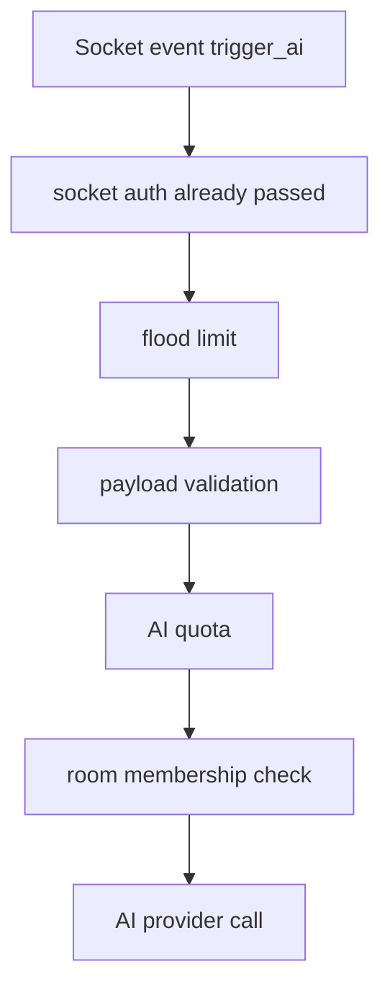

# Security and Rate Limiting

## Purpose of this file

This file documents backend protections that sit in front of AI behavior.

## Security layers relevant to AI

The backend AI path is protected by:

- bearer-token authentication for HTTP
- socket-token authentication for realtime events
- route-level validation
- AI-specific rate limiting
- AI-specific quota control
- room membership enforcement
- per-user AI feature toggles

## HTTP authentication

`auth.middleware.ts` checks:

- `Authorization: Bearer <token>`

If the token is missing or invalid, AI routes fail with `UNAUTHORIZED`.

## Socket authentication

`socketAuth.middleware.ts` checks:

- `socket.handshake.auth.token`
- or `Authorization` header on the handshake

Only authenticated sockets can reach `trigger_ai`.

## Input validation

AI routes and socket payloads use Zod.

Benefits:

- prevents malformed payloads
- bounds prompt length
- bounds attachment field size
- avoids unexpected shapes reaching service code

## `aiLimiter`

The backend uses `express-rate-limit` for AI request burst control.

Behavior:

- 60-second window
- max request count from `env.aiRateLimitPerMinute`
- keyed by user ID when available, otherwise IP

## `aiQuota`

The backend uses `aiQuota.service.ts` for a separate AI budget window.

Defaults:

- 15-minute window
- 20 requests

This is conceptually different from burst rate limiting.

## Socket flood control

The backend also protects sockets with an event flood limiter:

- 10-second window
- 60 events max per socket

## Security flow for room AI



## Per-user feature toggles

The backend stores AI feature flags in `User.settings.aiFeatures`.

These currently gate:

- smart replies
- sentiment
- grammar

## Logging and redaction

`helpers/logger.ts` redacts sensitive fields such as:

- tokens
- secrets
- authorization
- cookies
- API keys

## Security strengths

- AI routes are authenticated
- socket AI is authenticated
- validation is strong
- room membership is enforced before room AI execution
- quota and rate controls exist
- logs redact secrets

## Security weaknesses

### Single-instance control state

`aiQuota` and socket flood state are in memory.

In multi-instance deployment, limits can become inconsistent.

### Attachment download exposure

Uploaded files are accessible through `/api/uploads/:filename` without auth checks.

### Prompt-injection surface

Project context, memory summaries, and user content are concatenated into prompts with no dedicated prompt-injection defense layer.

### No output moderation layer

The backend currently saves AI output directly without a post-generation moderation pass.

## Example limiter snippet

```ts
export const aiLimiter = rateLimit({
  windowMs: 60 * 1000,
  max: env.aiRateLimitPerMinute,
  keyGenerator: resolveIdentity,
});
```

## Recommended upgrades

- move AI quota and rate state to Redis
- add upload access control or signed URLs
- add prompt-injection hardening for project and memory context
- add AI output moderation where room AI is user-visible
