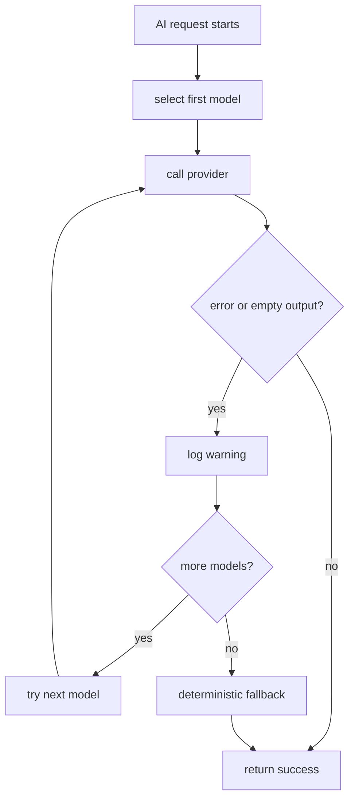

# Failure Handling

## Purpose of this file

This file explains backend AI error handling, fallback behavior, and recovery patterns.

## Failure philosophy

The backend prefers graceful degradation over total AI-path failure.

This is especially visible in the shared AI router.

## Major failure categories

- provider returns error
- provider returns empty content
- provider hangs
- structured output is malformed
- quota or rate limit blocks request
- validation fails
- persistence fails after generation

## Provider fallback chain

When a provider call fails:

1. the backend logs a warning
2. fallback is marked as used
3. the next model in the chain is tried
4. if all providers fail, deterministic fallback is returned

## Failure flow diagram



## Deterministic fallback behavior

### Smart replies

Returns a generic array of safe reply suggestions.

### Sentiment

Returns neutral with a confidence and fallback reason.

### Grammar

Returns the original trimmed input.

### Generic chat

Returns a plain provider-unavailable sentence.

## Structured-output failures

Several backend services expect JSON-like output:

- smart replies
- sentiment
- memory extraction
- insight generation

The backend tries to parse JSON, but does not enforce schema-constrained output at the provider layer.

## Timeout weakness

The backend intends to support AI request timeouts.

But the current timeout helper does not fully cancel provider fetches.

That means a provider hang may last longer than the configured timeout suggests.

## Persistence-after-generation failure

If the provider succeeds but a database write fails afterward:

- the AI work is already spent
- the backend has no replay ledger
- the answer may be lost from product state

## Background failure handling

`refreshConversationInsight()` is triggered asynchronously in solo chat.

If it fails:

- the backend logs a warning
- the main chat request still succeeds

## Recovery guidance

### For provider failures

- inspect warning logs
- confirm API keys
- confirm provider status
- inspect fallback telemetry

### For malformed JSON

- review prompt construction
- add stricter prompt templates
- add provider-native JSON mode

### For hanging requests

- fix abort handling
- add timeout metrics
- add provider circuit breaking

## Example fallback snippet

```ts
if (input.task === "grammar") {
  return input.message.trim();
}
```

## Recommended backend improvements

- implement real timeout cancellation
- add AI run ledger for recovery
- add provider health circuit breaker
- enforce schema-checked structured output
