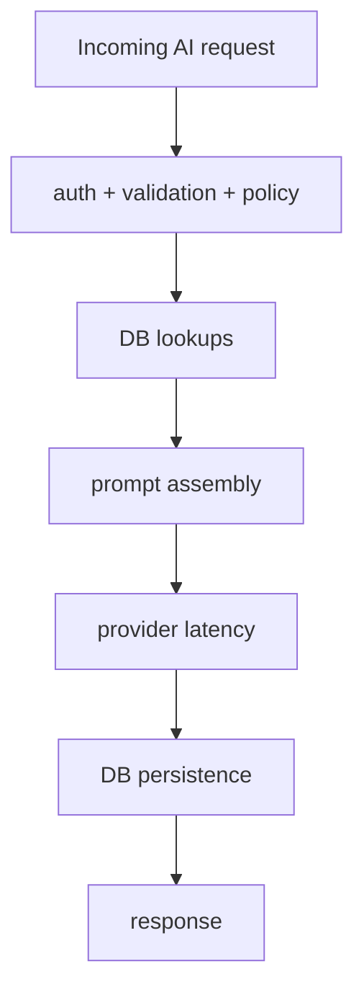
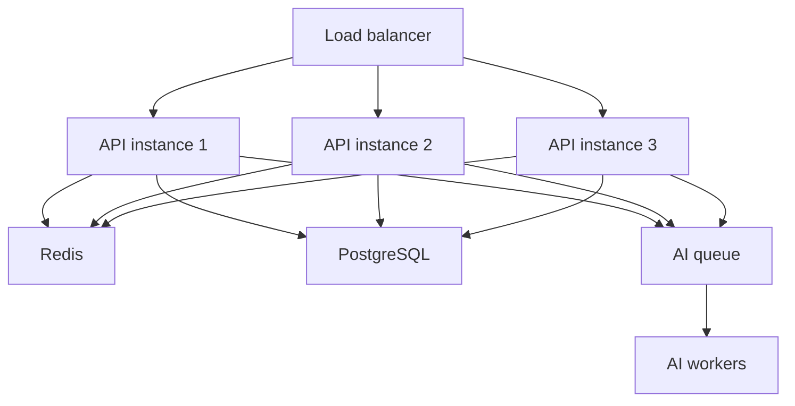

# Scalability and Performance

## Purpose of this file

This file explains the main backend AI bottlenecks, multi-instance risks, and practical scaling strategies.

## Current scaling posture

The backend AI system is suitable for:

- single-instance deployment
- small to moderate traffic
- early-stage product growth

It is not yet optimized for large multi-instance AI traffic.

## Main bottlenecks

### 1. Provider latency

Provider call latency dominates:

- solo chat
- room AI
- memory extraction
- insight generation

### 2. Inline orchestration

The backend performs AI work inline in:

- HTTP handlers
- socket event handlers

### 3. Multiple DB operations per request

A solo chat request can involve:

- conversation lookup
- project lookup
- memory lookup
- insight lookup
- conversation append
- memory upsert
- memory usage update
- async insight refresh

### 4. In-memory control state

The following backend state is local-only:

- AI quota map
- socket flood state
- user socket presence map
- express-rate-limit memory store

## Performance diagram

## Performance strengths

- prompt sizes are bounded
- history windows are bounded
- insight refresh in solo chat is async after the main result
- model catalog is cached

## Performance weaknesses

- no streaming
- no queue-based AI execution
- no request cancellation
- inline room AI can block event responsiveness
- no provider health cache

## Multi-instance problems

### Quota inconsistency

`aiQuota` is stored in a local map.

Across multiple instances, users may effectively get extra quota.

### Rate limit inconsistency

`express-rate-limit` uses memory store by default.

### Socket fragmentation

Presence and flood control are local to a backend process.

Without a shared adapter, realtime behavior diverges across instances.

## Scaling roadmap

### Phase 1

- move AI quota to Redis
- move rate limiting to Redis
- add Socket.IO Redis adapter

### Phase 2

- extract provider logic into adapters
- add provider health metrics
- add circuit breaker state

### Phase 3

- introduce AI work queue
- move long-running tasks to workers
- add streaming for user-facing latency improvement

### Phase 4

- add embeddings and vector retrieval
- add dedicated AI run analytics

## Suggested horizontal architecture

## Key scaling recommendation

The first backend AI scaling win is not vector search or agents.

It is making quota, rate limits, socket state, and provider health distributed and observable.
