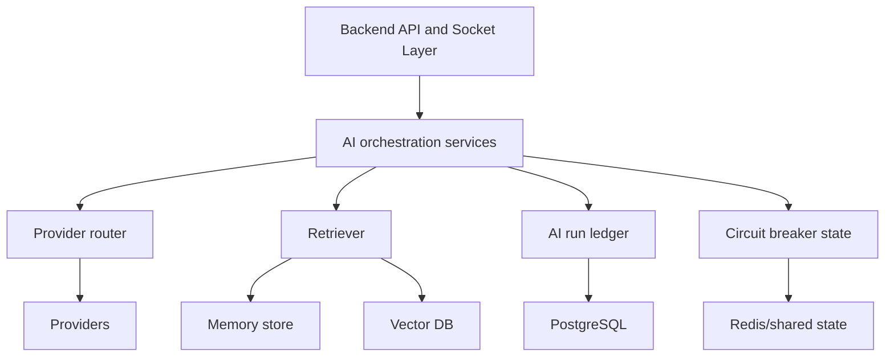

# Future Improvements

## Purpose of this file

This file describes backend AI improvements that would move ChatSphere from a strong early-stage implementation toward a more scalable and reliable AI platform.

## 1. Fix timeout enforcement first

This is the most important backend correctness improvement.

The backend already tries to support request timeouts.

It needs to:

- pass `AbortSignal` to fetch
- race provider calls against an explicit timeout
- classify timeouts distinctly from generic failures

## 2. Enforce structured output

Several backend services expect JSON-shaped results.

Upgrade the backend to:

- use provider-native structured output where available
- validate output against schemas
- retry once with a stricter instruction if parse fails

## 3. Use prompt templates consistently

The backend already has a prompt catalog.

Extend usage so that:

- solo chat uses `solo-chat`
- memory extraction uses `memory-extract`
- smart replies uses `smart-replies`
- sentiment uses `sentiment`
- grammar uses `grammar`

## 4. Add a real AI run ledger

Introduce a new backend model for AI execution tracking.

Suggested fields:

- task
- userId
- roomId or conversationId
- requested model
- selected model
- provider
- fallback used
- prompt template version
- status
- startedAt
- completedAt
- failure category

## 5. Improve multimodal support

Current backend attachment support is only partial.

Upgrade by:

- sending provider-native image parts
- adding optional OCR or document extraction
- supporting real PDF and image context, not just notes

## 6. Add vector retrieval

The backend memory layer is currently lexical.

The next major capability step is:

- embeddings
- vector search
- hybrid ranking

## 7. Add streaming

Backend streaming would improve both UX and perceived performance.

Targets:

- SSE or chunked responses for solo chat
- socket chunk events for room AI

## 8. Make AI state distributed

Move these backend concerns to shared infrastructure:

- AI quota
- rate limiting
- socket presence and coordination
- provider circuit-breaker state

## 9. Add circuit breakers and provider health

The backend should remember recent provider failures and temporarily skip unhealthy providers.

Benefits:

- lower latency under outage
- fewer cascading failures
- better fallback behavior

## 10. Improve identity model for room AI

The backend should eventually stop storing AI room messages under the human trigger identity.

Possible designs:

- dedicated assistant user
- `actorType` field
- room-scoped virtual assistant identity

## 11. Add citation and grounding support

Backend AI answers should eventually be able to cite:

- memory entries
- project files
- retrieved document chunks
- prior decisions from insight

## 12. Add evaluation and regression testing

Backend AI features should have:

- prompt regression tests
- JSON schema conformance tests
- fallback-path tests
- provider-failure simulation tests

## Future-state architecture sketch

## Practical upgrade order

1. fix timeout enforcement
2. enforce structured output
3. standardize prompt-template use
4. move quota and rate state to Redis
5. add AI run ledger
6. add true multimodal support
7. add vector retrieval
8. add streaming

## Closing recommendation

The backend AI foundation is already good enough to justify serious investment.

It should be evolved incrementally rather than replaced wholesale.
