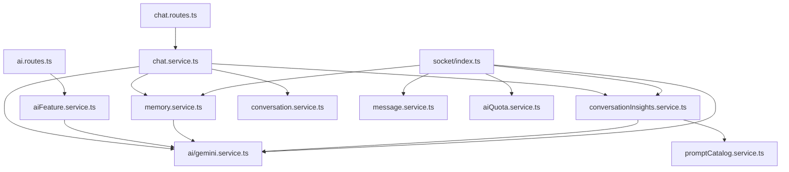

# Backend File Reference

## Purpose

This appendix is a backend-first reference map for the AI-related code.

It is organized by file.

Each section explains:

- why the file exists
- what part of the AI system it influences
- the main logic inside the file
- key dependencies
- risks and implementation notes

## 1. `backend/src/server.ts`

### Role

This file boots the backend process.

### AI significance

It is where the backend decides that AI is part of normal startup, not an optional sidecar process.

### Key behaviors

- runs startup checks
- creates the Express app
- attaches Socket.IO
- starts listening
- installs process-level error handlers

### AI-relevant dependencies

- `runStartupChecks()`
- `initializeSocketServer()`

### Why it matters for AI

If startup checks fail, AI never becomes available.

If socket initialization fails, room AI disappears even if HTTP AI still works.

### Small snippet

```ts
await runStartupChecks();
const app = createApp();
const server = http.createServer(app);
initializeSocketServer(server);
```

### Main risks

- no special AI readiness gate beyond startup checks
- no process restart strategy for provider degradation

## 2. `backend/src/app.ts`

### Role

Builds the Express middleware chain.

### AI significance

Every HTTP AI route depends on this middleware assembly order.

### Key behaviors

- request context installation
- security headers
- CORS
- body parsing
- cookie parsing
- Passport initialization
- global API limiter
- route registration
- error handling

### AI-relevant effects

- AI routes inherit request IDs
- AI routes inherit body size limits
- AI routes inherit generic API rate limiting before AI-specific limits

### Important sequence

1. `requestContext`
2. `helmet`
3. `cors`
4. JSON parser
5. URL-encoded parser
6. cookies
7. Passport
8. `apiLimiter`
9. route registration
10. error handlers

### Main risks

- if body limits are too low, attachment metadata flows can break
- if CORS is wrong, frontend AI calls fail before reaching service logic

## 3. `backend/src/config/env.ts`

### Role

Central environment configuration.

### AI significance

This file defines almost every AI runtime switch.

### AI-related fields

- `requestTimeoutMs`
- `aiContextMessageLimit`
- `aiQuotaWindowMs`
- `aiQuotaMaxRequests`
- `aiRateLimitPerMinute`
- `defaultAiModel`
- `openRouterApiKey`
- `openRouterDefaultModel`
- `openRouterModels`
- `geminiApiKey`
- `geminiModel`
- `grokApiKey`
- `grokModel`
- `groqApiKey`
- `groqModel`
- `togetherApiKey`
- `togetherModel`
- `huggingFaceApiKey`
- `huggingFaceModel`
- `socketFloodWindowMs`
- `socketFloodMaxEvents`

### Important observation

`aiContextMessageLimit` exists as config, but the backend currently hardcodes some history window sizes instead of using it consistently.

### Main risks

- env drift across instances causes routing inconsistency
- invalid or missing provider keys lead to fallback-heavy behavior

## 4. `backend/src/config/startup.ts`

### Role

Performs startup validation and warm-up tasks.

### AI significance

This file refreshes prompt catalog state and model catalog state during backend boot.

### AI-related startup steps

- validate startup env
- connect Prisma
- refresh prompt catalog
- refresh model catalog

### Why it matters

The backend begins serving AI requests with cached prompt and model metadata already loaded.

### Main risks

- prompt refresh failures are only warnings
- model refresh failures are only warnings
- the backend can come up in a degraded AI state without a hard startup stop

## 5. `backend/src/middleware/auth.middleware.ts`

### Role

Bearer-token authentication for HTTP routes.

### AI significance

All HTTP AI routes rely on this middleware.

### Main logic

- read `Authorization` header
- verify access token
- attach `req.user`

### AI routes protected by it

- `/api/chat`
- `/api/ai/*`
- conversations insight routes
- memory routes
- settings routes

### Main risks

- no AI-specific role differentiation
- all authenticated users have the same baseline AI access, subject only to quota and settings

## 6. `backend/src/middleware/socketAuth.middleware.ts`

### Role

Socket.IO authentication at handshake time.

### AI significance

Room AI depends on this file before any `trigger_ai` event can be processed.

### Main logic

- read token from handshake auth or header
- verify access token
- attach `socket.data.user`

### Main risks

- if handshake auth fails, realtime AI disappears entirely for that client
- socket errors are less trace-friendly than HTTP request errors

## 7. `backend/src/middleware/validate.middleware.ts`

### Role

Shared Zod validation middleware.

### AI significance

It is the backend safety boundary for prompt payloads.

### Key behaviors

- parse body
- parse params
- parse query
- replace request values with validated data

### Why it matters for AI

Without this middleware, oversized prompts and malformed attachment metadata would leak into service code.

## 8. `backend/src/middleware/rateLimit.middleware.ts`

### Role

Defines API, auth, and AI rate limiters.

### AI significance

`aiLimiter` is the first AI-specific anti-abuse layer on HTTP.

### AI-specific behavior

- one-minute window
- user-or-IP keyed
- structured JSON error response with `retryAfterMs`

### Main risks

- default in-memory store does not scale horizontally
- current limits are per instance rather than global

## 9. `backend/src/middleware/aiQuota.middleware.ts`

### Role

Applies long-window AI quota to HTTP routes.

### AI significance

This is the budget gate rather than the burst gate.

### Main logic

- derive quota key from user or IP
- consume quota
- reject with `AI_QUOTA_EXCEEDED` if necessary

### Main risks

- in-memory only
- not tied to actual cost or token usage

## 10. `backend/src/routes/chat.routes.ts`

### Role

Exposes the solo AI chat endpoint.

### AI significance

This is the main backend entry point for personal AI conversations.

### Request schema highlights

- required `message`
- optional `conversationId`
- optional `modelId`
- optional `projectId`
- optional attachment object

### Delegated service

- `handleSoloChat()`

### Why it matters

This route is where AI becomes a first-class product feature rather than a hidden utility.

## 11. `backend/src/routes/ai.routes.ts`

### Role

Exposes AI utility endpoints and the model catalog.

### Endpoints

- `GET /models`
- `POST /smart-replies`
- `POST /sentiment`
- `POST /grammar`

### AI significance

This file defines the backend's utility-AI surface area.

### Main risks

- route group currently consumes quota even for `/models`
- utilities depend on best-effort structured output but do not enforce it protocol-side

## 12. `backend/src/routes/conversations.routes.ts`

### Role

Exposes conversation read, delete, insight, and action endpoints.

### AI significance

The route itself does not always call providers directly, but it is the read and action layer over AI-generated conversation summaries.

### Key AI-related endpoints

- `GET /:conversationId/insights`
- `POST /:conversationId/actions`

### Why it matters

These routes let product UI consume AI-derived artifacts separately from primary chat generation.

## 13. `backend/src/routes/memory.routes.ts`

### Role

Memory CRUD, import, and export.

### AI significance

These routes are the backend control plane for personalization.

### Why it matters

They let users review and correct the same memory layer that future prompts depend on.

### Main risks

- memory quality can drift if extraction logic overfits or underfits
- no semantic retrieval metadata is shown here yet

## 14. `backend/src/routes/rooms.routes.ts`

### Role

Room CRUD, room message APIs, insight routes, and room actions.

### AI significance

This file handles room insight reads and actions, even though actual room AI generation is socket-based.

### Key AI-adjacent endpoints

- `GET /:roomId/insights`
- `POST /:roomId/actions`

## 15. `backend/src/services/ai/gemini.service.ts`

### Role

Shared AI router and provider abstraction.

### Responsibilities

- parse model catalog
- refresh model catalog
- estimate complexity
- resolve model chain
- build attachment note
- call provider adapters
- normalize provider failures
- generate deterministic fallback
- estimate usage
- return telemetry

### Why it matters most

This is the central backend AI execution layer.

### Key functions

- `refreshModelCatalog()`
- `getModelCatalog()`
- `resolveTaskModel()`
- `sendAiMessage()`
- provider call helpers
- `deterministicFallback()`

### Main design strength

One router gives the backend a consistent AI response envelope across multiple product features.

### Main design weaknesses

- file name no longer matches responsibility
- timeout implementation is incomplete
- output JSON is not strongly enforced
- multimodal image support is only partial

### Example snippet

```ts
const { complexity, chain } = await resolveTaskModel(
  input.task,
  input.message,
  input.modelId
);
```

## 16. `backend/src/services/aiFeature.service.ts`

### Role

Backend utility-AI orchestration layer.

### Responsibilities

- read AI feature flags from user settings
- list models
- generate smart replies
- analyze sentiment
- improve grammar

### Strengths

- narrow and readable
- feature flags are enforced server-side

### Weaknesses

- prompt templates exist but are mostly not used here
- utility endpoints are backend-ready but not deeply surfaced in the inspected frontend

## 17. `backend/src/services/chat.service.ts`

### Role

Solo AI chat orchestration.

### Responsibilities

- validate prompt content
- load existing conversation
- validate project ownership
- load project context
- retrieve relevant memories
- load conversation insight
- normalize history
- build prompt body
- call `sendAiMessage()`
- append conversation messages
- learn new memory
- mark memory usage
- refresh insight asynchronously

### Why it matters

This file is where ChatSphere turns plain chat completion into context-aware, personalized AI conversation.

### Main strength

It combines project context, memory, history, and insight in a single flow.

### Main weakness

The prompt body is assembled through concatenation rather than through a fully standardized prompt builder.

## 18. `backend/src/services/memory.service.ts`

### Role

Memory extraction, retrieval, lifecycle management, and import-export.

### Responsibilities

- deterministic candidate extraction
- AI-based candidate extraction
- upsert by fingerprint
- rank memories by overlap and metadata
- update usage counters
- list, update, delete, import, export

### Why it matters

This file gives the backend a personalization system that survives across chat sessions.

### Strengths

- deterministic fallback exists
- user-editable storage exists
- ranking is explainable

### Weaknesses

- no embeddings
- no semantic search
- `memory-extract` template is defined but not used in the core extraction path

## 19. `backend/src/services/conversationInsights.service.ts`

### Role

Summary and insight generation for conversations and rooms.

### Responsibilities

- normalize message collections
- build prompt from template
- request AI-generated structured summary
- parse JSON response
- fall back to deterministic summary if needed
- upsert `ConversationInsight`

### Main strength

This is one of the best-governed AI flows in the backend because it already uses prompt templates.

### Main weakness

It still relies on best-effort JSON output from the provider.

## 20. `backend/src/services/promptCatalog.service.ts`

### Role

Prompt registry and override system.

### Responsibilities

- define default templates
- refresh active templates from DB
- interpolate variables
- seed initial room AI history
- list and upsert prompt templates

### AI significance

This file is the backend's foundation for prompt governance.

### Main weakness

Its adoption is incomplete across the rest of the AI stack.

## 21. `backend/src/services/aiQuota.service.ts`

### Role

In-memory quota accounting.

### Responsibilities

- maintain time-window counters
- calculate allowance
- expose retry timing
- derive user or IP quota keys

### Main weakness

This design is not distributed or cost-aware.

## 22. `backend/src/services/conversation.service.ts`

### Role

Conversation persistence and AI-summary access.

### AI significance

Solo AI chat stores messages here, and conversation insight flows depend on it.

### Responsibilities

- list conversations
- read one conversation
- delete conversation
- append conversation messages
- expose conversation insight and actions

### Important implementation choice

Conversation messages are stored as JSON rather than relational message rows.

### Tradeoff

- simple to append and serialize
- weaker for queryability and analytics

## 23. `backend/src/services/room.service.ts`

### Role

Room lifecycle and room-level insight actions.

### AI significance

- seeds `Room.aiHistory`
- exposes room AI-adjacent actions
- returns room insight in room detail payloads

### Important nuance

`Room.aiHistory` is maintained, but the main room AI prompt path rebuilds history from recent messages instead of relying on this stored field.

## 24. `backend/src/services/message.service.ts`

### Role

Room message creation and mutation.

### AI significance

Room AI output becomes a standard message through this service.

### Responsibilities in AI context

- persist AI room message
- attach memory references
- attach model ID
- attach model provider
- attach model telemetry

### Main weakness

AI room messages are stored under the triggering user's `userId`, which blurs actor identity.

## 25. `backend/prisma/schema.prisma`

### Role

Defines the backend persistence model.

### AI-relevant models

- `Conversation`
- `ConversationInsight`
- `MemoryEntry`
- `PromptTemplate`
- `Project`
- `Message`
- `Room`
- `User`

### Why it matters

The schema shows what the backend believes AI state actually is.

### Important backend AI design decisions visible in schema

- solo AI chats live in `Conversation.messages` JSON
- room AI outputs live in relational `Message` rows
- summaries are cached in `ConversationInsight`
- personal memory is first-class and relational
- prompt templates are editable through the database

## Cross-file dependency map



## File-reference takeaway

If a new engineer only reads five backend files first, they should be:

1. `backend/src/services/ai/gemini.service.ts`
2. `backend/src/services/chat.service.ts`
3. `backend/src/services/memory.service.ts`
4. `backend/src/services/conversationInsights.service.ts`
5. `backend/src/socket/index.ts`
