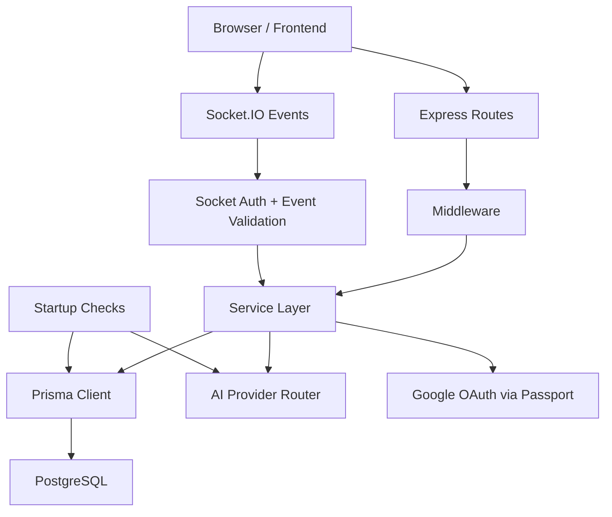

# Backend Architecture

## Why This Chapter Exists
When developers say they want to "understand the backend architecture," they usually mean one of two things:

- "I want to know where to put new code."
- "I want to know how a request moves through the system."

This file answers both.

Architecture is not just a diagram. It is the set of rules that tells the team where responsibilities belong. Good architecture reduces confusion. Bad architecture creates endless debates like "should this check live in the route, middleware, or service?"

In ChatSphere, the architecture is deliberately layered so each concern has a home.

## Architectural Style: Modular Monolith
ChatSphere is a **modular monolith**. The backend runs as one deployable application, but it is split into focused modules:

- auth
- chat
- conversations
- rooms
- groups
- polls
- memory
- projects
- settings
- search
- moderation
- analytics
- uploads
- AI features
- realtime socket handling

This design is similar to a well-organized workshop. There is one building, but different benches are used for different crafts. You do not need a fleet of microservices to stay disciplined.

### Why this style works well here
This project benefits from a monolith because many features depend on shared context:

- auth affects both HTTP and sockets
- rooms depend on users, memberships, messages, polls, and moderation
- AI features depend on messages, memories, insights, settings, and model catalogs
- settings affect behavior in AI services

Keeping those modules in one codebase makes cross-feature changes easier to implement and debug.

### Tradeoffs
**Advantages**

- simple deployment
- easy local development
- one debugger session for end-to-end tracing
- easy refactoring across domains

**Disadvantages**

- all modules share the same runtime and deployment blast radius
- in-process state becomes a scaling constraint
- teams can accidentally create tight coupling if boundaries are not respected

An alternative would be microservices, but that would add network boundaries, service discovery, queueing, and deployment complexity much earlier than this product likely needs.

## The Main Layers
The backend is best understood in six layers.

### 1. Bootstrap and runtime assembly
These files create the process, validate environment variables, connect to the database, and attach HTTP and Socket.IO servers.

Key files:

- [backend/src/server.ts](../../backend/src/server.ts)
- [backend/src/app.ts](../../backend/src/app.ts)
- [backend/src/config/startup.ts](../../backend/src/config/startup.ts)
- [backend/src/config/env.ts](../../backend/src/config/env.ts)
- [backend/src/config/prisma.ts](../../backend/src/config/prisma.ts)

### 2. Middleware and policy enforcement
Middleware handles cross-cutting concerns before business logic runs.

Key examples:

- `requestContext` attaches a request ID and logs timing
- `protect` verifies the access token
- `validateBody`, `validateParams`, and `validateQuery` apply Zod schemas
- rate limiters guard auth, general API traffic, and AI usage
- upload middleware enforces file rules

### 3. Transport layer
This is where input enters the system.

- Express route modules for HTTP requests
- Socket.IO handlers for realtime events

These layers should be thin. Their job is to validate, authorize, delegate, and return results.

### 4. Service layer
This is the real heart of the backend. Services contain business rules such as:

- who can join a room
- who can pin or delete a message
- how a room AI response is generated
- how memory entries are extracted and reused
- how settings are normalized and merged

### 5. Persistence layer
Prisma translates service intentions into database operations against PostgreSQL.

This includes:

- entity creation and updates
- relationship checks
- transactional deletes
- indexed reads
- JSON field storage for semi-structured data

### 6. Integration layer
Some features require external systems:

- Google OAuth through Passport
- AI model providers through the AI routing service
- Docker runtime and Prisma migrations in operations

## Architecture Diagram


## Request Lifecycle in Detail
Let us walk through a normal HTTP request.

### Example: `POST /api/chat`
The route lives in [backend/src/routes/chat.routes.ts](../../backend/src/routes/chat.routes.ts).

The flow looks like this:

1. The client sends a message to `/api/chat`.
2. `protect` checks the `Authorization: Bearer <token>` header.
3. `aiLimiter` enforces per-user AI request rate limits.
4. `aiQuota` checks a broader quota window.
5. `validateBody` confirms the request matches the Zod schema.
6. The route calls `handleSoloChat(...)`.
7. `handleSoloChat` loads existing conversation state, project context, relevant memories, and insight data.
8. The AI router chooses a model and calls a provider or fallback.
9. The conversation service appends user and assistant messages to the conversation JSON transcript.
10. Memory and insight updates are triggered.
11. The route returns `{ success: true, data: ... }`.

That is a good example of architectural separation:

- the route does not know how memory ranking works
- the middleware does not know how AI prompting works
- the service does not know how HTTP responses are serialized

## Realtime Lifecycle in Detail
Realtime features follow a similar pattern, but the transport is Socket.IO instead of HTTP.

### Example: `send_message`
1. The frontend connects to Socket.IO using an access token in the handshake.
2. `socketAuth` verifies the token and stores the user in `socket.data.user`.
3. The client emits `send_message`.
4. The socket layer validates the payload with Zod.
5. Flood protection checks whether the socket is sending too many events too quickly.
6. `sendRoomMessage(...)` verifies room membership and writes the message.
7. The server broadcasts `message_created` to the room.
8. Other clients update their UI immediately.

This looks a lot like HTTP, but with an event bus feel:

**connect -> authenticate -> validate event -> call service -> persist -> broadcast**

## The Most Important Architectural Rule
If you take only one idea from this document, take this one:

> Routes and socket handlers should describe the interaction. Services should own the business rules.

That rule matters because it prevents duplication.

For example, "only room admins or moderators can pin messages" is a domain rule. It belongs in the room service, not only in a route handler, because the same rule may be needed by both HTTP and Socket.IO.

## Concrete File Responsibilities
### `server.ts`
Starts the process, runs startup checks, creates the HTTP server, initializes sockets, and handles shutdown signals.

### `app.ts`
Assembles Express middleware in a specific order. This file is like the airport runway controller: it decides which checks happen before a request is allowed to continue.

### `routes/*.routes.ts`
Defines public contracts. These files describe the external API the frontend speaks to.

### `services/*.service.ts`
Implements the product's behavior. If a developer wants to know "what really happens," this is usually the answer.

### `socket/index.ts`
Acts as the realtime transport adapter. It validates and dispatches socket events, then emits broadcasts back out.

### `prisma/schema.prisma`
Defines the persistent shape of the system.

## A Beginner-Friendly Way to Follow a Feature
When you encounter a backend feature, trace it in this order:

1. route or socket event
2. middleware used by that entry point
3. service invoked
4. Prisma models touched
5. response or broadcast payload

### Example pseudo-trace
```ts
POST /api/rooms/:roomId/messages
  -> protect()
  -> validateBody(messageCreateSchema)
  -> sendRoomMessage(...)
      -> assertRoomMembership(...)
      -> prisma.message.create(...)
      -> prisma.room.update(...)
  -> return { success: true, data: message }
```

That sequence is simple, predictable, and teachable. That is one sign of a healthy backend architecture.

## Architectural Tradeoffs in This Project
### JSON-heavy data vs highly normalized tables
The project stores some rich objects as JSON:

- conversation messages
- room AI history
- message reply metadata
- reactions
- read receipts
- settings

This makes some writes very convenient, but it also means:

- search becomes more complex
- concurrent updates can be trickier
- some analytics are harder to push down to SQL

### In-memory state vs shared infrastructure
Some runtime state lives in memory:

- socket flood state
- connected socket maps
- Google OAuth exchange codes
- model catalog cache

This is perfectly reasonable in a single-node deployment, but it is an architectural limit if the system needs multiple backend replicas.

### AI in the request path vs background jobs
Today, many AI enrichments happen synchronously in the request path. That keeps user feedback immediate, but it also means provider latency directly affects API latency.

An alternative architecture would move some work into background jobs. That is a valid future direction, but synchronous execution is easier to reason about when the product is still evolving.

## How This Architecture Helps a Team Rebuild the Backend
If someone had to rebuild the backend from scratch, this architecture gives them a recipe:

1. bootstrap the server and environment
2. assemble middleware
3. define route contracts
4. implement services per domain
5. model persistence in Prisma
6. add realtime transports for room features
7. integrate AI as a service dependency, not as a transport concern

That is why architecture matters. It is not just how the current code is arranged. It is the blueprint that lets future engineers rebuild or evolve the system without guessing.
